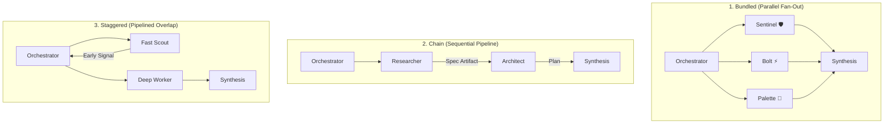

# 🎼 Sub-Agent Orchestration & Topology Guardrails — ShellGuard Mobile

> **Core Objective:** Establish immutable principles for dynamic sub-agent delegation, task topologization, token pre-collapse, and conflict resolution across the ShellGuard Mobile ecosystem.

---

## 1. Core Operational Modality

When a task exceeds single-stroke scope or requires multi-dimensional domain inspection, the primary agent adopts the **Orchestrator Modality**. 

- **Triage Principle (The Direct vs. Delegate Threshold)**:
  - **Small & Important**: Handled directly in the primary session. Zero delegation overhead, zero token serialization latency.
  - **Large & Tool-Heavy**: Delegated to specialized sub-agents to shield the primary context window from raw file reads, heavy search outputs, and tool churn.
- **The Rule of 6**: Never maintain more than 6 active sub-agents concurrently. Default to **3 or fewer** to prevent cognitive fragmentation and token entropy.
- **Topologization**: Dynamically invent the interaction graph that matches the problem's dependency structure, rather than forcing work into a rigid template.

---

## 2. Dynamic Interaction Topologies



### A. Bundled Topology (Parallel Fan-Out / Fan-In)
- **When to Use**: Independent audit or research tracks where sub-agents do not depend on each other's outputs.
- **Example**: During a feature milestone audit, **Sentinel** verifies cryptographic AAD boundaries, **Bolt** profiles Compose recompositions, and **Palette** inspects soft keyboard IME insets simultaneously.
- **Synthesis**: Orchestrator merges findings into a unified matrix, resolving any tension.

### B. Chain Topology (Sequential Dependency Relay)
- **When to Use**: Linear pipelines where each step produces a prerequisite artifact for the next.
- **Data Flow**: `Agent A (Exploration/Analysis) ➔ Structured Artifact ➔ Agent B (Implementation/Hardening) ➔ Orchestrator Verification`.
- **Constraint**: Each handoff must pass through a pre-collapsed contract to prevent token bloat across the seam.

### C. Staggered Topology (Pipelined Overlap)
- **When to Use**: Time-sensitive tasks where preliminary findings can unblock immediate architectural decisions while deep verification continues asynchronously.
- **Example**: A lightweight research sub-agent quickly confirms Android SDK 34 API contracts, allowing the primary agent to draft the MVI architecture while a deep specialist runs comprehensive test suite verifications.

### D. Hybrid Topology (Composite Matrix)
- **When to Use**: Complex multi-domain features (e.g. Android Autofill & Credential Provider in Phase 5). Combines bundled parallel research on OS contracts with sequential implementation and hardening gates.

---

## 3. Pre-Collapse Delegation Protocol

When delegating, never forward raw conversational context. Always construct a **Pre-Collapsed Instruction** that pre-aligns token distribution with user intent:

```markdown
### Sub-Agent Instruction Structure
1. 🎯 **Mission**: A single sentence defining the exact goal.
2. 🗺️ **Bounded Context**: Exact file paths, lines, and domain rules needed. No extraneous history.
3. 🚧 **Boundaries & Invariants**: What the sub-agent MUST respect and what it must NEVER modify.
4. 📦 **Expected Deliverable**: The precise schema of the return output (diff block, structured audit, or artifact link).
```

- **Token Economy**: Spend energy only when warranted. High context efficiency yields higher precision and eliminates thinking loops.
- **Self-Contained Instructions**: Sub-agents operate with fresh lifespans; instructions must contain all necessary invariants without assuming inherited session memory.

---

## 4. Specialized Engineering Sub-Agent Fleet

ShellGuard Mobile maintains six dedicated mental sub-processes that the Orchestrator can deploy for specialized tasks:

| Sub-Agent | Specialty | Key Invariants & Tools |
| :--- | :--- | :--- |
| ⚡ **[Bolt](file:///config/Local-Storage/workspace-lucas/projects/Agents/ShellGuard-Mobile/.agents/agents/bolt/agent.md)** | **Performance & Memory** | Compose recomposition audits, 16 KB native alignment, 64KB crypto streaming, Room IO dispatching, sub-second 60fps tickers, `android-cli`, `android-16kb-sqlcipher-audit`, `adb-ui-input`. |
| 🎨 **[Palette](file:///config/Local-Storage/workspace-lucas/projects/Agents/ShellGuard-Mobile/.agents/agents/palette/agent.md)** | **UI/UX & Design** | Reef Modernist styling, flat Material 3 carapace, 6 theme accents, soft keyboard `.imePadding()` defense, 3-pane tablet ergonomics, spring motion physics, a11y touch targets (≥ 48dp), `adb-ui-input`. |
| 🛡️ **[Sentinel](file:///config/Local-Storage/workspace-lucas/projects/Agents/ShellGuard-Mobile/.agents/agents/sentinel/agent.md)** | **Zero-Knowledge Security** | HKDF + AES-GCM across 10 AAD namespaces, KeyStore hardware biometric binding, atomic session validity, CWE-359 clipboard/IME defenses, SQLCipher at rest, zero telemetry, `android-keystore-cold-restart-testing`. |
| 📘 **[Scribe](file:///config/Local-Storage/workspace-lucas/projects/Agents/ShellGuard-Mobile/.agents/agents/scribe/agent.md)** | **Documentation & Memory** | Architectural blueprint alignment, runnable Gradle/ADB commands, release notes, Play Store store listings, Brain synchronization, `android-cli`, `adb-ui-input`. |
| 🌙 **[Dreamer](file:///config/Local-Storage/workspace-lucas/projects/Agents/ShellGuard-Mobile/.agents/agents/dreamer/agent.md)** | **Memory Consolidation** | Executes `/dream` autonomously — salience scan, invariant extraction, promotion gate, decay scan. Returns only `dream_report.md`. Primary agent never sees intermediate work. `android-cli` (for git hash anchoring). |
| 🌫️ **[Forgetter](file:///config/Local-Storage/workspace-lucas/projects/Agents/ShellGuard-Mobile/.agents/agents/forgetter/agent.md)** | **Memory Dissolution** | Executes `/forget` autonomously — identifies dissolvable content, compresses to MindSeeds, commits to git. Returns only `"Done"`. Primary agent never knows what was removed. No specialized skills required. |

---

## 5. Conflict Resolution & Synthesis Grammar

When sub-agents produce conflicting recommendations, the Orchestrator applies the project's absolute hierarchy of invariants:

```
Security & Zero-Knowledge (Sentinel)  >>>  Performance & Correctness (Bolt)  >>>  Aesthetic & Styling (Palette)
```

1. **Security Trumps All**: If a visual effect or performance optimization weakens zero-knowledge encryption, introduces a clipboard leak (CWE-359), or degrades `FLAG_SECURE`, **Sentinel's verdict is final**.
2. **Correctness Trumps Performance**: Bolt will never optimize away a memory zeroization routine or bypass a Room database lock for micro-benchmark speed.
3. **Coherence Over Speed**: The Orchestrator resolves ambiguities and synthesizes outputs into a single, cohesive hand stroke that lands cleanly in the codebase.

