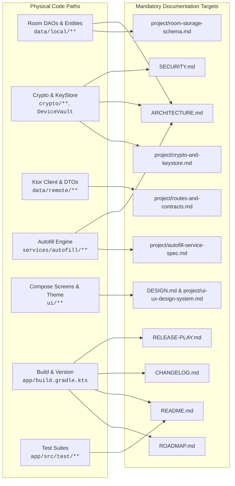

# 📚 Skill: Deterministic Documentation Automation (Doc-Automation)

Patterns, verification pipelines, and automated synchronization strategies for ensuring root-level repository documentation 100% bows to the physical codebase and remains deterministically in sync.

---

## 🧭 When to Use This Skill
- Preparing a version increment, phase completion, or release candidate.
- Auditing repository health for **Documentation Drift** (code modified without doc updates).
- Synchronizing central metric anchors (`versionCode`, `versionName`, test suite counts).
- Generating dual-tier release notes (GitHub Releases + Google Play Store `<en-US>`).
- Aligning downstream strategic projections (`ROADMAP.md`) with physical build history.
- Verifying architectural claims against actual physical Kotlin, XML, and Gradle files.

---

## 🏛️ Core Concepts

### 1. The Code-Bow Principle (Ground Truth Invariant)
The codebase is physical silicon reality; documentation is an epistemological model.
- **Docs bow unconditionally to code**: If a specification describes a pattern that the code does not implement, or if code implements behavior absent from the documentation, the code is the ground truth and the documentation is in error.
- **Zero-Deferred Documentation**: Code and its governing documentation evolve in the **same commit** or **same branch**. "I will update the docs later" is treated as an incomplete task and an epistemic defect.
- **Testing Exemption**: Markdown documentation updates are strictly exempt from build/test execution taxes (`cadence-and-lifecycle-prompts.md`). Application bytecode requires 100% test gates; documentation requires factual code alignment.

### 2. ShellGuard-Mobile Root Documentation Anatomy
Root-level documentation is partitioned into 9 distinct living contracts:

| Document | Primary Role | Source of Truth For | Update Trigger |
| :--- | :--- | :--- | :--- |
| [`README.md`](file:///config/Local-Storage/workspace-lucas/projects/Agents/ShellGuard-Mobile/README.md) | Public storefront, badges, quickstart, security highlights | Verified test count, active version badge, architectural elevator pitch | Version bumps, new test suites added, major milestones |
| [`SECURITY.md`](file:///config/Local-Storage/workspace-lucas/projects/Agents/ShellGuard-Mobile/SECURITY.md) | Security policy, threat model invariants, vulnerability disclosure | Zero-knowledge rules, AAD binding, KeyStore biometrics, safe LAN policy, SLA | Cryptographic updates, network security changes, policy shifts |
| [`ROADMAP.md`](file:///config/Local-Storage/workspace-lucas/projects/Agents/ShellGuard-Mobile/ROADMAP.md) | Strategic execution chronicle, stage projections | Monotonic build projection (`Phase X ➔ Build Y`), task checkboxes `[x]`, completion % | Phase transitions, hotfix insertions, scope adjustments |
| [`ARCHITECTURE.md`](file:///config/Local-Storage/workspace-lucas/projects/Agents/ShellGuard-Mobile/ARCHITECTURE.md) | System boundaries, threat model, cryptographic invariants | Zero-knowledge boundary, AAD namespaces, MVI topology, Room/SQLCipher | Crypto modifications, network security config, storage shifts |
| [`CHANGELOG.md`](file:///config/Local-Storage/workspace-lucas/projects/Agents/ShellGuard-Mobile/CHANGELOG.md) | Chronological release changelog (Keep a Changelog 1.1.0) | Historical changes categorized under `Added`, `Changed`, `Deprecated`, `Removed`, `Fixed`, `Security` | Every version release or pre-release preparation |
| [`DESIGN.md`](file:///config/Local-Storage/workspace-lucas/projects/Agents/ShellGuard-Mobile/DESIGN.md) | Visual design system, Reef Modernist principles, Compose tokens | Colors, typography, component DNA, master-detail layouts | UI token changes, theme accents, layout restructuring |
| [`CONTRIBUTING.md`](file:///config/Local-Storage/workspace-lucas/projects/Agents/ShellGuard-Mobile/CONTRIBUTING.md) | Contributor workflows, attribution, git hygiene | Conventional Commits, two-layer attribution, verification gates | Toolchain changes, commit conventions, process revisions |
| [`RELEASE-PLAY.md`](file:///config/Local-Storage/workspace-lucas/projects/Agents/ShellGuard-Mobile/RELEASE-PLAY.md) | Store deployment notes for Google Play Console | `<en-US>` release notes strictly under 500 characters | Every production or closed testing upload |
| `RELEASE-vX.Y.Z.N.md` | Internal engineering release manifest | Comprehensive release artifacts, AAD receipts, dependency tables, test gates | Cut at each official release tag |

---

## 🗺️ 3. The Domain-to-Doc Drift Matrix

Whenever physical code files are touched, the following documentation targets **MUST** be verified and synchronized in the same branch:



---

## ⚙️ Implementation Methods & Automations

### Method 1: Automated Git Diff Domain Classifier
Run this lightweight shell recipe to immediately detect code changes that lack corresponding documentation updates:

```bash
#!/usr/bin/env bash
# doc-drift-check.sh - Audits working tree or PR range for documentation drift
set -euo pipefail

BASE_REF="${1:-main}"
CHANGED_FILES=$(git diff --name-only "$BASE_REF"...HEAD)

echo "🔍 Auditing modified files against Domain-to-Doc Drift Matrix..."

check_drift() {
    local code_pattern="$1"
    local doc_pattern="$2"
    local domain_name="$3"

    if echo "$CHANGED_FILES" | grep -qE "$code_pattern"; then
        if ! echo "$CHANGED_FILES" | grep -qE "$doc_pattern"; then
            echo "⚠️ [DOC-DRIFT] $domain_name code modified without documentation update!"
            echo "   Code pattern: $code_pattern"
            echo "   Required doc: $doc_pattern"
            return 1
        else
            echo "✅ [SYNCED] $domain_name code and documentation updated together."
        fi
    fi
    return 0
}

DRIFT_COUNT=0
check_drift "app/src/main/java/.*/data/local/" "project/room-storage-schema\.md|ARCHITECTURE\.md" "Database/Room" || ((DRIFT_COUNT++))
check_drift "app/src/main/java/.*/crypto/" "project/crypto-and-keystore\.md|ARCHITECTURE\.md|SECURITY\.md" "Cryptography" || ((DRIFT_COUNT++))
check_drift "app/src/main/java/.*/data/remote/" "project/routes-and-contracts\.md" "Networking/API" || ((DRIFT_COUNT++))
check_drift "app/src/main/java/.*/services/autofill/" "project/autofill-service-spec\.md|ARCHITECTURE\.md" "Autofill" || ((DRIFT_COUNT++))
check_drift "app/build\.gradle\.kts" "CHANGELOG\.md|ROADMAP\.md|README\.md" "Versioning/Build" || ((DRIFT_COUNT++))

if [ "$DRIFT_COUNT" -gt 0 ]; then
    echo "❌ Drift check failed: $DRIFT_COUNT domain(s) have desynchronized documentation."
    exit 1
fi
echo "🎉 All touched domains have synchronized documentation!"
```

---

### Method 2: Central Metric Anchor Synchronizer
Ensures that `versionCode`, `versionName`, and unit test suite counts in `README.md` and `ROADMAP.md` match physical truth:

```bash
#!/usr/bin/env bash
# sync-metrics.sh - Validates metric consistency across root documentation
set -euo pipefail

# 1. Extract physical truth from Gradle
VERSION_CODE=$(grep -oE 'versionCode\s*=\s*[0-9]+' app/build.gradle.kts | awk '{print $3}')
VERSION_NAME=$(grep -oE 'versionName\s*=\s*"[^"]+"' app/build.gradle.kts | cut -d'"' -f2)

echo "📌 Physical Version: $VERSION_NAME (versionCode: $VERSION_CODE)"

# 2. Check README.md badge
README_BADGE_VERSION=$(grep -oE 'version-[0-9]+\.[0-9]+\.[0-9]+\.[0-9]+' README.md | cut -d'-' -f2 || true)
if [ "$README_BADGE_VERSION" != "$VERSION_NAME" ]; then
    echo "❌ README.md version badge mismatch! (README: $README_BADGE_VERSION vs Gradle: $VERSION_NAME)"
else
    echo "✅ README.md version badge aligned."
fi

# 3. Count physical unit tests
TEST_COUNT=$(find app/src/test/java -name "*Test.kt" -exec grep -h "@Test" {} + | wc -l)
echo "🧪 Physical @Test annotation count: $TEST_COUNT"

# 4. Check CHANGELOG.md for current version heading
if grep -q "## \[$VERSION_NAME\]" CHANGELOG.md; then
    echo "✅ CHANGELOG.md contains release heading for [$VERSION_NAME]."
else
    echo "⚠️ CHANGELOG.md missing release heading for [$VERSION_NAME]!"
fi
```

---

### Method 3: Monotonic Build Projection Auditor
In a project adhering to strict monotonic Android `versionCode` sequencing, inserting hotfixes or changing phase order causes downstream projections in `ROADMAP.md` to break.

**The Calculus Rule**:
- Every phase and hotfix consumes at least one monotonic integer `versionCode` (`N + 1`).
- If Hotfix 5.3 consumes `Build 7`, Phase 6 **MUST** project to `Build 8`, Phase 7 to `Build 9`, etc.
- Downstream stage headers in `project/meta-prompt-ai-studio.md` and roadmap milestones must be monotonically reconciled in the same stroke.

---

### Method 4: Dual-Tier Release Notes Generator
Automates generation of public user-facing notes and internal engineering manifests:

#### Tier 1: Public Google Play Console Template (`RELEASE-PLAY.md`)
Must stay strictly under 500 characters to comply with Google Play Console track ceiling:

```markdown
<en-US>
ShellGuard Mobile v0.0.0.7 (Build 7):
• Hotfix: Hardened bidirectional sync reconciliation with serialized mutex.
• Zero-Knowledge: Fail-closed cryptographic retrieval prevents ciphertext corruption.
• Stability: Tombstone retention prevents zombie item resurrection upon deletion.
• Performance: Chunked batch pruning for high-volume vault collections.
Full encryption at rest via SQLCipher with local home lab support.
</en-US>
```

#### Tier 2: Internal Engineering Release Manifest (`RELEASE-vX.Y.Z.N.md`)
Engineered for GitHub Releases, CI logs, and security auditability:

```markdown
# Release Manifest: ShellGuard Mobile vX.Y.Z.N (Build N)

## 📌 Executive Summary
Brief summary of the milestone, phase deliverables, and security posture.

## 🚀 Key Architectural Highlights
- **Domain A**: Concrete technical enhancement and file links.
- **Domain B**: Concrete cryptographic or storage refinement.

## 🛡️ Cryptographic & Security Verification
- [x] AAD namespace binding validated across all records.
- [x] SQLCipher whole-database encryption active.
- [x] Hardware KeyStore authentication challenge validated.
- [x] FLAG_SECURE active in release configuration.

## 📦 Binary Packaging Receipts
- **Target SDK**: 36 (Android 16 Baklava)
- **Min SDK**: 24 (Android 7.0 Nougat)
- **Page Alignment**: 16 KB ELF segment alignment verified (`jniLibs.useLegacyPackaging = false`)
- **Distribution Artifacts**: `app-release.aab` (Play Store) + `app-release.apk` (Direct GitHub Release)

## 🔄 Dependency Updates Table
| Package | Previous | Updated | Rationale |
| :--- | :--- | :--- | :--- |
| `androidx.room:room-runtime` | `2.6.1` | `2.7.0` | KSP 2.0 stability |
```

---

## 📋 The 9-Point "Walk the Docs" Protocol

When completing a task, phase, or release, systematically walk and verify these 9 anchors:

1. **`app/build.gradle.kts`**: Confirm `versionCode` is monotonically incremented and `versionName` reflects the semantic tier.
2. **`ROADMAP.md`**: Mark completed items (`[x]`), update `current_position`, recalculate percentage, and re-align downstream monotonic build codes.
3. **`README.md`**: Update version badge, verified test count badge, and architectural summary.
4. **`SECURITY.md`**: Verify security policy, supported versions, and cryptographic invariants match codebase reality.
5. **`CHANGELOG.md`**: Add new version header under Keep a Changelog 1.1.0 format with canonical categories (`Added`, `Changed`, `Deprecated`, `Removed`, `Fixed`, `Security`) and bottom compare links.
6. **`RELEASE-PLAY.md`**: Prepend concise `<en-US>` notes under 500 characters.
7. **`RELEASE-vX.Y.Z.N.md`**: Generate root release manifest matching the official template.
8. **Domain Specifications (`project/*.md`)**: If Room entities, crypto keys, network routes, or Autofill parsers changed, update the corresponding domain spec.
9. **Internal Brain (`.agents/brain/`)**: Update `productVersion.md`, `activeContext.md`, and `brain/project/changelog.md`.

---

## 🚫 Anti-Patterns to Avoid

| Anti-Pattern | Why It Breaks | Correct Pattern |
| :--- | :--- | :--- |
| **"Docs later" syndrome** | Context decays rapidly; uncommitted doc updates cause phantom state in future sessions. | Update docs in the **same commit** or branch as the code changes. |
| **Custom Changelog Headings** | Arbitrary headings (`### Bug Fixes`, `### Updates`) break automated changelog tools (`git-cliff`, `semantic-release`). | Use strictly the 6 Keep a Changelog categories (`Added`, `Changed`, `Deprecated`, `Removed`, `Fixed`, `Security`). |
| **Play Store Note Overflow** | Play Console rejects release descriptions exceeding 500 characters during upload. | Enforce strict `<en-US>` character limit (`wc -m <= 500`). |
| **Broken Downstream Projections** | Inserting a hotfix without re-indexing future roadmap builds leads to conflicting `versionCode` targets. | Recalculate all downstream `Phase X ➔ Build Y` tags upon any inserted version. |
| **Fictional Doc Specs** | Writing specs for features that don't exist in code misleads subsequent agents. | Always inspect physical code before drafting or updating documentation. |

---

## 🔗 Resources & Standards
- [Keep a Changelog 1.1.0 Standard](https://keepachangelog.com/en/1.1.0/)
- [Semantic Versioning 2.0.0](https://semver.org/spec/v2.0.0.html)
- [Conventional Commits 1.0.0](https://www.conventionalcommits.org/en/v1.0.0/)
- [Google Play Console Release Notes Guidelines](https://support.google.com/googleplay/android-developer/answer/9859348)
- [Walk the Docs Workflow](file:///config/Local-Storage/workspace-lucas/projects/Agents/ShellGuard-Mobile/.agents/workflows/walk-the-docs.md)
