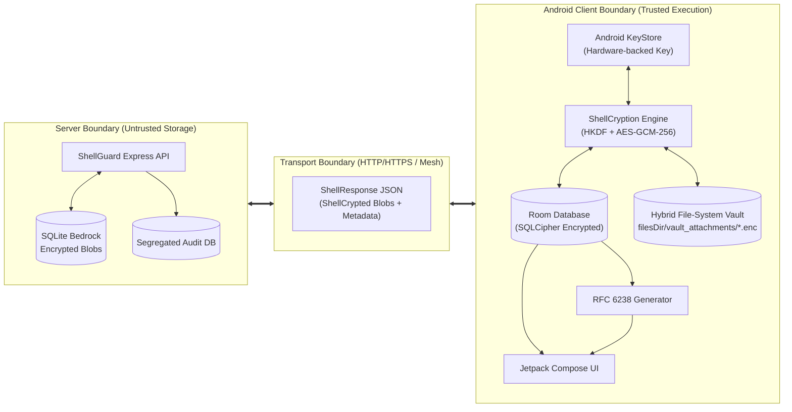
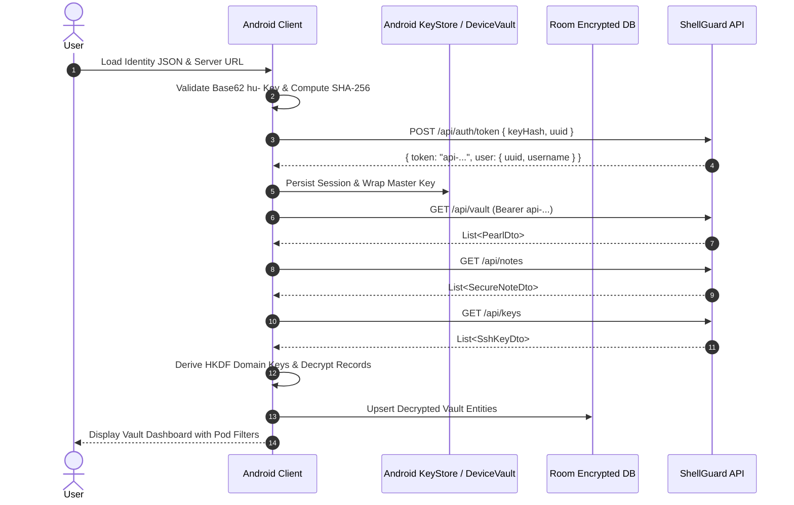
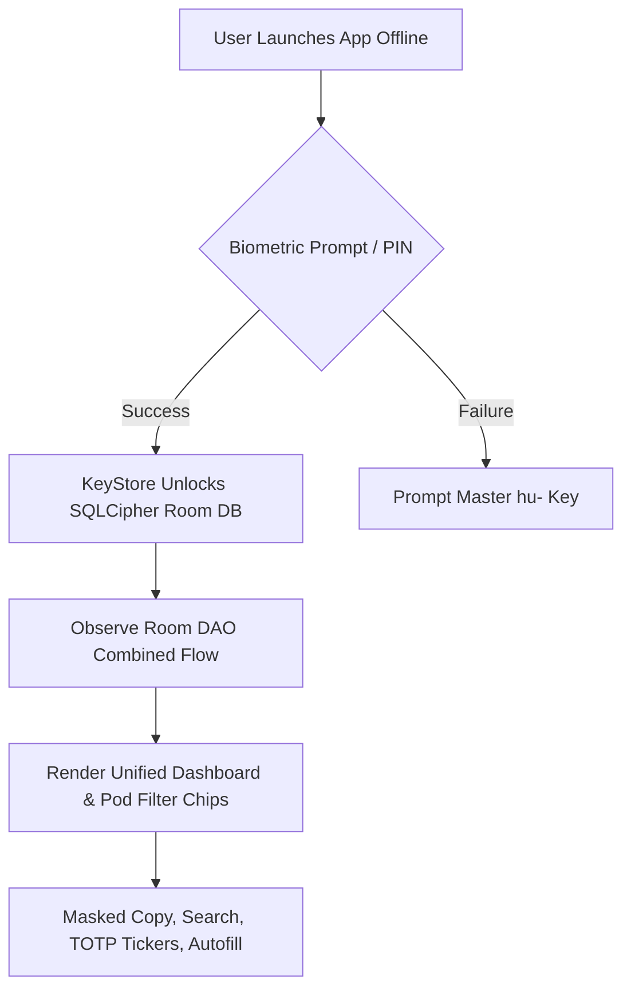
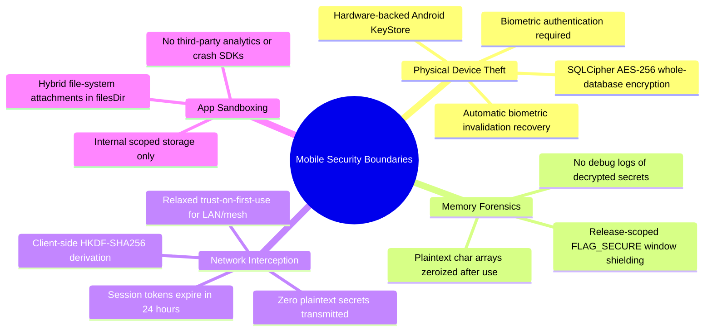

# 🏗️ ShellGuard Mobile — Client Architecture & Boundaries

> **Technical Blueprint: Client-Server Relationships, System Boundaries & Mobile Architecture**  
> *Targeted for Google AI Studio Android Application Generator.*

---

## 1. System Role & Philosophy

The **ShellGuard Mobile** Android application operates as the **full secrets vault native Android client** connected to self-hosted ShellGuard servers or operating in sovereign offline autonomy.

- **Full Secrets Vault**: Provides full bidirectional access across all secrets domains: **Vault Pearls (Logins/Passwords)**, **Secure Notes**, **SSH Keys**, **Secure Attachments**, and integrated **TOTP generation**.
- **Autonomous Operability**: Follows the Bitwarden offline paradigm: when disconnected from the server, 100% of read, search, copy, autofill, and TOTP ticker functionality remains operational. Mutation actions (create/edit/delete) are guarded to prevent split-brain conflicts.
- **Zero-Knowledge Decryption**: The server stores only opaque `ShellCryption` ciphertext envelopes. The Android client independently derives domain-specific AES-GCM-256 keys from the human master key (`hu-`) using HKDF-SHA256 and decrypts secrets strictly in client volatile memory.

---

## 2. Client-Server Division of Responsibilities

| Responsibility Area | ShellGuard Web Server | ShellGuard Mobile Android Client |
|---|---|---|
| **Identity & Authentication** | Validates SHA-256 key hash of `hu-` key; issues short-lived bearer session token. | Captures `hu-` / `lb-` key via file upload or paste, validates Base62 format, hashes key locally, and requests session token. |
| **Secrets Decryption** | **NEVER** decrypts secrets. Stores only ShellCryption ciphertext envelopes. | Derives domain-bound AES keys via HKDF-SHA256 and decrypts passwords, notes, and SSH keys in ephemeral memory. |
| **Storage & Persistence** | Authoritative remote store (`vault_pearls`, `vault_secure_notes`, `vault_ssh_keys`). | Local offline cache in SQLCipher Room DB. Full vault access persists across app restarts without network. |
| **Attachment Handling** | Stores encrypted binary blobs in filesystem storage. | Hybrid File-System Vault: metadata in Room, ciphertext streamed to disk in 64KB buffers to avoid 2MB `CursorWindow` limits. |
| **Delta Synchronization** | Serves full/filtered domain records and accepts mutation requests. | Bidirectional delta sync: reconciles server timestamps, pushes local pending changes, and prunes remotely deleted items. |
| **Biometric Security** | No awareness of biometrics. | Protects cached vault keys in hardware `AndroidKeyStore` with `BiometricPrompt` and key-invalidation recovery. |

---

## 3. Lifecycle & Operational Modes

### Mode A: Initial Setup & Gateway Authentication (Online)
1. **User Identity Pairing**: User loads their `shellguard_identity_*.json` file or pastes their 67-character Base62 `hu-...` Human Identity Key.
2. **Server Discovery**: User configures server URL (e.g. `http://192.168.1.5:6464` or `https://vault.example.com`).
3. **Session Authentication**: Client sends `SHA-256(huKey)` and owner UUID to `POST /api/auth/token`, receiving session token `api-...`.
4. **Master Key Sealing**: If biometrics are enabled, the raw key is encrypted using a KeyStore-generated AES-256-GCM key and saved in `EncryptedSharedPreferences`.
5. **Initial Vault Hydration**: Client initiates downstream delta sync across all domains (`vault_pearls`, `vault_secure_notes`, `vault_ssh_keys`), decrypts items, and populates the local Room database.

---

### Mode B: Everyday Offline Operation (Zero Network)
1. **App Launch**: User opens app without internet connection.
2. **Biometric Unlock**: Biometric prompt verifies identity and unseals database encryption keys.
3. **Instant Cached Display**: Room DB streams unified items (`UnifiedVaultItem`) via Kotlin `Flow`.
4. **Full Read-Only Access**: View passwords, copy credentials with sensitive masking, read notes, inspect SSH keys, and run TOTP countdown rings.
5. **Mutation Guards**: UI dims create/edit/delete controls and displays an amber `OfflineReadOnly` banner, preventing split-brain divergence.

---

### Mode C: Background / Foreground Bidirectional Sync (Connected)
1. **Trigger**: Foreground pull-to-refresh, navigation focus, or Android `ConnectivityManager.NetworkCallback` reconnect.
2. **Health Probe**: Client probes `GET /api/health` to confirm server reachability.
3. **Token Refresh**: If session token has expired, silent re-authentication executes using stored key hash.
4. **Reconciliation**:
   - Pushes any local pending changes.
   - Pulls server deltas across Pearls, Notes, and SSH Keys.
   - Timestamp comparison determines server-wins resolution.
   - Prunes local records deleted remotely.
   - Updates `SyncMetadataEntity.lastSyncTimestamp`.

---

## 4. Mobile Threat Model & Defenses

1. **Hardware-Backed Cryptographic Isolation**: Master keys never live in unencrypted preferences. Key derivation utilizes `AndroidKeyStore` with `setUserAuthenticationRequired(true)`.
2. **Memory Hygiene & Secret Zeroization**: Plaintext secrets are cleared from RAM upon session lock or screen exit.
3. **Screen Capture Defense (`FLAG_SECURE`)**: Scoped to release builds, blocking screen recorders, malware overlays, and task-switcher previews while preserving developer inspection in debug builds.
4. **Sensitive Clipboard Masking (CWE-359)**: Password copies apply `ClipDescription.EXTRA_IS_SENSITIVE = true` to suppress visual cleartext previews in Android 13+ clipboard overlays, paired with an automated 30s background scrub timer.
5. **Emergency Panic Purge (`ACTION_PANIC_WIPE`)**: Broadcast receiver executes an instant irreversible wipe across KeyStore aliases, EncryptedSharedPreferences, Room database files, and terminates the process immediately.

---

  Engineered with precision for the ClawStack / ShellGuard ecosystem.

