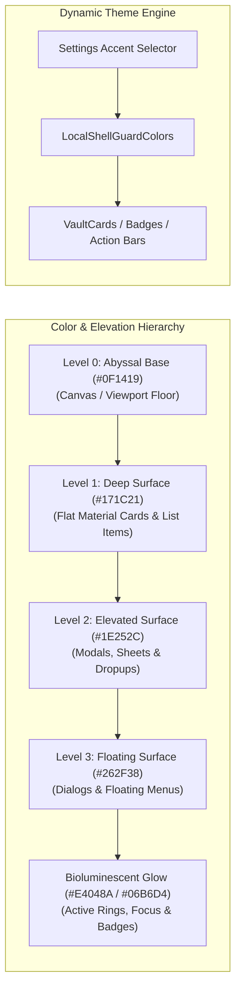
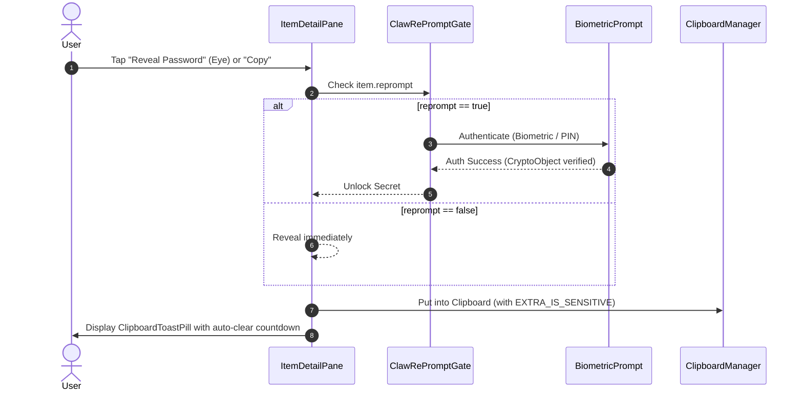

# 🦞 ShellGuard Mobile — Design System: Reef Modernist Mobile

> **Material Design 3 Adaptation of the Reef Modernist ("Bioluminescent Defense") Design Language**  
> *Engineered for Native Android Jetpack Compose with Flat Exoskeletal Shells, Dynamic Theme Accents, Master-Detail Adaptive Ergonomics, Smooth Motion & Tactile Feedback.*

---

## 💎 1. Brand & Visual Identity

**Reef Modernist Mobile** translates ShellGuard’s desktop and web vault design language into a high-performance, touch-first Android experience. It embodies **Bioluminescent Defense**—organic marine resilience fused with sharp, mathematical cryptographic precision.

The mobile interface treats authentication and data protection not as an opaque wall, but as an active, luminous carapace:

- **Exoskeletal Shells (Flat Material 3 Cards)**: Containers use clean geometric contours (`12dp`–`16dp` rounded corners), crisp 1dp structural borders (`#3D484E`), and subtle tonal surface elevations rather than heavy drop shadows.
- **Bioluminescent Glow**: Active items, countdown progress arcs, focus rings, and clipboard copy feedback glow with electric **Claw Cyan** (`#06B6D4`) and signature **Lobster Red** (`#E4048A`), shifting dynamically as cryptographic states transition.
- **Dual-Mode Fluidity**: Full native support for **Abyssal Dark** (Default Vault Mode) and **Ocean Mist** (Crisp Light Mode), with seamless theme transition support.
- **Dynamic Accent Customization**: Users can personalize their vault accent directly from Settings, choosing between 6 curated ShellGuard palettes (*Reef Bioluminescent, Electric Cyan, Imperial Shell, Emerald Bio-Flora, Solar Vent, Minimalist Pearl*) with dynamic Compose inheritance.
- **Glanceable Cryptographic Precision**: Large 3x3 grouped monospace digits (`123 456`) for TOTP, masked passwords with biometric re-prompt gates, and high-visibility monospace fingerprints for SSH keys.
- **Master-Detail Ergonomics**: Bitwarden-style three-pane responsive hierarchy adapting effortlessly across handheld phones, foldable devices, and widescreen tablets.



---

## 👁️ 2. The Blind Side-by-Side Presentation Test

If an end user or auditor is shown **ShellGuard Web** on a desktop browser and **ShellGuard Mobile** on an Android phone or tablet side-by-side with brand titles masked:
1. **Color Signature**: The exact same Abyssal Dark background (`#0F1419`), Deep Surface (`#171C21`), and crisp Carapace Ridge (`#3D484E` / `#3D484E`) create an identical physical tone.
2. **Typography**: The unmistakable pairing of `Outfit` headlines, `Inter` interface body text, and `JetBrains Mono` for secrets and cryptographic hashes.
3. **Accent Dynamics**: The canonical dual-tone neon interplay between **Lobster Red** (`#E4048A`) and **Claw Cyan** (`#06B6D4`).
4. **Three-Pane Layout**: The left folder tree (Pods), middle item list with type filters, and right inspection pane on tablets reproduce the exact desktop layout ergonomics.
5. **Bitwarden Custom Fields**: Text, Hidden, Checkbox, and Linked fields render with identical iconography and badge stylings.
6. **Bioluminescent Feedback**: Copy actions trigger the same glowing emerald confirmation checkmark, and TOTP timers run the identical counter-clockwise depleting circular progress ring.

---

## 🎨 3. Palette & Dynamic Theme Tokens

Aligned 1:1 with ShellGuard's web design tokens (`DESIGN.md`), calibrated for Jetpack Compose:

### 🌑 Dark Mode (Abyssal Dark — Default)
- **Base Canvas (`--bg-base`)**: `Color(0xFF0F1419)` (`rgb(15, 20, 25)`)
- **Surface Card (`--bg-surface`)**: `Color(0xFF171C21)` (`rgb(23, 28, 33)`)
- **Elevated Surface**: `Color(0xFF1E252C)` (`rgb(30, 37, 44)`)
- **Floating Surface**: `Color(0xFF262F38)` (`rgb(38, 47, 56)`)
- **Text Main (`--text-main`)**: `Color(0xFFDEE3EA)` (`rgb(222, 227, 234)`)
- **Text Muted (`--text-muted`)**: `Color(0xFF879298)` (`rgb(135, 146, 152)`)
- **Border Subtle (`--border-subtle`)**: `Color(0xFF3D484E)` (`rgb(61, 72, 78)`)
- **Header Accent Border**: `Color(0xFFE4048A)` (Lobster Red)

### ☀️ Light Mode (Ocean Mist)
- **Base Canvas (`--bg-base`)**: `Color(0xFFF1F5F9)` (`rgb(241, 245, 249)`)
- **Surface Card (`--bg-surface`)**: `Color(0xFFFFFFFF)` (`rgb(255, 255, 255)`)
- **Elevated Surface**: `Color(0xFFF8FAFC)` (`rgb(248, 250, 252)`)
- **Floating Surface**: `Color(0xFFFFFFFF)`
- **Text Main (`--text-main`)**: `Color(0xFF0F172A)` (`rgb(15, 23, 42)`)
- **Text Muted (`--text-muted`)**: `Color(0xFF64748B)` (`rgb(100, 116, 139)`)
- **Border Subtle (`--border-subtle`)**: `Color(0xFFCBD5E1)` (`rgb(203, 213, 225)`)
- **Header Accent Border**: `Color(0xFF3B0764)` (ShellGuard Purple)

---

## 🌈 4. Dynamic Theme Accent Palettes

Users can personalize their vault accent directly from Settings. All 6 curated palettes maintain high contrast against both Abyssal Dark and Ocean Mist canvases:

| Accent Enum | Name | Primary Accent | Secondary / Glow | Character & Vibe |
|:---|:---|:---|:---|:---|
| `REEF_DEFAULT` | **Reef Bioluminescent** | `#E4048A` (Lobster Red) | `#06B6D4` (Claw Cyan) | Canonical ShellGuard dual-tone signature |
| `CYAN_VENT` | **Electric Cyan** | `#06B6D4` (Claw Cyan) | `#E4048A` (Lobster Red) | Crisp hydro-thermal neon focus |
| `PURPLE_SHELL`| **Imperial Shell** | `#A855F7` (Deep Purple) | `#06B6D4` (Claw Cyan) | Regal executive vault carapace |
| `EMERALD_TRENCH`| **Emerald Bio-Flora** | `#10B981` (Emerald) | `#06B6D4` (Claw Cyan) | Subaquatic luminescence & vitality |
| `AMBER_FLARE` | **Solar Vent** | `#F59E0B` (Amber Gold) | `#E4048A` (Lobster Red) | Warm high-visibility solar beacon |
| `MONOCHROME` | **Minimalist Pearl** | `#F8FAFC` (Pure Pearl) | `#879298` (Muted Steel) | Stealth, zero-distraction monochrome |

---

## 💻 5. Kotlin Theme Engine (`Theme.kt` & `Color.kt`)

```kotlin
package com.clawstack.shellguard.ui.theme

import androidx.compose.foundation.isSystemInDarkTheme
import androidx.compose.material3.*
import androidx.compose.runtime.*
import androidx.compose.ui.graphics.Color

// ── Canonical ShellGuard Brand Colors ───────────────────────────
val BrandLobsterRed = Color(0xFFE4048A)      // Primary Action / Brand Gradient
val BrandClawCyan = Color(0xFF06B6D4)        // Secondary Action / Active Vents
val BrandPurple = Color(0xFF3B0764)          // ShellGuard Dark Purple
val BrandCoralOrange = Color(0xFFF97316)      // Warning & Offline Status
val BrandEmerald = Color(0xFF10B981)          // Success / Validated State

// ── Dark Mode Tokens (Abyssal Dark) ─────────────────────────────
val DarkBgBase = Color(0xFF0F1419)           // Canvas Viewport Floor
val DarkBgSurface = Color(0xFF171C21)        // Card / Container Surface
val DarkBgElevated = Color(0xFF1E252C)       // Sheets / Modals / Toolbars
val DarkBgFloating = Color(0xFF262F38)       // Dialogs & Dropups
val DarkTextMain = Color(0xFFDEE3EA)         // Luminous Shell Headlines & Codes
val DarkTextMuted = Color(0xFF879298)        // Secondary Subtitles & Timestamps
val DarkBorderSubtle = Color(0xFF3D484E)     // Carapace Ridge 1dp Outlines

// ── Light Mode Tokens (Ocean Mist) ──────────────────────────────
val LightBgBase = Color(0xFFF1F5F9)          // Ocean Mist Canvas
val LightBgSurface = Color(0xFFFFFFFF)       // Crisp White Card Surface
val LightBgElevated = Color(0xFFF8FAFC)      // Elevated Surfaces
val LightBgFloating = Color(0xFFFFFFFF)
val LightTextMain = Color(0xFF0F172A)        // Slate 900 Typography
val LightTextMuted = Color(0xFF64748B)       // Slate 500 Subtitles
val LightBorderSubtle = Color(0xFFCBD5E1)    // Slate 300 Outlines

// ── Theme Accents Enum ──────────────────────────────────────────
enum class ThemeAccent(
    val displayName: String,
    val primaryColor: Color,
    val secondaryColor: Color
) {
    REEF_DEFAULT("Reef Bioluminescent", BrandLobsterRed, BrandClawCyan),
    CYAN_VENT("Electric Cyan", BrandClawCyan, BrandLobsterRed),
    PURPLE_SHELL("Imperial Shell", Color(0xFFA855F7), BrandClawCyan),
    EMERALD_TRENCH("Emerald Bio-Flora", BrandEmerald, BrandClawCyan),
    AMBER_FLARE("Solar Vent", Color(0xFFF59E0B), BrandLobsterRed),
    MONOCHROME("Minimalist Pearl", Color(0xFFF8FAFC), Color(0xFF879298))
}

enum class ThemeMode {
    SYSTEM, DARK, LIGHT
}

// ── Dynamic Color Scheme Carrier ─────────────────────────────────
@Immutable
data class ShellGuardCustomColors(
    val bgBase: Color,
    val bgSurface: Color,
    val bgElevated: Color,
    val bgFloating: Color,
    val textMain: Color,
    val textMuted: Color,
    val borderSubtle: Color,
    val primaryAccent: Color,
    val secondaryAccent: Color,
    val warning: Color = BrandCoralOrange,
    val danger: Color = BrandLobsterRed,
    val success: Color = BrandEmerald
)

val LocalShellGuardColors = staticCompositionLocalOf<ShellGuardCustomColors> {
    error("No ShellGuardColors provided")
}

@Composable
fun ShellGuardTheme(
    themeMode: ThemeMode = ThemeMode.DARK,
    accent: ThemeAccent = ThemeAccent.REEF_DEFAULT,
    content: @Composable () -> Unit
) {
    val isDark = when (themeMode) {
        ThemeMode.SYSTEM -> isSystemInDarkTheme()
        ThemeMode.DARK -> true
        ThemeMode.LIGHT -> false
    }

    val customColors = if (isDark) {
        ShellGuardCustomColors(
            bgBase = DarkBgBase,
            bgSurface = DarkBgSurface,
            bgElevated = DarkBgElevated,
            bgFloating = DarkBgFloating,
            textMain = DarkTextMain,
            textMuted = DarkTextMuted,
            borderSubtle = DarkBorderSubtle,
            primaryAccent = accent.primaryColor,
            secondaryAccent = accent.secondaryColor
        )
    } else {
        ShellGuardCustomColors(
            bgBase = LightBgBase,
            bgSurface = LightBgSurface,
            bgElevated = LightBgElevated,
            bgFloating = LightBgFloating,
            textMain = LightTextMain,
            textMuted = LightTextMuted,
            borderSubtle = LightBorderSubtle,
            primaryAccent = accent.primaryColor,
            secondaryAccent = accent.secondaryColor
        )
    }

    val materialColors = if (isDark) {
        darkColorScheme(
            primary = accent.primaryColor,
            onPrimary = if (accent == ThemeAccent.MONOCHROME) DarkBgBase else Color.White,
            secondary = accent.secondaryColor,
            background = DarkBgBase,
            onBackground = DarkTextMain,
            surface = DarkBgSurface,
            onSurface = DarkTextMain,
            surfaceVariant = DarkBgElevated,
            onSurfaceVariant = DarkTextMuted,
            outline = DarkBorderSubtle,
            error = BrandLobsterRed
        )
    } else {
        lightColorScheme(
            primary = accent.primaryColor,
            onPrimary = Color.White,
            secondary = accent.secondaryColor,
            background = LightBgBase,
            onBackground = LightTextMain,
            surface = LightBgSurface,
            onSurface = LightTextMain,
            surfaceVariant = LightBgElevated,
            onSurfaceVariant = LightTextMuted,
            outline = LightBorderSubtle,
            error = BrandLobsterRed
        )
    }

    CompositionLocalProvider(LocalShellGuardColors provides customColors) {
        MaterialTheme(
            colorScheme = materialColors,
            typography = ShellGuardTypography,
            content = content
        )
    }
}
```

---

## 🔤 6. Typography & Monospace Hierarchy

Typography is calibrated for instant readability, high-speed scanning, and developer-grade cryptographic precision:

```
Headlines:   Outfit (Bold 700 / ExtraBold 800, tracking -0.02em)
Body Text:   Inter (Regular 400 / Medium 500 / SemiBold 600, tracking -0.01em)
Monospace:   JetBrains Mono (Regular 400 / Bold 700)
```

```kotlin
package com.clawstack.shellguard.ui.theme

import androidx.compose.material3.Typography
import androidx.compose.ui.text.TextStyle
import androidx.compose.ui.text.font.FontFamily
import androidx.compose.ui.text.font.FontWeight
import androidx.compose.ui.unit.sp

val ShellGuardTypography = Typography(
    headlineLarge = TextStyle(
        fontFamily = FontFamily.SansSerif, // Outfit via res/font/outfit_bold.ttf
        fontWeight = FontWeight.Bold,
        fontSize = 28.sp,
        lineHeight = 34.sp,
        letterSpacing = (-0.5).sp
    ),
    headlineMedium = TextStyle(
        fontFamily = FontFamily.SansSerif,
        fontWeight = FontWeight.Bold,
        fontSize = 22.sp,
        lineHeight = 28.sp
    ),
    headlineSmall = TextStyle(
        fontFamily = FontFamily.SansSerif,
        fontWeight = FontWeight.SemiBold,
        fontSize = 18.sp,
        lineHeight = 24.sp
    ),
    bodyLarge = TextStyle(
        fontFamily = FontFamily.SansSerif, // Inter via res/font/inter_regular.ttf
        fontWeight = FontWeight.Normal,
        fontSize = 15.sp,
        lineHeight = 22.sp
    ),
    bodyMedium = TextStyle(
        fontFamily = FontFamily.SansSerif,
        fontWeight = FontWeight.Normal,
        fontSize = 13.sp,
        lineHeight = 18.sp
    ),
    labelSmall = TextStyle(
        fontFamily = FontFamily.SansSerif,
        fontWeight = FontWeight.SemiBold,
        fontSize = 11.sp,
        lineHeight = 14.sp,
        letterSpacing = 0.5.sp
    ),
    displayLarge = TextStyle(
        fontFamily = FontFamily.Monospace, // JetBrains Mono
        fontWeight = FontWeight.Bold,
        fontSize = 32.sp,
        lineHeight = 36.sp,
        letterSpacing = 3.sp
    ),
    displayMedium = TextStyle(
        fontFamily = FontFamily.Monospace,
        fontWeight = FontWeight.Bold,
        fontSize = 22.sp,
        lineHeight = 26.sp,
        letterSpacing = 2.sp
    ),
    displaySmall = TextStyle(
        fontFamily = FontFamily.Monospace,
        fontWeight = FontWeight.Medium,
        fontSize = 13.sp,
        lineHeight = 16.sp
    )
)
```

---

## 🏛️ 7. Adaptive Master-Detail Architecture (Phone, Foldable, Tablet)

On Android, screen widths vary from 360dp phones to 600dp foldables and 1200dp tablets. ShellGuard Mobile implements the **Adaptive Master-Detail Pattern**:

```
[ PHONE (< 600dp) ]
┌───────────────────────────┐         ┌───────────────────────────┐
│ 🐚 ShellGuard       🔍 ➕ │  Tap    │ 🔑 GitHub Corporate    ⭐ │
│ ───────────────────────── │ ──────> │ 👤 octocat@github.com     │
│ 🔑 GitHub Corporate       │         │ •••••••••••••••• 👁️ 📋   │
│ 📝 AWS Root Key           │         │ ⏱️ 842 190 (24s)         │
│ 🔒 Server SSH Key         │         │ [ Edit ] [ Delete ]       │
└───────────────────────────┘         └───────────────────────────┘
          List View                            Detail View

[ TABLET / EXPANDED (>= 840dp) - 3-Pane Parity with Desktop ]
┌─────────────────┬─────────────────────────┬──────────────────────────────┐
│  Sidebar Tree   │     Item List Pane      │      Item Detail Pane        │
│  (Folder Pods)  │  (Search & Type Filter) │ (Secrets, Custom Fields, CF) │
│                 │                         │                              │
│ 📁 All Vaults   │ 🔍 Search secrets...    │ 🔑 GitHub Corporate         │
│ 📁 Personal     │                         │ 👤 octocat@github.com        │
│ 📁 Work/Finance │ 📝 AWS Root Key         │ •••••••••••••••• 👁️ 📋     │
│ 📁 Infrastructure│ 🔑 GitHub Corporate    │ ⏱️ 842 190 (24s)           │
│                 │ 🔒 Server SSH           │ 📝 Custom Fields (4)         │
│                 │                         │ 📎 Attachments (2)           │
└─────────────────┴─────────────────────────┴──────────────────────────────┘
```

### Adaptive Window Scaffolding (`MasterDetailScaffold.kt`)

```kotlin
package com.clawstack.shellguard.ui.layout

import androidx.compose.foundation.layout.*
import androidx.compose.material3.windowsizeclass.WindowWidthSizeClass
import androidx.compose.runtime.Composable
import androidx.compose.ui.Modifier
import androidx.compose.ui.unit.dp

@Composable
fun MasterDetailScaffold(
    windowWidthSizeClass: WindowWidthSizeClass,
    sidebarContent: @Composable () -> Unit,
    listContent: @Composable () -> Unit,
    detailContent: @Composable () -> Unit,
    selectedItemId: String?,
    modifier: Modifier = Modifier
) {
    when (windowWidthSizeClass) {
        WindowWidthSizeClass.Expanded -> {
            // Three-Pane Desktop-Parity Layout (Sidebar 240dp, List 340dp, Detail Remaining)
            Row(modifier = modifier.fillMaxSize()) {
                Box(modifier = Modifier.width(240.dp).fillMaxHeight()) {
                    sidebarContent()
                }
                Box(modifier = Modifier.width(340.dp).fillMaxHeight()) {
                    listContent()
                }
                Box(modifier = Modifier.weight(1f).fillMaxHeight()) {
                    detailContent()
                }
            }
        }
        WindowWidthSizeClass.Medium -> {
            // Two-Pane Foldable Layout (List 360dp, Detail Remaining)
            Row(modifier = modifier.fillMaxSize()) {
                Box(modifier = Modifier.width(360.dp).fillMaxHeight()) {
                    listContent()
                }
                Box(modifier = Modifier.weight(1f).fillMaxHeight()) {
                    detailContent()
                }
            }
        }
        else -> {
            // Compact Phone: Single pane navigated by Compose Navigation
            Box(modifier = modifier.fillMaxSize()) {
                if (selectedItemId != null) {
                    detailContent()
                } else {
                    listContent()
                }
            }
        }
    }
}
```

---

## 🟡 8. Bitwarden-Style Offline State & Status Banners

When the device drops connection to the self-hosted ShellGuard instance (or when in airplane mode), the vault enters `VaultConnectionState.OfflineReadOnly`. 

### The Status Banner (`BitwardenOfflineBanner.kt`)
The banner anchors to the top of the vault list beneath the top bar:

```kotlin
package com.clawstack.shellguard.ui.components

import androidx.compose.animation.*
import androidx.compose.foundation.background
import androidx.compose.foundation.clickable
import androidx.compose.foundation.layout.*
import androidx.compose.foundation.shape.RoundedCornerShape
import androidx.compose.material.icons.Icons
import androidx.compose.material.icons.filled.CloudDone
import androidx.compose.material.icons.filled.CloudOff
import androidx.compose.material.icons.filled.Refresh
import androidx.compose.material3.Icon
import androidx.compose.material3.Text
import androidx.compose.runtime.Composable
import androidx.compose.ui.Alignment
import androidx.compose.ui.Modifier
import androidx.compose.ui.draw.clip
import androidx.compose.ui.text.font.FontWeight
import androidx.compose.ui.unit.dp
import androidx.compose.ui.unit.sp
import com.clawstack.shellguard.ui.theme.LocalShellGuardColors

enum class VaultConnectionState {
    CONNECTED,
    CONNECTING,
    OFFLINE_READ_ONLY
}

@Composable
fun BitwardenOfflineBanner(
    connectionState: VaultConnectionState,
    onRetryConnect: () -> Unit,
    modifier: Modifier = Modifier
) {
    val colors = LocalShellGuardColors.current

    AnimatedVisibility(
        visible = connectionState == VaultConnectionState.OFFLINE_READ_ONLY,
        enter = expandVertically() + fadeIn(),
        exit = shrinkVertically() + fadeOut(),
        modifier = modifier.fillMaxWidth()
    ) {
        Box(
            modifier = Modifier
                .fillMaxWidth()
                .padding(horizontal = 16.dp, vertical = 6.dp)
                .clip(RoundedCornerShape(10.dp))
                .background(colors.warning.copy(alpha = 0.15f))
                .padding(horizontal = 14.dp, vertical = 10.dp)
        ) {
            Row(
                modifier = Modifier.fillMaxWidth(),
                verticalAlignment = Alignment.CenterVertically,
                horizontalArrangement = Arrangement.SpaceBetween
            ) {
                Row(
                    verticalAlignment = Alignment.CenterVertically,
                    modifier = Modifier.weight(1f)
                ) {
                    Icon(
                        imageVector = Icons.Default.CloudOff,
                        contentDescription = "Offline Mode",
                        tint = colors.warning,
                        modifier = Modifier.size(18.dp)
                    )
                    Spacer(modifier = Modifier.width(10.dp))
                    Column {
                        Text(
                            text = "Offline Mode — Vault is read-only",
                            color = colors.textMain,
                            fontSize = 13.sp,
                            fontWeight = FontWeight.SemiBold
                        )
                        Text(
                            text = "Cached locally. Connect to add or edit items.",
                            color = colors.textMuted,
                            fontSize = 11.sp
                        )
                    }
                }
                Icon(
                    imageVector = Icons.Default.Refresh,
                    contentDescription = "Retry Connection",
                    tint = colors.warning,
                    modifier = Modifier
                        .size(20.dp)
                        .clickable { onRetryConnect() }
                )
            }
        }
    }
}
```

### Mutation Guards in Offline Mode:
1. **FAB Speed Dial**: Rendered disabled with 0.38f alpha. Tapping shows a toast: *"Connect to server to add vault items."*
2. **Item Detail Actions**: The `Edit` (pencil) and `Delete` (trash) buttons in `ItemDetailPane` are disabled (`alpha = 0.38f`, non-clickable).
3. **Data Availability**: Decrypted passwords, TOTP codes, Secure Notes, and SSH keys remain **100% accessible, copyable, and searchable**.

---

## 🎴 9. The 4 Vault Domain Cards & Spring Press Feedback

ShellGuard Mobile supports all 4 core vault domains:
1. **Vault Pearls** (Passwords & Logins)
2. **TOTP Codes** (Two-Factor Authentication)
3. **Secure Notes** (Encrypted text & markdown)
4. **SSH Keys** (Encrypted private keys & public keys)

All cards feature **Spring Scale Press Physics** (scales down to `0.97f` on touch down with damping `0.75f` and stiffness `400f`), paired with **Haptic Long-Press Feedback** on copy:

### A. The Vault Pearl Card (`VaultPearlCard.kt`)

```kotlin
package com.clawstack.shellguard.ui.components

import androidx.compose.animation.core.animateFloatAsState
import androidx.compose.animation.core.spring
import androidx.compose.foundation.*
import androidx.compose.foundation.interaction.MutableInteractionSource
import androidx.compose.foundation.interaction.collectIsPressedAsState
import androidx.compose.foundation.layout.*
import androidx.compose.foundation.shape.CircleShape
import androidx.compose.foundation.shape.RoundedCornerShape
import androidx.compose.material.icons.Icons
import androidx.compose.material.icons.filled.ContentCopy
import androidx.compose.material.icons.filled.Lock
import androidx.compose.material.icons.filled.Star
import androidx.compose.material3.*
import androidx.compose.runtime.*
import androidx.compose.ui.Alignment
import androidx.compose.ui.Modifier
import androidx.compose.ui.draw.clip
import androidx.compose.ui.draw.scale
import androidx.compose.ui.hapticfeedback.HapticFeedbackType
import androidx.compose.ui.platform.LocalHapticFeedback
import androidx.compose.ui.text.font.FontWeight
import androidx.compose.ui.unit.dp
import androidx.compose.ui.unit.sp
import com.clawstack.shellguard.ui.theme.LocalShellGuardColors

@OptIn(ExperimentalFoundationApi::class)
@Composable
fun VaultPearlCard(
    title: String,
    username: String?,
    url: String?,
    category: String?,
    hasTotp: Boolean,
    reprompt: Boolean,
    isFavorite: Boolean,
    onClick: () -> Unit,
    onQuickCopyPassword: () -> Unit,
    modifier: Modifier = Modifier
) {
    val colors = LocalShellGuardColors.current
    val haptic = LocalHapticFeedback.current
    val interactionSource = remember { MutableInteractionSource() }
    val isPressed by interactionSource.collectIsPressedAsState()

    val scale by animateFloatAsState(
        targetValue = if (isPressed) 0.97f else 1.0f,
        animationSpec = spring(dampingRatio = 0.75f, stiffness = 400f),
        label = "CardSpringScale"
    )

    Card(
        modifier = modifier
            .fillMaxWidth()
            .scale(scale)
            .combinedClickable(
                interactionSource = interactionSource,
                indication = null,
                onClick = onClick,
                onLongClick = {
                    haptic.performHapticFeedback(HapticFeedbackType.LongPress)
                    onQuickCopyPassword()
                }
            ),
        shape = RoundedCornerShape(16.dp),
        colors = CardDefaults.cardColors(containerColor = colors.bgSurface),
        border = BorderStroke(1.dp, colors.borderSubtle),
        elevation = CardDefaults.cardElevation(defaultElevation = 0.dp)
    ) {
        Row(
            modifier = Modifier
                .fillMaxWidth()
                .padding(14.dp),
            verticalAlignment = Alignment.CenterVertically,
            horizontalArrangement = Arrangement.SpaceBetween
        ) {
            Row(
                verticalAlignment = Alignment.CenterVertically,
                modifier = Modifier.weight(1f)
            ) {
                // Initial Badge / Favicon
                Box(
                    modifier = Modifier
                        .size(42.dp)
                        .clip(CircleShape)
                        .background(colors.bgElevated)
                        .border(1.dp, colors.borderSubtle, CircleShape),
                    contentAlignment = Alignment.Center
                ) {
                    Text(
                        text = title.firstOrNull()?.uppercase() ?: "🔑",
                        color = colors.primaryAccent,
                        fontSize = 17.sp,
                        fontWeight = FontWeight.Bold
                    )
                }

                Spacer(modifier = Modifier.width(12.dp))

                Column {
                    Row(verticalAlignment = Alignment.CenterVertically) {
                        Text(
                            text = title,
                            color = colors.textMain,
                            fontSize = 15.sp,
                            fontWeight = FontWeight.SemiBold,
                            maxLines = 1
                        )
                        if (reprompt) {
                            Spacer(modifier = Modifier.width(4.dp))
                            Icon(
                                imageVector = Icons.Default.Lock,
                                contentDescription = "Requires Biometric Re-prompt",
                                tint = colors.primaryAccent,
                                modifier = Modifier.size(12.dp)
                            )
                        }
                    }
                    if (!username.isNullOrBlank()) {
                        Text(
                            text = username,
                            color = colors.textMuted,
                            fontSize = 13.sp,
                            maxLines = 1
                        )
                    }
                    if (!url.isNullOrBlank()) {
                        Text(
                            text = url.removePrefix("https://").removePrefix("http://"),
                            color = colors.secondaryAccent,
                            fontSize = 11.sp,
                            maxLines = 1
                        )
                    }
                }
            }

            // Quick Actions: TOTP Indicator & Copy Action
            Row(verticalAlignment = Alignment.CenterVertically) {
                if (hasTotp) {
                    Box(
                        modifier = Modifier
                            .clip(RoundedCornerShape(6.dp))
                            .background(colors.secondaryAccent.copy(alpha = 0.15f))
                            .padding(horizontal = 6.dp, vertical = 3.dp)
                    ) {
                        Text(
                            text = "2FA",
                            color = colors.secondaryAccent,
                            fontSize = 10.sp,
                            fontWeight = FontWeight.Bold
                        )
                    }
                    Spacer(modifier = Modifier.width(8.dp))
                }
                IconButton(
                    onClick = {
                        haptic.performHapticFeedback(HapticFeedbackType.LongPress)
                        onQuickCopyPassword()
                    }
                ) {
                    Icon(
                        imageVector = Icons.Default.ContentCopy,
                        contentDescription = "Quick Copy Password",
                        tint = colors.textMuted,
                        modifier = Modifier.size(18.dp)
                    )
                }
            }
        }
    }
}
```

---

## ⏱️ 10. Dynamic Canvas Circular Countdown Ring (`TotpCountdownRing.kt`)

Used both within the standalone TOTP generator and embedded directly inside the `VaultPearlDetailView`:

```kotlin
package com.clawstack.shellguard.ui.components

import androidx.compose.animation.animateColorAsState
import androidx.compose.animation.core.tween
import androidx.compose.foundation.Canvas
import androidx.compose.foundation.layout.Box
import androidx.compose.foundation.layout.size
import androidx.compose.material3.Text
import androidx.compose.runtime.Composable
import androidx.compose.runtime.getValue
import androidx.compose.ui.Alignment
import androidx.compose.ui.Modifier
import androidx.compose.ui.graphics.StrokeCap
import androidx.compose.ui.graphics.drawscope.Stroke
import androidx.compose.ui.text.font.FontFamily
import androidx.compose.ui.text.font.FontWeight
import androidx.compose.ui.unit.dp
import androidx.compose.ui.unit.sp
import com.clawstack.shellguard.ui.theme.LocalShellGuardColors

@Composable
fun TotpCountdownRing(
    remainingSeconds: Int,
    progress: Float,
    modifier: Modifier = Modifier
) {
    val colors = LocalShellGuardColors.current

    val ringColor by animateColorAsState(
        targetValue = when {
            remainingSeconds <= 5 -> colors.danger
            remainingSeconds <= 10 -> colors.warning
            else -> colors.secondaryAccent
        },
        animationSpec = tween(400),
        label = "RingColorInterpolation"
    )

    Box(
        modifier = modifier.size(38.dp),
        contentAlignment = Alignment.Center
    ) {
        Canvas(modifier = Modifier.size(34.dp)) {
            // Track
            drawCircle(
                color = colors.borderSubtle,
                style = Stroke(width = 3.dp.toPx())
            )
            // Progress Arc
            drawArc(
                color = ringColor,
                startAngle = -90f,
                sweepAngle = progress * 360f,
                useCenter = false,
                style = Stroke(width = 3.dp.toPx(), cap = StrokeCap.Round)
            )
        }
        Text(
            text = "$remainingSeconds",
            color = ringColor,
            fontFamily = FontFamily.Monospace,
            fontSize = 11.sp,
            fontWeight = FontWeight.Bold
        )
    }
}
```

---

## ✨ 11. Bitwarden-Style Custom Fields Components

Custom fields appear in `ItemDetailPane` and `ItemFormScreen`. They support 4 field types with complete fidelity to Bitwarden and ShellGuard Web:

```kotlin
package com.clawstack.shellguard.ui.components

import androidx.compose.foundation.background
import androidx.compose.foundation.border
import androidx.compose.foundation.clickable
import androidx.compose.foundation.layout.*
import androidx.compose.foundation.shape.RoundedCornerShape
import androidx.compose.material.icons.Icons
import androidx.compose.material.icons.filled.*
import androidx.compose.material3.*
import androidx.compose.runtime.*
import androidx.compose.ui.Alignment
import androidx.compose.ui.Modifier
import androidx.compose.ui.draw.clip
import androidx.compose.ui.text.font.FontFamily
import androidx.compose.ui.text.font.FontWeight
import androidx.compose.ui.unit.dp
import androidx.compose.ui.unit.sp
import com.clawstack.shellguard.ui.theme.LocalShellGuardColors

enum class CustomFieldType {
    TEXT, HIDDEN, BOOLEAN, LINKED
}

@Composable
fun CustomFieldDisplayRow(
    label: String,
    value: String,
    type: CustomFieldType,
    onCopy: () -> Unit,
    modifier: Modifier = Modifier
) {
    val colors = LocalShellGuardColors.current
    var isRevealed by remember { mutableStateOf(false) }

    Row(
        modifier = modifier
            .fillMaxWidth()
            .clip(RoundedCornerShape(8.dp))
            .background(colors.bgElevated)
            .padding(horizontal = 12.dp, vertical = 10.dp),
        verticalAlignment = Alignment.CenterVertically,
        horizontalArrangement = Arrangement.SpaceBetween
    ) {
        Column(modifier = Modifier.weight(1f)) {
            Text(
                text = label.uppercase(),
                color = colors.textMuted,
                fontSize = 10.sp,
                fontWeight = FontWeight.Bold,
                letterSpacing = 0.5.sp
            )
            Spacer(modifier = Modifier.height(2.dp))
            when (type) {
                CustomFieldType.TEXT -> {
                    Text(text = value, color = colors.textMain, fontSize = 14.sp)
                }
                CustomFieldType.HIDDEN -> {
                    Text(
                        text = if (isRevealed) value else "••••••••••••",
                        color = colors.textMain,
                        fontFamily = FontFamily.Monospace,
                        fontSize = 14.sp
                    )
                }
                CustomFieldType.BOOLEAN -> {
                    val isChecked = value.toBooleanStrictOrNull() ?: false
                    Box(
                        modifier = Modifier
                            .clip(RoundedCornerShape(4.dp))
                            .background(if (isChecked) colors.success.copy(alpha = 0.2f) else colors.bgBase)
                            .padding(horizontal = 6.dp, vertical = 2.dp)
                    ) {
                        Text(
                            text = if (isChecked) "☑ Enabled" else "☐ Disabled",
                            color = if (isChecked) colors.success else colors.textMuted,
                            fontSize = 11.sp,
                            fontWeight = FontWeight.SemiBold
                        )
                    }
                }
                CustomFieldType.LINKED -> {
                    Row(verticalAlignment = Alignment.CenterVertically) {
                        Text(
                            text = "→ $value",
                            color = colors.secondaryAccent,
                            fontFamily = FontFamily.Monospace,
                            fontSize = 13.sp,
                            fontWeight = FontWeight.SemiBold
                        )
                    }
                }
            }
        }

        // Action Icons
        Row(verticalAlignment = Alignment.CenterVertically) {
            if (type == CustomFieldType.HIDDEN) {
                IconButton(onClick = { isRevealed = !isRevealed }, modifier = Modifier.size(32.dp)) {
                    Icon(
                        imageVector = if (isRevealed) Icons.Default.VisibilityOff else Icons.Default.Visibility,
                        contentDescription = "Toggle Visibility",
                        tint = colors.textMuted,
                        modifier = Modifier.size(16.dp)
                    )
                }
            }
            IconButton(onClick = onCopy, modifier = Modifier.size(32.dp)) {
                Icon(
                    imageVector = Icons.Default.ContentCopy,
                    contentDescription = "Copy Field",
                    tint = colors.textMuted,
                    modifier = Modifier.size(16.dp)
                )
            }
        }
    }
}
```

---

## 📝 12. Modal Form Architecture & Ergonomics (`ItemFormScreen.kt`)

For creating and editing vault items, ShellGuard Mobile adheres to the **Ergonomic Pinned Architecture**:

```
┌─────────────────────────────────────────────────────────────┐
│  [Favicon] Edit Login Item (Pinned Header)              [X] │
├─────────────────────────────────────────────────────────────┤
│  ▲ SCROLLABLE FORM BODY (.imePadding().verticalScroll())     │
│                                                             │
│  Title * [ GitHub Corporate        ]  Pod [ Work/Dev      ] │
│  Username [ octocat                ]  URL [ github.com    ] │
│  Password [ •••••••••••••••••••••• ] [ 🎲 Generator ]       │
│                                                             │
│  ── URIs & Match Mode ───────────────────────────────────   │
│  🔗 https://github.com/login    [ Base Domain ▼ ]           │
│  🔗 http://192.168.1.50:8080    [ Host ▼ ]                  │
│                                                             │
│  ── Security Flags ──────────────────────────────────────   │
│  🛡️ Require Master Password / Biometric Re-prompt    [ON]   │
│                                                             │
│  ── Custom Fields ────────────────────────────────────────  │
│  📝 Employee ID: ENG-8492                               [X] │
│  🔒 Recovery PIN: •••••••• (Hidden) 👁️                  [X] │
│                                                             │
│  ┌─────────────────────────────────┐                       │
│  │ ⏱️ TOTP Secret                   │                       │
│  │ 📎 Secure Attachment            │                       │
│  │ ✨ Custom Field                  │  (Dropup Menu ▲)      │
│  └─────────────────────────────────┘                       │
│  [+ Add Extra Field               ]                         │
│  ▼                                                          │
├─────────────────────────────────────────────────────────────┤
│  (Pinned Footer)                     [ Cancel ] [ Save Item ]│
└─────────────────────────────────────────────────────────────┘
```

### Ergonomic Rules:
1. **Pinned Header & Footer**: Action buttons ("Cancel", "Save Item") remain anchored at the bottom of the viewport above the soft keyboard.
2. **Keyboard Hardening (CWE-359)**: All secret password and seed inputs apply:
   ```kotlin
   visualTransformation = PasswordVisualTransformation(),
   keyboardOptions = KeyboardOptions(
       keyboardType = KeyboardType.Password,
       autoCorrectEnabled = false
   )
   ```
3. **Soft Keyboard Inset**: The form container applies `.imePadding()` and `.verticalScroll(rememberScrollState())` to prevent input fields from being hidden beneath the IME keyboard.
4. **Upward Dropup Menu**: The "+ Add Extra Field" menu expands **upward** above the button rather than downward, preventing truncation off the bottom edge of the screen.

---

## 🔒 13. Claw Re-Prompt Gate & Sensitive Clipboard Masking

When an item has `reprompt == true` (or when accessing high-security SSH keys), the application intercepts secret visibility and clipboard copies:



### Sensitive Clipboard Toast (`ClipboardToastPill.kt`)

```kotlin
package com.clawstack.shellguard.ui.components

import androidx.compose.animation.*
import androidx.compose.foundation.background
import androidx.compose.foundation.border
import androidx.compose.foundation.layout.*
import androidx.compose.foundation.shape.RoundedCornerShape
import androidx.compose.material.icons.Icons
import androidx.compose.material.icons.filled.CheckCircle
import androidx.compose.material3.Icon
import androidx.compose.material3.LinearProgressIndicator
import androidx.compose.material3.Text
import androidx.compose.runtime.Composable
import androidx.compose.ui.Alignment
import androidx.compose.ui.Modifier
import androidx.compose.ui.draw.clip
import androidx.compose.ui.text.font.FontWeight
import androidx.compose.ui.unit.dp
import androidx.compose.ui.unit.sp
import com.clawstack.shellguard.ui.theme.LocalShellGuardColors

@Composable
fun ClipboardToastPill(
    visible: Boolean,
    message: String,
    autoClearProgress: Float,
    remainingSeconds: Int,
    modifier: Modifier = Modifier
) {
    val colors = LocalShellGuardColors.current

    AnimatedVisibility(
        visible = visible,
        enter = slideInVertically(initialOffsetY = { it }) + fadeIn(),
        exit = slideOutVertically(targetOffsetY = { it }) + fadeOut(),
        modifier = modifier
            .padding(16.dp)
            .fillMaxWidth()
    ) {
        Column(
            modifier = Modifier
                .fillMaxWidth()
                .clip(RoundedCornerShape(12.dp))
                .background(colors.bgFloating)
                .border(1.dp, colors.primaryAccent.copy(alpha = 0.5f), RoundedCornerShape(12.dp))
                .padding(horizontal = 16.dp, vertical = 10.dp)
        ) {
            Row(
                verticalAlignment = Alignment.CenterVertically,
                horizontalArrangement = Arrangement.SpaceBetween,
                modifier = Modifier.fillMaxWidth()
            ) {
                Row(verticalAlignment = Alignment.CenterVertically) {
                    Icon(
                        imageVector = Icons.Default.CheckCircle,
                        contentDescription = "Copied",
                        tint = colors.primaryAccent,
                        modifier = Modifier.size(18.dp)
                    )
                    Spacer(modifier = Modifier.width(10.dp))
                    Text(
                        text = message,
                        color = colors.textMain,
                        fontSize = 13.sp,
                        fontWeight = FontWeight.Medium
                    )
                }
                Text(
                    text = "Clears in ${remainingSeconds}s",
                    color = colors.textMuted,
                    fontSize = 11.sp
                )
            }
            Spacer(modifier = Modifier.height(6.dp))
            LinearProgressIndicator(
                progress = { autoClearProgress },
                modifier = Modifier.fillMaxWidth().height(2.dp),
                color = colors.primaryAccent,
                trackColor = colors.borderSubtle
            )
        }
    }
}
```

---

## 🐣 14. "Hatch New Vault" Initial Launch Wizard (`HatchVaultScreen.kt`)

When first launched on a fresh Android install, the user must **never** be presented with a cold biometric request. Instead, they are stewarded through a welcoming 3-step wizard:

```
┌──────────────────────────────────────────────────────────┐
│                      [ 🛡️ / 🐚 ]                          │
│                                                          │
│                 Hatch Your Vault                         │
│   Choose how you'd like to protect your keys on device   │
│                                                          │
│     [ PIN Code (4–8 digits) ]   [ Master Password ]      │
│                                                          │
│                 [ Continue to Setup -> ]                 │
└──────────────────────────────────────────────────────────┘
                            │
                            ▼
┌──────────────────────────────────────────────────────────┐
│                   Set Your Vault PIN                     │
│               [ • • • • • • ] (4-8 Digits)               │
│               [ • • • • • • ] (Confirm)                  │
│                                                          │
│   ┌──────────────────────────────────────────────────┐   │
│   │ 🧬 Enable Biometric Unlock (Fingerprint / Face) [X]│   │
│   └──────────────────────────────────────────────────┘   │
│                                                          │
│                   [ Hatch My Vault ]                     │
└──────────────────────────────────────────────────────────┘
                            │
                            ▼
┌──────────────────────────────────────────────────────────┐
│                         [ ✅ ]                           │
│               Vault Hatched Successfully!                │
│                                                          │
│   ┌──────────────────────────────────────────────────┐   │
│   │ 1. 🔑 Create Passwords, Notes, SSH & 2FA Codes   │   │
│   │    Full zero-knowledge encryption on device      │   │
│   │ ──────────────────────────────────────────────── │   │
│   │ 2. ☁️ Connect to ShellGuard Server                │   │
│   │    Sync seamlessly over LAN, Tailscale, or HTTPS │   │
│   └──────────────────────────────────────────────────┘   │
│                                                          │
│                 [ Open My Vault ]                        │
└──────────────────────────────────────────────────────────┘
```

---

## 🔦 15. Interactive Spotlight Guided Tour (`SpotlightOverlay.kt`)

After completing the onboarding wizard, an **Interactive Spotlight Overlay** dims and blurs the screen background (`#E6030712`), blocking extraneous touches while punching out a glowing circular cutout over the **Settings Icon** / **Add Item FAB** in the top bar.

```
┌──────────────────────────────────────────────────────────┐
│  🐚 ShellGuard                      [ 🟢 Synced ]   ( ⚙️ ) │ <── Spotlight Cutout (Punched through scrim)
├──────────────────────────────────────────────────────────┤
│                                                          │
│  ▓▓▓▓▓▓▓▓▓▓▓▓▓▓▓▓▓▓▓▓▓▓▓▓▓▓▓▓▓▓▓▓▓▓▓▓▓▓▓▓▓▓▓▓▓▓▓▓▓▓▓▓▓▓▓  │
│  ▓▓               ┌──────────────────────┐             ▓▓  │
│  ▓▓               │  ☁️ Connect to Server │             ▓▓  │
│  ▓▓               │  To sync across LAN  │             ▓▓  │
│  ▓▓               │  or Tailscale, open  │             ▓▓  │
│  ▓▓               │  the settings menu.  │             ▓▓  │
│  ▓▓               └──────────────────────┘             ▓▓  │
│  ▓▓                                                    ▓▓  │
│  ▓▓                 [ Skip Tutorial ]                  ▓▓  │
│  ▓▓                                                    ▓▓  │
│  ▓▓▓▓▓▓▓▓▓▓▓▓▓▓▓▓▓▓▓▓▓▓▓▓▓▓▓▓▓▓▓▓▓▓▓▓▓▓▓▓▓▓▓▓▓▓▓▓▓▓▓▓▓▓▓  │
└──────────────────────────────────────────────────────────┘
```

### Key Interaction Invariants:
1. **Punched-Out Cutout**: Uses Canvas blend mode `BlendMode.Clear` on an offscreen layer to punch a clean circular hole around the targeted component.
2. **Touch-Gating**: Taps outside the cutout are swallowed by the modal overlay canvas. Taps on the highlighted target trigger navigation immediately.
3. **Skip Button**: Prominent outlined button `"Skip Tutorial"` sits centered beneath the tooltip pill allowing users to dismiss the tour at any instant.
4. **Persistence**: Dismissing or completing sets `hasCompletedGuidedTour = true` in local preferences so it never reappears on subsequent launches.

---

## 📱 16. Android Autofill & Quick Settings Visual Language

### A. Android 11+ Inline Presentation Chips (Keyboard Bar)
When a login field is focused in Chrome, Firefox, or a native app:
- An inline chip appears above the virtual keyboard with Option B privacy-preserving disambiguation (category/tag + masked username):
  `[ 🐚 GitHub Corporate · Work · oc***t ]`
- Raw plaintext usernames are **never** rendered on the keyboard strip to prevent shoulder-surfing. Locked or Claw Re-Prompt items display the normalized domain title with `"Unlock Vault"` subtitle.
- Visual styling: Deep surface background (`#171C21`), 1dp border (`#3D484E`), zero-copy resource app icon or ShellGuard emblem (`ic_locked_shell`), high-contrast white text (`#DEE3EA`).
- Tapping triggers biometric authentication if the vault is locked or `reprompt == true`, then simultaneously injects credentials into both the username and password fields.

### B. Quick Settings TileService & Glance AppWidget
- **Quick Tile**: "🐚 ShellGuard Vault" tile in the Android Quick Settings pull-down drawer:
  - Active state: Neon cyan badge glowing when vault is unlocked.
  - Tapping opens the quick search overlay or prompts biometric unlock.
- **Glance AppWidget**: 4x2 Home Screen widget displaying favorite pearls or favorite TOTP verification codes with live updating countdown rings directly on the user's home screen.

---

## 📐 17. Elevation, Shape & Motion Tokens

| Token | Value | Compose Mapping | Purpose |
|:---|:---|:---|:---|
| **Corner SM** | `4dp` | `RoundedCornerShape(4.dp)` | Category badges, custom field tags, status pills |
| **Corner MD** | `8dp` | `RoundedCornerShape(8.dp)` | Custom field display rows, URI chips |
| **Corner LG** | `12dp` | `RoundedCornerShape(12.dp)` | Dialog buttons, toast pills, form text fields |
| **Corner XL** | `16dp` | `RoundedCornerShape(16.dp)` | Vault item cards, bottom sheets, filter chips |
| **Corner 2XL**| `24dp` | `RoundedCornerShape(24.dp)` | Onboarding illustration badges, spotlight targets |
| **Elevation 0**| `0dp` | `CardDefaults.cardElevation(0.dp)` | Flat Material 3 cards (relying on 1dp border) |
| **Elevation 1**| `2dp` | Sheet peek heights and sticky search bars |
| **Elevation 2**| `4dp` | Floating Action Button (`ScannerFab`) |
| **Elevation 3**| `8dp` | Dropup contextual menus |
| **Spring Damping**| `0.75f` | `spring(dampingRatio = 0.75f, stiffness = 400f)` | Card press bounce and button depressions |
| **Ring Interpolation**| `tween(400)` | Circular countdown ring color transition |

---

## 🌐 18. LAN, Tailscale Mesh & Transport Security

Self-hosters frequently access ShellGuard instances across a spectrum of topologies:
1. **Unencrypted HTTP over Local LAN**: `http://192.168.1.150:6565`, `http://unraid.local:6565`, `http://10.0.0.50:6565`.
2. **Encrypted HTTPS / Custom TLS**: `https://vault.mydomain.com` or self-signed certs on custom ports (`:8443`, `:6565`).
3. **Private Mesh VPNs (Tailscale / WireGuard / Headscale)**: `http://100.x.y.z:6565` or `http://magicdns-node:6565`.

### Android Network Security Configuration (`res/xml/network_security_config.xml`):
```xml
<?xml version="1.0" encoding="utf-8"?>
<network-security-config>
    <!-- Allow cleartext HTTP for private LAN subnets and Tailscale VPN -->
    <base-config cleartextTrafficPermitted="true">
        <trust-anchors>
            <certificates src="system" />
            <certificates src="user" />
        </trust-anchors>
    </base-config>
</network-security-config>
```

### Ktor Transport Invariants:
- **OkHttp Engine**: Dynamically routes through the active Android `VpnService` routing table, ensuring transparent Tailscale and WireGuard tunnel traversal.
- **Custom Certificate Handling**: Supports self-signed certificates in private lab environments via custom X.509 `TrustManager` and trust-on-first-use certificate pinning.
- **Port Flexibility**: Fully accepts arbitrary non-standard ports (e.g. `:6565`, `:6464`, `:8080`, `:3000`, `:9443`).
