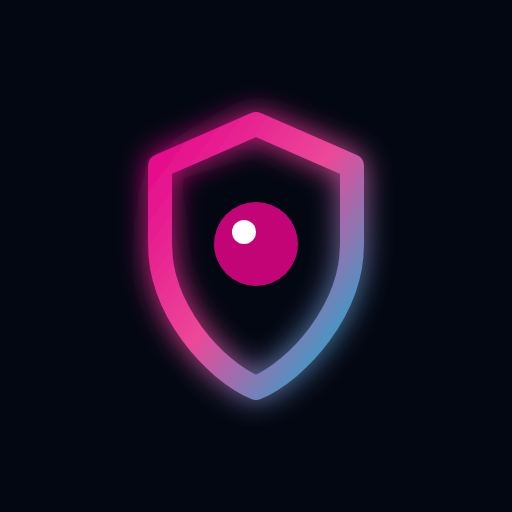
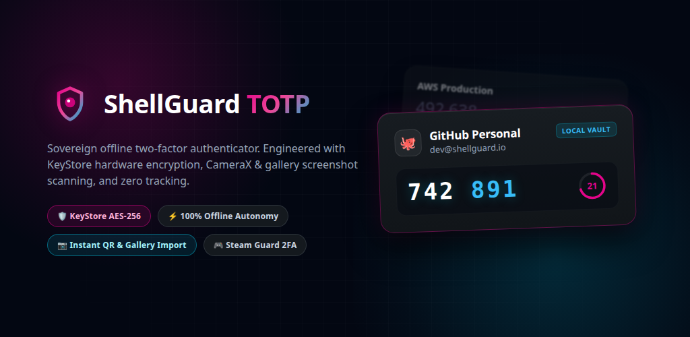
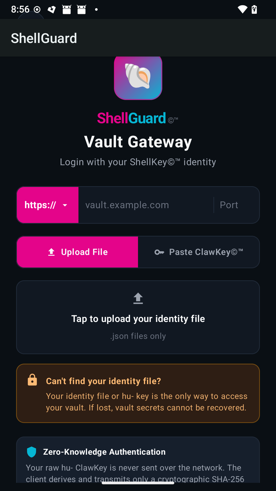
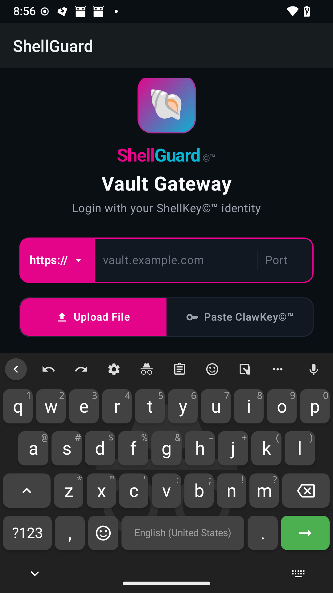
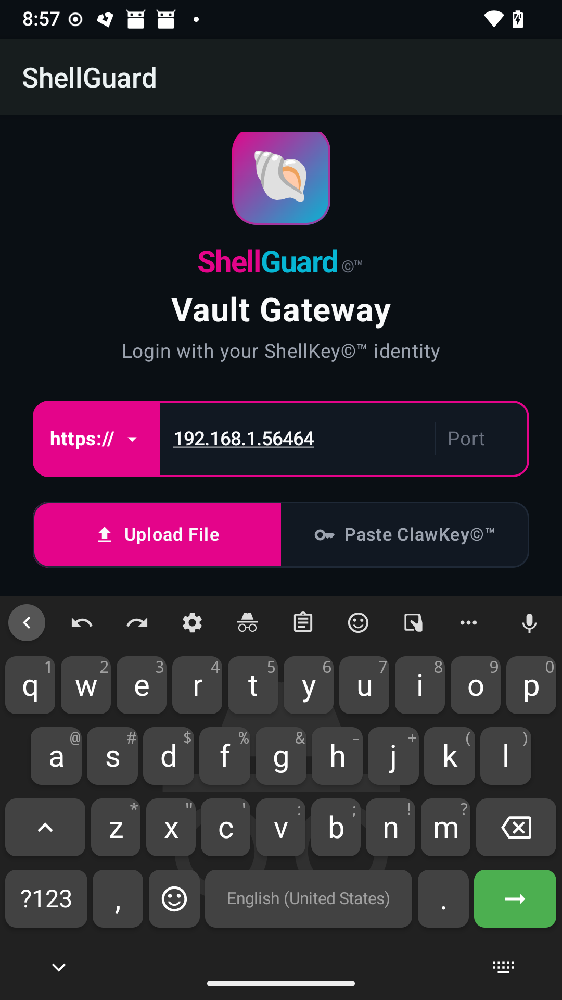
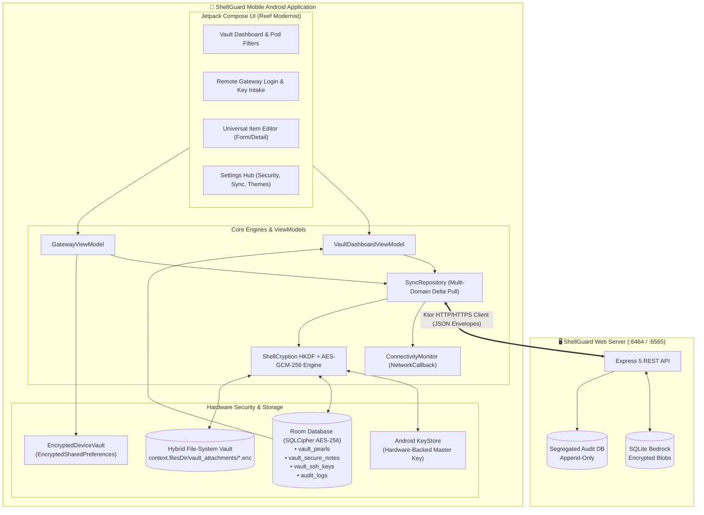

<div align="center">



# 🐚 ShellGuard Mobile

### Sovereign, privacy-first secrets vault native Android client with hardware-encrypted storage.

[-E4048A?style=for-the-badge&logo=android&logoColor=white)](CHANGELOG.md)
[](app/build.gradle.kts)
[](SECURITY.md)
[](project/16kb-page-size-alignment-guide.md)
[](LICENSE)

<br/><br/>



<br/><br/>

<p align="center">
  <a href="#-device-screenshots">Screenshots</a> •
  <a href="#-executive-summary--product-vision">Vision</a> •
  <a href="#-key-features--capabilities">Key Features</a> •
  <a href="#-system-architecture">Architecture</a> •
  <a href="SECURITY.md">Security Policy</a> •
  <a href="#-tech-stack">Tech Stack</a> •
  <a href="#-building--running">Build & Test</a> •
  <a href="#-documentation-index">Docs</a>
</p>

</div>

---

## 📱 Device Screenshots

Captured natively from physical Google Pixel hardware running Android 14 (LineageOS).

| 1. Gateway & Brand Parity | 2. IME Soft Keyboard Protection | 3. Remote Server Connection |
|:---:|:---:|:---:|
|  |  |  |
| **Sovereign Gateway**<br/>Base62 identity key & segmented URL | **IME Hardening**<br/>Smooth cursor retention & zero blackout | **Home Lab Integration**<br/>Direct LAN & Tailscale mesh routing |

---

## 🎯 Executive Summary & Product Vision

**ShellGuard Mobile** is a hardened, privacy-first native Android client engineered for complete sovereign secrets management. Paired with a self-hosted ShellGuard web server or operating in complete offline isolation, ShellGuard Mobile provides zero-knowledge, hardware-secured storage and synchronization across all secrets domains: passwords, secure notes, SSH keypairs, encrypted attachments, and integrated RFC 6238 time-based one-time passwords (TOTP).

> *"Your reef. Your keys. Your vault. In your pocket."*

### Core Pillars
1. **Zero-Knowledge Hardware Isolation**: Root cryptographic keys (`hu-` human root identity, `lb-` agent keys) never leave client-side volatile memory. The remote server stores only opaque `ShellCryption` AES-GCM-256 ciphertext envelopes. Master keys are anchored to the Android KeyStore (StrongBox / TEE) and local SQLite storage is fully encrypted via SQLCipher 4.6.1+.
2. **100% Offline Autonomy (Bitwarden Read-Only Model)**: When disconnected from the self-hosted instance, the vault remains 100% accessible for viewing, searching, copying credentials (masked), running TOTP tickers, and performing system Autofill. Mutation actions (create/edit/delete) are guarded to eliminate split-brain divergence.
3. **Bidirectional Delta Synchronization**: Real-time push of pending local modifications and downstream delta pull of server items with server-wins conflict resolution. Automated `ConnectivityManager.NetworkCallback` health probes restore synchronization seamlessly upon reconnect.
4. **Universal Multi-Vault Migration**: Import and export your digital habitat seamlessly using encrypted `.sgvault.bak` backup archives, `.sgtotp.bak` for 1:1 interoperability with the companion authenticator, or polymorphic Bitwarden JSON ingestion with pre-DAO deduplication.

---

## ✨ Key Features & Capabilities

### 🔒 Hardware-Grade Security
- **Android KeyStore & StrongBox**: Cryptographic keys are hardware-isolated; all AES-256-GCM wrapping is executed inside the device security enclave.
- **SQLCipher Whole-Database Encryption**: All Room tables, indexes, and queries are encrypted at rest with 256-bit AES cipher blocks.
- **FLAG_SECURE Privacy Shield**: Window obfuscation in the Android Recents app switcher and screenshot capture prevention (scoped to release builds to preserve development inspection).
- **Hybrid File-System Vault (CWE-400 CursorWindow Defense)**: Attachments bypass SQLite's 2MB row limit; metadata is stored in Room while ciphertext streams directly to `context.filesDir/vault_attachments/{id}.enc` using zero-heap 64KB buffers.
- **Biometric & PIN Cold Lock**: Biometric unlock (`BiometricPrompt`) with an automated recovery state machine catching `KeyPermanentlyInvalidatedException` if device biometrics are altered in system settings.
- **Claw Re-Prompt Gate**: Localized biometric/PIN challenge (`reprompt == true`) required before revealing or copying high-privilege credentials.
- **Emergency Panic Purge**: Irreversible broadcast receiver (`ACTION_PANIC_WIPE`) to destroy encryption keys, databases, and cached sessions.

### 📦 Unified Vault Domains (Pods)
- **Vault Pearls (Logins)**: Username, password, multi-URI matching, password history tracking, custom fields, and integrated TOTP seeds.
- **Secure Notes**: Markdown notes, attachments, encrypted tags, and custom metadata fields.
- **SSH Keys**: Public/private keypairs, passphrases, server associations, and fingerprint badges.
- **Secure Attachments**: Encrypted file storage streaming multi-megabyte payloads safely off the UI thread.
- **Integrated TOTP Tickers**: Real-time RFC 6238 token generator with animated circular countdown rings, split-digit formatting (`947 449`), and automated copy-on-autofill.

### ⚡ Ergonomics & Touch Usability
- **Debounced Instant Search**: Sub-16ms filtering across account titles, usernames, URLs, and notes.
- **Horizontal Pod Filter Chips**: Rapidly filter items by domain (`All`, `Passwords`, `Notes`, `SSH Keys`) with live item counts.
- **Adaptive Master-Detail Ergonomics**: Fluid single-column navigation on compact phones; seamless 3-pane layout on foldables and tablets (`SidebarFolderTree` 240dp, `ItemListPane` 340dp, `ItemDetailPane` weight 1f) achieving **100% layout parity with the desktop web client**.
- **Touch Form Hardening**: Pinned headers/footers with `.imePadding().verticalScroll(rememberScrollState())` and upward-expanding dropup menus to prevent soft keyboard truncation.
- **CWE-359 Sensitive Keyboard Isolation**: All secret fields apply `PasswordVisualTransformation()` and `KeyboardOptions(keyboardType = KeyboardType.Password, autoCorrectEnabled = false)` to block predictive dictionary learning and keyboard telemetry scraping.

### 🌐 Autofill & Home Lab Integration
- **Android Autofill Framework & Inline Suggestions**: Suggestion chips rendered directly above keyboards (Gboard, SwiftKey) on Android 11+ alongside standard dropdown popups, with simultaneous 1-tap username and password injection.
- **5-Tier Confidence Heuristics & Blast-Radius Co-Presence Gate**: Intelligent view hierarchy parser with editable-input gating (`<form>`/`<div>` container hijack defense), `AutoCompleteTextView` URL-bar exclusion, password/username mutual exclusion, and a Co-Presence Gate suppressing weak substring guesses when no password field is present while preserving explicit Rank 1–3 email/username fields for 2-step login flows (e.g., `accounts.google.com`).
- **Option B Masked Username Disambiguation & Zero-Copy Icons**: Unlocked inline chips combine non-default category/tag badges with partially masked usernames (`Work · lu***@company.com`, `lu***@gmail.com`) and zero-copy `Icon.createWithResource` references, preventing shoulder-surfing leaks and Binder `TransactionTooLargeException`.
- **Context-Aware Locked Suggestions & Add Item**: Displays clean domain recognition with lock prompt when locked; offers a single `"Add Item"` chip pre-filling the website URL when zero matches exist.
- **Multi-Mode URI Match Detection**: 5 matching algorithms (`BASE_DOMAIN`, `HOST`, `EXACT`, `STARTS_WITH`, `NEVER`) supporting multi-service home lab setups sharing identical IPs across different ports (`:8080` vs `:9000`).
- **Cleartext LAN & Mesh Support**: Intentional support for local home labs (Unraid, TrueNAS, LAN IPs) and Tailscale/WireGuard mesh networks where domain TLS is absent.

### 🎨 Reef Modernist Design System
- **Curated Marine Accent Palettes**: 6 custom theme accents inspired by deep-sea bioluminescence (Reef Pink `#E4048A` default, Electric Cyan `#04D9FF`, Imperial Gold `#F6C445`, Emerald, Solar, Minimalist).
- **Abyssal Dark & High-Contrast Light**: Pure `#0A0D0F` dark canvas for OLED power conservation and high-contrast `Ocean Mist` light mode.
- **Exoskeletal Shells**: Flat Material 3 cards with 1dp `#3D484E` borders, 0dp elevation shadows, and spring press physics (`0.97f` scale down with damping `0.75f`).

---

## 🏛️ System Architecture



---

## 🛠️ Tech Stack

| Layer | Technology | Description |
|---|---|---|
| **Language & Platform** | Kotlin 2.0+ / Android 14–16 (API 24 to 36) | Modern Kotlin toolchain targeting the latest Android runtime standards |
| **Architecture** | MVI (Unidirectional Data Flow) | Unidirectional state management with reactive `StateFlow` |
| **UI Framework** | Jetpack Compose (Material 3) | Declarative UI with custom Canvas rendering & spring physics |
| **Dependency Injection** | Application-Scoped Lazy DI | Lightweight, thread-safe singletons via `AppContainer` with zero KSP overhead |
| **Local Database** | Room 2.7+ with SQLCipher 4.6.1+ | Whole-database 256-bit AES encryption; 16 KB page-size kernel ready |
| **Attachment Vault** | Hybrid File-System Vault | 64KB bounded streaming to `filesDir/vault_attachments/{id}.enc` |
| **Hardware Security** | Android KeyStore (StrongBox / TEE) | Hardware-backed master key derivation; zero plaintext key leakage |
| **Network Client** | Ktor Client (OkHttp Engine) | High-performance transport with cleartext LAN and TLS mesh support |
| **Background Sync** | WorkManager & NetworkCallback | Automated reconnect health probes and periodic delta synchronization |

---

## 🚀 Building & Running

### Prerequisites
- **JDK 17 or 21** (e.g. JetBrains Runtime `jbr` bundled with Android Studio)
- **Android SDK** with Platforms `android-36` and Build-Tools `36.0.0`
- **Gradle 8.13+** (bundled via `./gradlew`)

### Subshell & Headless Build Setup
When running Gradle or ADB commands in containerized or headless CI environments, export the bundled JBR and container-safe JVM options:

```bash
export JAVA_HOME="/config/Applications/android-studio/jbr"
export PATH="$JAVA_HOME/bin:/config/Android/Sdk/platform-tools:$PATH"
export GRADLE_OPTS="-XX:-UsePerfData -Djava.io.tmpdir=$PWD/app/build/tmp"
```

### Verification & Testing
```bash
# Run the complete unit test suite (114/114 tests passing green)
./gradlew testDebugUnitTest

# Assemble debug APK
./gradlew assembleDebug

# Deploy to connected physical device or emulator over ADB
adb install -r app/build/outputs/apk/debug/app-debug.apk
adb shell am start -n com.clawstack.shellguard/.MainActivity

# Build release Android App Bundle (.aab)
./gradlew bundleRelease
```

---

## 🗂️ Documentation Index

| Document | Description |
|---|---|
| [**`CONTRIBUTING.md`**](CONTRIBUTING.md) | Developer onboarding guide, local environment setup, verification loops, and git conventions. |
| [**`ARCHITECTURE.md`**](ARCHITECTURE.md) | Client mode architecture, client-server relationship boundaries, and threat model. |
| [**`SECURITY.md`**](SECURITY.md) | Security policy, threat model invariants, and responsible disclosure SLAs. |
| [**`DESIGN.md`**](DESIGN.md) | Comprehensive Material 3 design system tokens, color palettes, and motion specs. |
| [**`ROADMAP.md`**](ROADMAP.md) | Multi-phase development roadmap tracking completed features and upcoming milestones. |
| [**`CHANGELOG.md`**](CHANGELOG.md) | Chronological version release history adhering to Keep a Changelog standards. |
| [**`RELEASE-PLAY.md`**](RELEASE-PLAY.md) | Google Play Store release notes single source of truth across all published versions. |
| [**`RELEASE-v0.0.0.10.md`**](RELEASE-v0.0.0.10.md) | Dedicated release manifest and architecture notes for v0.0.0.10 (Build 10). |
| [**`project/architecture.md`**](project/architecture.md) | Deep architectural specification and system role boundaries. |
| [**`project/routes-and-contracts.md`**](project/routes-and-contracts.md) | REST API endpoints, DTO models, and delta sync reconciliation contracts. |
| [**`project/crypto-and-keystore.md`**](project/crypto-and-keystore.md) | Complete ShellCryption specification, KeyStore derivation, and biometric integration. |
| [**`project/room-storage-schema.md`**](project/room-storage-schema.md) | Room SQLite entity definitions, DAOs, and SQLCipher configuration. |
| [**`project/sync-and-offline-engine-spec.md`**](project/sync-and-offline-engine-spec.md) | Bidirectional delta sync, Bitwarden offline caching, and reconnection state machines. |
| [**`project/autofill-service-spec.md`**](project/autofill-service-spec.md) | System autofill provider, inline keyboard suggestions, and URI match algorithms. |
| [**`project/import-export-and-migration-spec.md`**](project/import-export-and-migration-spec.md) | Backup manager, Bitwarden JSON intake, and `.sgvault.bak` / `.sgtotp.bak` migration. |
| [**`project/16kb-page-size-alignment-guide.md`**](project/16kb-page-size-alignment-guide.md) | Android 15+ 16 KB ELF segment alignment audit procedures and native verification. |

---

## 🛡️ Security Invariants

1. **Zero-Knowledge Invariant**: Master keys and plaintext secrets are decrypted strictly in ephemeral memory for the duration of active use, never written to disk unencrypted, and zeroized upon session lock or garbage collection.
2. **Release-Scoped FLAG_SECURE**: App windows declare `FLAG_SECURE` in release builds to block unauthorized screen captures and task-switcher previews while preserving debug inspection.
3. **Bitwarden-Model Read-Only Offline Caching**: Disconnected clients retain 100% read, search, copy, and autofill functionality while blocking mutations to eliminate split-brain synchronization divergence.
4. **Hybrid File-System Vault**: Sensitive file attachments never enter SQLite rows, eliminating 2MB `CursorWindowAllocationException` crashes through 64KB bounded streaming.
5. **Base62 Sovereign Key Validation**: ClawKey identity strings strictly adhere to the 67-character Base62 specification (`hu-[0-9a-zA-Z]{64}` / `lb-[0-9a-zA-Z]{64}`).

For our full security policy, cryptographic specifications, and responsible disclosure SLAs, see [**`SECURITY.md`**](SECURITY.md).

---

<div align="center">
  <sub>Engineered with precision for the ClawStack / ShellGuard ecosystem.</sub>
</div>
