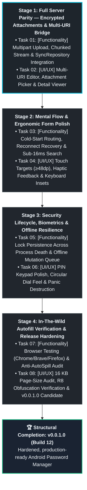

# Master Project Roadmap — Meta-Phase: Feature Verification and Polish

> **Milestone Note**: The Genesis MVP (Phases 1–7) is 100% complete, verified on Google Pixel glass, and published through `v0.0.0.11 (Build 11)`. The historical Genesis roadmap is archived at `.agents/internal/ROADMAP_MVP_GENESIS.md`.
>
> This active roadmap defines the **Feature Verification and Polish** meta-phase. It bridges remaining data gaps against the ShellGuard Web Server (Encrypted Attachments, Multi-URI), audits and polishes the full mental flow of the mobile client, and drives towards `structural_completion` at `v0.0.1.0`.

---

## 🛡️ Systemic Operating Invariant
"Build features around security, not security around features." Each stage adheres strictly to our **Lazy Senior Developer** tight loop:
`Plan (inspect both sides of the seam) ➔ Implement (minimal, robust code) ➔ Test Code (headless test suite) ➔ Test Physical Hardware (ADB + Google Pixel glass)`.

---

## Stage 1: Full Server Parity — Encrypted Attachments & Multi-URI Bridge

> **Stage Objective**:
> Achieve 100% data layer and synchronization parity with the ShellGuard server database across all 4 core tables (`vault_pearls`, `vault_secure_notes`, `vault_ssh_keys`, and `vault_secure_attachments`). Uphold the CWE-400 2MB CursorWindow defense by streaming ciphertext files directly to internal storage while maintaining reactive Room metadata.

- [ ] **Task 01: [Functionality] Attachments Network Engine, Hybrid Storage & Sync Repository Bridge**
  - Implement attachment endpoints in `ShellGuardClient.kt`:
    - `POST /api/attachments`: Multipart/form-data upload streaming pre-encrypted ShellCryption envelope bytes with progress tracking.
    - `GET /api/attachments`: Fetch metadata list (`id`, `title`, `size_bytes`, `file_name`, `mime_type`, `category`, `created_at`).
    - `GET /api/attachments/:id/file`: Streamed chunked (1MB) ciphertext BLOB download.
    - `DELETE /api/attachments/:id`: Delete attachment record.
  - Implement hybrid file-system vault in `data/local/`:
    - Ciphertext payloads stream to `context.filesDir/vault_attachments/{id}.enc` (never inline SQLite BLOBs).
    - Room `SecureAttachmentDao` stores lightweight metadata (`size_bytes`, `file_name`, `mime_type`, `local_file_path`).
  - Wire attachments into `SyncRepository.kt`:
    - `syncAll()` pulls remote attachment metadata and prunes deleted records.
    - `pushPendingChanges()` uploads staged local attachments.
  - Plumb `attachments` JSON string into `CreateNoteRequest` and `CreateVaultItemRequest` to achieve bidirectional attachment linking without schema loss.
  - *Success Criteria*: Unit tests verify multipart payload formatting, chunked stream saving to disk, and attachment metadata delta synchronization.

- [ ] **Task 02: [UI/UX] Multi-URI Dynamic Form Editor, Attachment Picker & Detail Actions**
  - In `ItemFormScreen.kt`:
    - Dynamic Multi-URI list builder: add, edit, and remove multiple login URLs for a single password entry (`vault_pearls.uris`), matching Bitwarden and ShellGuard Web.
    - System file picker integration (`ActivityResultContracts.GetContent`) to stage, encrypt (AAD `vault_secure_attachments:{id}`), and link attachments to Pearls and Notes.
  - In `ItemDetailScreen.kt`:
    - Multi-URI list display with launch-in-browser and copy actions.
    - Linked attachment section: file name, extension icon badge, humanized byte size, and tap-to-decrypt/share/view intent.
  - In `VaultDashboardScreen.kt`:
    - Add `[Attachments]` Pod category filter chip and standalone attachment cards.
  - Update `DomainMatcher` to evaluate all configured `uris` for domain matching during autofill.
  - *Success Criteria*: User can attach files in mobile, verify they upload and appear on web client, and view multi-URI entries in detail and autofill.

---

## Stage 2: Mental Flow & Ergonomic Form Polish

> **Stage Objective**:
> Eliminate cognitive friction, latency, and layout quirks across the app's three primary views (Gateway, Dashboard, Universal Form). Ensure seamless transitions, instant search, and ergonomic keyboard and touch interactions.

- [ ] **Task 03: [Functionality] Cold-Start Routing, Reconnect Recovery & Sub-16ms Search Performance**
  - Benchmark and optimize `observeUnifiedItems` search filtering across 100+ items to guarantee sub-16ms frame times.
  - Harden Gateway cold-start routing: validate saved Base62 `hu-` sovereign key format, auto-fill server host/port, and transition immediately to local offline cache with an amber status banner if the server is unreachable.
  - Implement automated network reconnect recovery: seamlessly transition from `OFFLINE_READ_ONLY` to `SYNCING` ➔ `ONLINE_SYNCED` without UI stutter.
  - *Success Criteria*: Cold launch with stored session navigates in <300ms; offline search responds instantaneously; reconnect syncs automatically.

- [ ] **Task 04: [UI/UX] Touch Targets (≥48dp), Haptic Feedback & Keyboard Insets**
  - Audit all interactive surfaces against `mobile-android-design`: ensure all buttons, toggles, icon buttons, and list items have touch targets ≥ 48dp.
  - Implement subtle, tactile haptic feedback on secret reveal, copy actions, and password generation.
  - Polish soft keyboard auto-scroll behavior (`.imePadding()` + `LaunchedEffect` scroll-to-focused): ensure active text fields remain comfortably visible above Gboard on all screen sizes.
  - Refine Secure Notes markdown rendering with clean monospace code blocks and formatted headers.
  - *Success Criteria*: Typing on physical Pixel never obscures input fields; touch targets feel effortless; copy actions produce distinct haptic confirmation.

---

## Stage 3: Security Lifecycle, Biometrics & Offline Resilience

> **Stage Objective**:
> Harden background lifecycle, KeyStore biometric unsealing, timeout enforcement, and emergency wipe cascades. Guarantee zero data loss when modifying items offline.

- [ ] **Task 05: [Functionality] Lock Persistence Across Process Death & Offline Mutation Queue**
  - Verify and harden `VaultLockManager` background timestamp tracking: ensure killing the app from recents or OS low-memory termination enforces the configured timeout upon relaunch.
  - Test and verify offline mutation queueing in `SyncRepository`: items created, edited, or deleted in Airplane Mode must persist locally through app restarts and flush cleanly to the server on reconnect without resurrecting deleted items.
  - Verify fail-closed decryption across all domains: corrupt or untrusted payloads must never leak ciphertext strings into editable form fields.
  - *Success Criteria*: Process kill enforces lock; offline creates/edits/deletes sync cleanly upon reconnect without data loss.

- [ ] **Task 06: [UI/UX] PIN Keypad Polish, Circular Dial Feel & Panic Destruction**
  - Polish `LockScreen.kt` numerical PIN keypad: responsive press states, masked PIN dots, and instantaneous fallback to Master ClawKey.
  - Polish `CircularDialPicker` gesture physics: smooth continuous arc dragging with clear duration snap points (5s–60s).
  - Verify `PanicPurgeCountdownScreen`: 3 pulsing concentric Canvas rings, 68sp monospace timer, hardware back button cancellation, and full 4-step fail-closed destruction cascade.
  - *Success Criteria*: PIN keypad unlocks reliably on device; panic countdown can be cancelled or executed cleanly, leaving zero database or key remnants.

---

## Stage 4: In-The-Wild Autofill Verification & Release Hardening

> **Stage Objective**:
> Rigorously verify system autofill in real third-party applications and browsers, audit Android 15+ 16 KB page-size compliance and ProGuard R8 rules, and package the `v0.0.1.0` production candidate.

- [ ] **Task 07: [Functionality] Real-World Browser & Native App Autofill Gauntlet**
  - Exercise system autofill across physical browsers (Google Chrome, Brave, Firefox) and native Android apps:
    - 2-step split login flows (`accounts.google.com`, Microsoft): verify Step 1 displays `"Add Item"` and Step 2 fills password.
    - Option B subtitle masking (`Work · lu***@company.com`): verify zero raw username leakage above keyboard.
    - Multi-field dataset injection: verify single tap fills both username and password simultaneously.
    - Anti-AutoSpill WebView isolation: verify WebView forms cannot inherit credentials from outer native views.
  - Verify direct Settings deep-link from `SettingsAutofillScreen` opens system autofill picker cleanly.
  - *Success Criteria*: Autofill triggers reliably across browsers and apps without UI flicker or crashes; sensitive credentials fill accurately.

- [ ] **Task 08: [Configuration & Release] 16 KB Page Alignment, ProGuard Audit & v0.0.1.0 Candidate**
  - Audit uncompressed native packaging: verify SQLCipher `.so` native libraries pass 16 KB ELF alignment verification (`16kb-page-size-alignment-guide.md`).
  - Audit R8 ProGuard preservation rules: verify release builds preserve Room DAOs, SQLCipher JNI bindings, and Kotlinx Serialization models.
  - Execute full regression test gauntlet (`./gradlew testDebugUnitTest assembleDebug`) verifying 100% green status.
  - Author `RELEASE-v0.0.1.0.md` and format `<en-US>` release notes in `RELEASE-PLAY.md`.
  - Bump monotonic `versionCode` and update `versionName` to `v0.0.1.0 (Build 12)`.
  - *Success Criteria*: Full test suite green; release APK compiles cleanly; 16 KB alignment verified; `structural_completion` of the Feature Verification and Polish meta-phase achieved.
