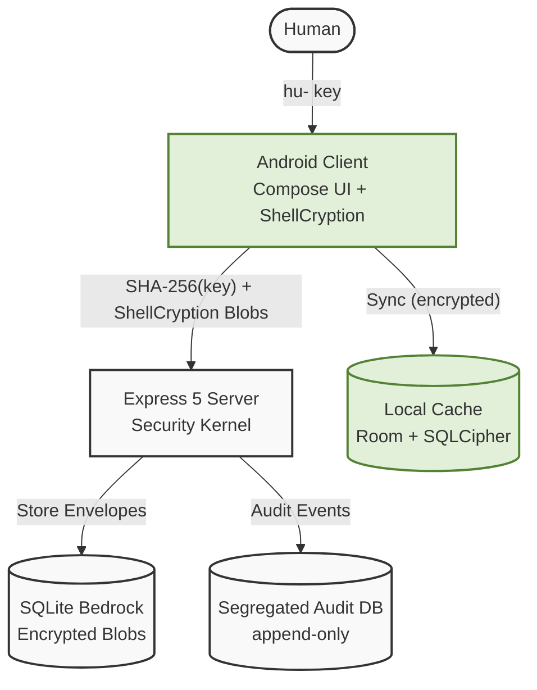
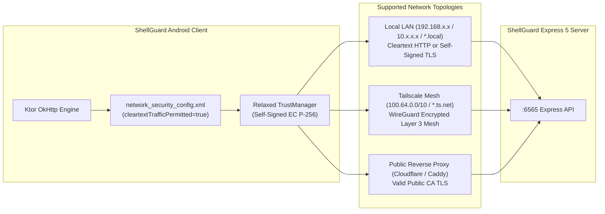

# ShellGuard Mobile Architecture Specification
Targeted for Google AI Studio Android Application Generator

## §1. System Role

ShellGuard Mobile is a privacy-first, zero-knowledge secrets vault native Android client. It provides full bidirectional CRUD access to all vault domains (passwords, secure notes, SSH keys, attachments) plus integrated TOTP generation. The client generates and holds the encryption keys; the server stores only opaque encrypted blobs.

Tagline: *"Your reef. Your keys. Your vault. In your pocket."*

## §2. Boundaries

| Boundary | Enforcement & Characteristics |
| :--- | :--- |
| **Client ↔ Server** | Server NEVER sees plaintext secrets or the `hu-` key. Login sends `SHA-256(hu-)` only. |
| **Client ↔ Local Storage** | Room DB encrypted with SQLCipher. Decrypted secrets held in memory only during active session. |
| **Server ↔ Disk** | Secrets stored as ShellCryption blobs; server-side metadata encryption layers on top. |
| **Human ↔ Agent** | `hu-` keys are human-only root identity. `lb-` agent keys are granular and revocable. |
| **Local ↔ Remote** | Bidirectional sync with conflict resolution. Server is source of truth. |
| **Vault ↔ Audit** | Audit log is segregated, append-only — never mixed with vault data. |

## §3. Topology

*   **Client**: Kotlin, Jetpack Compose + Material 3, MVI architecture
*   **DI**: Dagger Hilt
*   **Local DB**: Room 2.7+ with SQLCipher whole-database encryption
*   **Network**: Ktor Client (OkHttp engine) consuming Express 5 REST API
*   **Security**: Android KeyStore, EncryptedSharedPreferences, BiometricPrompt
*   **Camera**: CameraX + ML Kit Barcode Scanning
*   **Target SDK**: 36
*   **Min SDK**: 24
*   **Server ports**: `:6565` (API), `:6464` (web dev)
*   **Package Name**: `com.clawstack.shellguard`

## §4. Threat Model & Invariants

1.  **Zero-knowledge invariant**: Server stores only ShellCryption envelopes.
2.  **Key hierarchy separation**: `hu-` (human root) and `lb-` (agent-scoped).
3.  **Ownership scoping**: Every vault query scoped to authenticated owner.
4.  **Local encryption at rest**: Room DB encrypted via SQLCipher.
5.  **Biometric binding**: Hardware-backed KeyStore keys invalidated on enrollment change.
6.  **Memory security**: `FLAG_SECURE` blocks screen capture; secrets zeroized post-use.
7.  **IME hardening**: `KeyboardType.Password` with auto-correct disabled for all secret inputs.
8.  **Panic wipe**: Emergency broadcast receiver for instant data destruction.
9.  **Security priority**: Build features around security, not security around features.
10. **Transport vs Identity**: TLS is transport armor, not identity — secrecy lives client-side.

## §5. Transport Security & Network Topology

Self-hosters frequently operate ShellGuard within private home labs (Unraid, TrueNAS, Proxmox, Docker) or over encrypted overlay mesh networks (Tailscale, WireGuard). The Android client must provide seamless connectivity across both **Cleartext HTTP** and **Self-Signed / Modern TLS HTTPS** without Android OS security policy interference.

### 1. Cleartext HTTP Invariant (LAN & Tailscale)
- **Why Cleartext HTTP is Allowed**: Many self-hosted servers operate purely on internal subnets without domain names or public CA certificates. Since Tailscale itself encrypts all traffic end-to-end at the WireGuard protocol layer (Layer 3), running plain HTTP over Tailscale is cryptographically sound.
- **Zero-Knowledge Defense**: In ShellGuard, secrecy lives on the client. All vault items are encrypted via ShellCryption (AES-GCM-256) before leaving the phone, and login sends `SHA-256(hu-)` instead of raw keys. Cleartext HTTP over LAN/Tailscale never exposes plaintext passwords or encryption keys.
- **Android OS Constraint**: By default, Android 9+ (API 28+) blocks all cleartext HTTP traffic. Android's `<network-security-config>` XML parser **does not support CIDR IP notation** (e.g. `<domain>192.168.0.0/16</domain>` is invalid and crashes on parse). Therefore, `<base-config cleartextTrafficPermitted="true" />` is strictly mandatory.

### 2. Self-Signed & Tailscale TLS Invariant
- **Self-Signed Certificates**: ShellGuard Web Server generates an internal EC P-256 TLS certificate on first boot (`server.crt`). The Android client employs a relaxed `X509TrustManager` and permissive `HostnameVerifier` for private IP subnets and Tailscale MagicDNS hostnames (`*.ts.net`), adopting a Trust-On-First-Use (TOFU) security posture.
- **Connection Specifications**: OkHttp must explicitly register `ConnectionSpec.CLEARTEXT` alongside `ConnectionSpec.MODERN_TLS` and `ConnectionSpec.COMPATIBLE_TLS`. Without this, OkHttp throws `UnknownServiceException` when attempting unencrypted HTTP calls.
