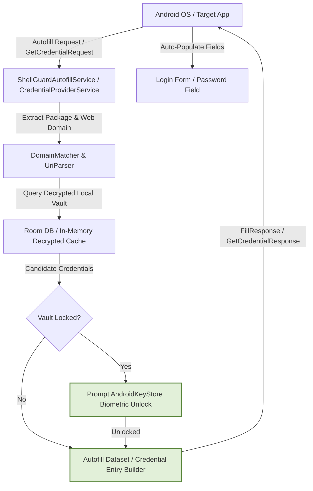

# 🔑 ShellGuard Mobile — Android Autofill & Credential Provider Specification

> **Android Autofill Framework, Android 14+ Credential Manager, Domain Matching & Biometric Gating**  
> *Targeted for Google AI Studio Android Application Generator.*

---

## 1. Autofill Architecture Overview

ShellGuard Mobile operates as a system-level Android Credential Provider. It allows users to automatically fill credentials (usernames, passwords, TOTP verification codes) into third-party apps and browsers (Chrome, Firefox, Brave) without manual copy-pasting.



---

## 2. Android Manifest & Permissions

The service must be declared in `AndroidManifest.xml` with the `android.permission.BIND_AUTOFILL_SERVICE` permission and the metadata for Android 14+ Credential Manager.

```xml
<!-- Android Autofill Framework Service (API 26+) -->
<service
    android:name=".services.autofill.ShellGuardAutofillService"
    android:label="@string/autofill_service_label"
    android:permission="android.permission.BIND_AUTOFILL_SERVICE"
    android:exported="true">
    <intent-filter>
        <action android:name="android.service.autofill.AutofillService" />
    </intent-filter>
    <meta-data
        android:name="android.service.autofill"
        android:resource="@xml/autofill_service_config" />
</service>

<!-- Android 14+ Credential Provider Service (API 34+) -->
<service
    android:name=".services.credentials.ShellGuardCredentialProviderService"
    android:label="@string/credential_provider_label"
    android:permission="android.permission.BIND_CREDENTIAL_PROVIDER_SERVICE"
    android:exported="true">
    <intent-filter>
        <action android:name="android.service.credentials.CredentialProviderService" />
    </intent-filter>
    <meta-data
        android:name="android.service.credentials"
        android:resource="@xml/credential_provider_config" />
</service>
```

### Autofill Service Configuration (`res/xml/autofill_service_config.xml`)

```xml
<?xml version="1.0" encoding="utf-8"?>
<autofill-service xmlns:android="http://schemas.android.com/apk/res/android"
    android:settingsActivity="com.clawstack.shellguard.ui.MainActivity"
    android:compatibilityMode="true" />
```

---

## 3. Core Autofill Engine Implementation

### `ShellGuardAutofillService.kt`

```kotlin
package com.clawstack.shellguard.services.autofill

import android.app.PendingIntent
import android.app.assist.AssistStructure
import android.content.Intent
import android.os.Build
import android.os.CancellationSignal
import android.service.autofill.*
import android.view.autofill.AutofillId
import android.view.autofill.AutofillValue
import android.widget.RemoteViews
import androidx.annotation.RequiresApi
import com.clawstack.shellguard.R
import com.clawstack.shellguard.data.repository.VaultRepository
import com.clawstack.shellguard.domain.models.VaultPearl
import com.clawstack.shellguard.utils.DomainMatcher
import dagger.hilt.android.AndroidEntryPoint
import kotlinx.coroutines.*
import javax.inject.Inject

@RequiresApi(Build.VERSION_CODES.O)
@AndroidEntryPoint
class ShellGuardAutofillService : AutofillService() {

    @Inject
    lateinit var vaultRepository: VaultRepository

    private val serviceScope = CoroutineScope(Dispatchers.IO + SupervisorJob())

    override fun onFillRequest(
        request: FillRequest,
        cancellationSignal: CancellationSignal,
        callback: FillCallback
    ) {
        val structure = request.fillContexts.lastOrNull()?.structure ?: run {
            callback.onSuccess(null)
            return
        }

        val parsedFields = AutofillStructureParser.parse(structure)
        if (parsedFields.usernameId == null && parsedFields.passwordId == null) {
            callback.onSuccess(null)
            return
        }

        serviceScope.launch {
            val webDomain = parsedFields.webDomain
            val packageName = parsedFields.packageName

            // Query matching credentials from decrypted local vault
            val matches = vaultRepository.findMatchingPearls(webDomain, packageName)

            if (matches.isEmpty()) {
                callback.onSuccess(null)
                return@launch
            }

            val responseBuilder = FillResponse.Builder()
            val inlineRequest = if (Build.VERSION.SDK_INT >= Build.VERSION_CODES.R) {
                request.inlineSuggestionsRequest
            } else null

            for (pearl in matches) {
                val datasetBuilder = Dataset.Builder()

                // Standard dropdown presentation RemoteViews
                val dropdownPresentation = RemoteViews(packageName, R.layout.autofill_suggestion_item).apply {
                    setTextViewText(R.id.text_title, pearl.title)
                    setTextViewText(R.id.text_username, pearl.username.ifBlank { "No Username" })
                }

                // Android 11+ (API 30+) Keyboard Inline Suggestion Chip
                val inlinePresentation = if (Build.VERSION.SDK_INT >= Build.VERSION_CODES.R && inlineRequest != null) {
                    AutofillInlineHelper.createInlineSuggestion(
                        context = this@ShellGuardAutofillService,
                        inlineRequest = inlineRequest,
                        title = pearl.title,
                        subtitle = pearl.username.ifBlank { "No Username" }
                    )
                } else null

                // Claw Re-Prompt Check: If high-security item requires re-authentication,
                // gate this specific dataset behind BiometricPrompt even if vault is currently unlocked
                if (pearl.isRepromptRequired) {
                    val authIntent = Intent(this@ShellGuardAutofillService, AutofillAuthActivity::class.java).apply {
                        putExtra("PEARL_ID", pearl.id)
                        putExtra("REPROMPT_MODE", true)
                    }
                    val intentSender = PendingIntent.getActivity(
                        this@ShellGuardAutofillService,
                        pearl.id.hashCode(),
                        authIntent,
                        PendingIntent.FLAG_CANCEL_CURRENT or PendingIntent.FLAG_IMMUTABLE
                    ).intentSender

                    datasetBuilder.setAuthentication(intentSender)
                }

                parsedFields.usernameId?.let { userFieldId ->
                    if (inlinePresentation != null && Build.VERSION.SDK_INT >= Build.VERSION_CODES.R) {
                        datasetBuilder.setValue(
                            userFieldId,
                            AutofillValue.forText(pearl.username),
                            dropdownPresentation,
                            inlinePresentation
                        )
                    } else {
                        datasetBuilder.setValue(
                            userFieldId,
                            AutofillValue.forText(pearl.username),
                            dropdownPresentation
                        )
                    }
                }

                parsedFields.passwordId?.let { passFieldId ->
                    if (inlinePresentation != null && Build.VERSION.SDK_INT >= Build.VERSION_CODES.R) {
                        datasetBuilder.setValue(
                            passFieldId,
                            AutofillValue.forText(pearl.decryptedSecret),
                            dropdownPresentation,
                            inlinePresentation
                        )
                    } else {
                        datasetBuilder.setValue(
                            passFieldId,
                            AutofillValue.forText(pearl.decryptedSecret),
                            dropdownPresentation
                        )
                    }
                }

                responseBuilder.addDataset(datasetBuilder.build())
            }

            callback.onSuccess(responseBuilder.build())
        }
    }

    override fun onSaveRequest(request: SaveRequest, callback: SaveCallback) {
        // Prompts user to save newly entered credentials to ShellGuard
        callback.onSuccess()
    }

    override fun onDestroy() {
        super.onDestroy()
        serviceScope.cancel()
    }
```

---

## 3.1. Auto-Copy TOTP on Autofill Selection (Bitwarden Parity)

When an autofill credential dataset is selected by the user (or authenticated via BiometricPrompt/PIN):
If the matching `VaultPearlEntity` contains an active `totpSecret`:
1. Generate the current 6-digit TOTP verification code via `TotpEngine.generateCode(secret)`.
2. Copy the code into Android's `ClipboardManager`.
3. Set `ClipDescription.EXTRA_IS_SENSITIVE = true` (Android 13+ CWE-359 privacy defense).
4. Launch a 30s background scrubbing timer to clear the clipboard automatically.
5. Display a brief system feedback toast: *"Verification code copied to clipboard"*.

*User Experience*: The user submits their login form in Chrome or an external app, lands on the service's 2FA challenge screen, and can immediately paste their code without having to switch back into the vault app.

---

## 4. Assist Structure Parser & Domain Matching

Android forms vary drastically across native apps and web browsers. The parser traverses the window view hierarchy (`AssistStructure.ViewNode`) to locate:
1. Web domain URLs (via `viewNode.webDomain`)
2. Autofill Hints (`AutofillHint.USERNAME`, `AutofillHint.PASSWORD`, `AutofillHint.EMAIL`)
3. Input types (e.g. `InputType.TYPE_TEXT_VARIATION_PASSWORD`)
4. View IDs containing `user`, `login`, `email`, `pass`, `pwd`

```kotlin
package com.clawstack.shellguard.services.autofill

import android.app.assist.AssistStructure
import android.os.Build
import android.view.View
import android.view.autofill.AutofillId
import androidx.annotation.RequiresApi

data class ParsedAutofillFields(
    var usernameId: AutofillId? = null,
    var passwordId: AutofillId? = null,
    var webDomain: String? = null,
    var packageName: String? = null
)

@RequiresApi(Build.VERSION_CODES.O)
object AutofillStructureParser {

    fun parse(structure: AssistStructure): ParsedAutofillFields {
        val result = ParsedAutofillFields()
        val nodeCount = structure.windowNodeCount

        for (i in 0 until nodeCount) {
            val windowNode = structure.getWindowNodeAt(i)
            traverseNode(windowNode.rootViewNode, result)
        }

        return result
    }

    private fun traverseNode(node: AssistStructure.ViewNode, result: ParsedAutofillFields) {
        if (node.visibility != View.VISIBLE) return

        // Capture web domain if browser
        node.webDomain?.let { if (result.webDomain == null) result.webDomain = it }
        node.idPackage?.let { if (result.packageName == null) result.packageName = it }

        val hints = node.autofillHints
        val idEntry = node.idEntry?.lowercase() ?: ""

        if (hints != null) {
            for (hint in hints) {
                when (hint.lowercase()) {
                    View.AUTOFILL_HINT_USERNAME, View.AUTOFILL_HINT_EMAIL_ADDRESS -> result.usernameId = node.autofillId
                    View.AUTOFILL_HINT_PASSWORD -> result.passwordId = node.autofillId
                }
            }
        }

        // Heuristic fallback if hints are missing
        if (result.passwordId == null && (idEntry.contains("password") || idEntry.contains("pwd"))) {
            result.passwordId = node.autofillId
        } else if (result.usernameId == null && (idEntry.contains("username") || idEntry.contains("login") || idEntry.contains("email"))) {
            result.usernameId = node.autofillId
        }

        for (i in 0 until node.childCount) {
            traverseNode(node.getChildAt(i), result)
        }
    }
}
```

---

## 5. Configurable URI Match Detection (`UriMatchMode`)

Matching URLs against vault entries requires flexible detection to support home labbers and multi-tenant subdomains:
- `http://192.168.1.100:8080/` vs `http://192.168.1.100:9000/` (Exact / Port Matching)
- `https://mail.google.com` vs `https://accounts.google.com` (Host Matching)
- `https://github.com` (Base Domain Matching)

```kotlin
package com.clawstack.shellguard.utils

import java.net.URI

enum class UriMatchMode {
    /** Matches base domain (eTLD+1), ignoring subdomains, ports, and paths. Default. */
    BASE_DOMAIN,

    /** Matches full host including subdomains (e.g. mail.google.com != accounts.google.com). */
    HOST,

    /** Requires exact match of protocol, host, port, and path. Essential for local IP home labs. */
    EXACT,

    /** Matches if current page URL starts with the saved URI prefix. */
    STARTS_WITH,

    /** Explicitly disables autofill suggestions for this specific URI. */
    NEVER
}

object DomainMatcher {
    fun getEffectiveDomain(url: String): String {
        return try {
            val cleanUrl = if (!url.startsWith("http://") && !url.startsWith("https://")) {
                "https://$url"
            } else url
            val uri = URI(cleanUrl)
            val host = uri.host?.lowercase() ?: return url
            
            val parts = host.split(".")
            if (parts.size >= 2) {
                "${parts[parts.size - 2]}.${parts[parts.size - 1]}"
            } else host
        } catch (e: Exception) {
            url
        }
    }

    fun getHost(url: String): String {
        return try {
            val cleanUrl = if (!url.startsWith("http://") && !url.startsWith("https://")) {
                "https://$url"
            } else url
            URI(cleanUrl).host?.lowercase() ?: url
        } catch (e: Exception) {
            url
        }
    }

    fun isMatch(
        vaultUrl: String,
        requestedUrl: String,
        matchMode: UriMatchMode = UriMatchMode.BASE_DOMAIN
    ): Boolean {
        if (matchMode == UriMatchMode.NEVER) return false
        if (vaultUrl.isBlank() || requestedUrl.isBlank()) return false

        return when (matchMode) {
            UriMatchMode.BASE_DOMAIN -> {
                val vaultBase = getEffectiveDomain(vaultUrl)
                val requestedBase = getEffectiveDomain(requestedUrl)
                vaultBase.equals(requestedBase, ignoreCase = true)
            }
            UriMatchMode.HOST -> {
                val vaultHost = getHost(vaultUrl)
                val requestedHost = getHost(requestedUrl)
                vaultHost.equals(requestedHost, ignoreCase = true)
            }
            UriMatchMode.EXACT -> {
                vaultUrl.trimEnd('/').equals(requestedUrl.trimEnd('/'), ignoreCase = true)
            }
            UriMatchMode.STARTS_WITH -> {
                requestedUrl.startsWith(vaultUrl, ignoreCase = true)
            }
            UriMatchMode.NEVER -> false
        }
    }
}
```

---

## 6. Biometric Gating on Autofill Selection

When the device vault is locked, selecting an autofill item **MUST** present an authentication gate before credentials are dispatched:

1. The service constructs an `Intent` pointing to `AutofillAuthActivity`.
2. The dataset is wrapped with `datasetBuilder.setAuthentication(intentSender)`.
3. `AutofillAuthActivity` triggers `BiometricPrompt` with `AndroidKeyStoreHelper.getBiometricCipher()`.
4. Upon biometric success, decrypted credentials are placed in the dataset result and emitted back to the calling application.
5. If biometric fails or is cancelled, no credential bytes ever leave the ShellGuard process.
