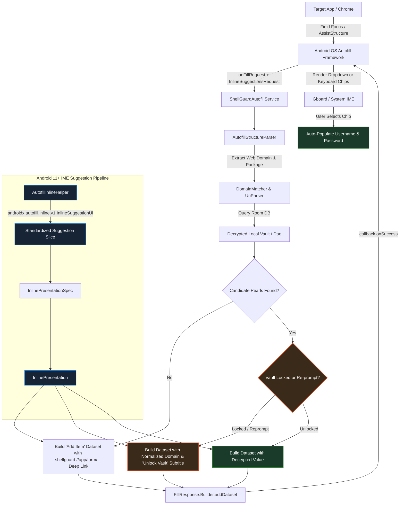

# 🔑 ShellGuard Mobile — Android Autofill & Credential Provider Specification

> **Android Autofill Framework (API 26+), Keyboard Inline Suggestions (Android 11+ / API 30+), Domain Matching & Biometric Gating**  
> *Targeted for Google AI Studio Android Application Generator & ShellGuard Mobile Architecture.*

---

## 1. Autofill Architecture Overview

ShellGuard Mobile operates as a system-level Android Autofill Service and Credential Provider. It allows users to automatically fill credentials (usernames, passwords, and TOTP verification codes) into native applications and browsers (Chrome, Firefox, Brave) without manual copy-pasting.

Beginning in Android 11 (API 30), Autofill suggestions can be rendered directly into the **keyboard suggestion strip** (Input Method Editor / IME, such as Gboard, SwiftKey, and Samsung Keyboard) via **Inline Presentations**.



---

## 2. Dependencies & Android Manifest Requirements

### 2.1. Gradle Dependencies (`app/build.gradle.kts` & `libs.versions.toml`)

Inline suggestions in modern Android IMEs (Gboard, SwiftKey) **strictly require** the Jetpack Autofill library to build compatible slices. Without this library, constructing empty or raw platform slices results in silent rejection by the keyboard:

```toml
# gradle/libs.versions.toml
[versions]
autofill = "1.3.0"
credentials = "1.5.0"

[libraries]
androidx-autofill = { group = "androidx.autofill", name = "autofill", version.ref = "autofill" }
```

```kotlin
// app/build.gradle.kts
dependencies {
    implementation(libs.androidx.autofill)
    implementation(libs.androidx.credentials)
    implementation(libs.androidx.credentials.play.services)
}
```

### 2.2. Service Declaration in `AndroidManifest.xml`
```xml
<!-- Android Autofill Framework Service (API 26+) -->
<service
    android:name=".services.autofill.ShellGuardAutofillService"
    android:label="@string/autofill_service_label"
    android:permission="android.permission.BIND_AUTOFILL_SERVICE"
    android:exported="true">
    <intent-filter>
        <action android:name="android.service.autofill.AutofillService" />
    </intent-filter>
    <meta-data
        android:name="android.service.autofill"
        android:resource="@xml/autofill_service_config" />
</service>

<!-- Transparent Biometric Gate for Locked Datasets & Claw Re-Prompt -->
<activity
    android:name=".services.autofill.AutofillAuthActivity"
    android:theme="@android:style/Theme.Translucent.NoTitleBar"
    android:excludeFromRecents="true"
    android:finishOnTaskLaunch="true"
    android:noHistory="true"
    android:exported="false" />
```

### 2.3. Service Configuration (`res/xml/autofill_service_config.xml`)
```xml
<?xml version="1.0" encoding="utf-8"?>
<autofill-service xmlns:android="http://schemas.android.com/apk/res/android"
    android:settingsActivity="com.clawstack.shellguard.ui.MainActivity"
    android:compatibilityMode="true" />
```

---

## 3. Core Autofill Engine Implementation

### `ShellGuardAutofillService.kt`
```kotlin
package com.clawstack.shellguard.services.autofill

import android.app.PendingIntent
import android.content.ClipData
import android.content.ClipDescription
import android.content.ClipboardManager
import android.content.Context
import android.content.Intent
import android.graphics.drawable.Icon
import android.net.Uri
import android.os.Build
import android.os.CancellationSignal
import android.os.Handler
import android.os.Looper
import android.service.autofill.*
import android.util.Log
import android.view.autofill.AutofillValue
import android.widget.RemoteViews
import android.widget.Toast
import androidx.annotation.RequiresApi
import com.clawstack.shellguard.R
import com.clawstack.shellguard.ShellGuardApp
import com.clawstack.shellguard.crypto.ShellCryptionEngine
import com.clawstack.shellguard.domain.matcher.DomainMatcher
import com.clawstack.shellguard.engine.TotpEngine
import kotlinx.coroutines.*

@RequiresApi(Build.VERSION_CODES.O)
class ShellGuardAutofillService : AutofillService() {

    private val serviceScope = CoroutineScope(Dispatchers.IO + SupervisorJob())

    override fun onFillRequest(
        request: FillRequest,
        cancellationSignal: CancellationSignal,
        callback: FillCallback
    ) {
        val structure = request.fillContexts.lastOrNull()?.structure ?: run {
            callback.onSuccess(null)
            return
        }

        val parsedFields = AutofillStructureParser.parse(structure)
        if (parsedFields.usernameId == null && parsedFields.passwordId == null) {
            callback.onSuccess(null)
            return
        }

        val app = application as? ShellGuardApp ?: run {
            callback.onSuccess(null)
            return
        }

        val container = app.appContainer
        val deviceVault = container.deviceVault
        val database = container.database
        val cryptoEngine = container.cryptoEngine

        serviceScope.launch {
            if (cancellationSignal.isCanceled) return@launch

            val ownerUuid = deviceVault.getOwnerUuid()
            if (ownerUuid.isNullOrBlank()) {
                callback.onSuccess(null)
                return@launch
            }

            val targetDomain = parsedFields.webDomain
            val targetPackage = parsedFields.packageName
            val target = targetDomain?.ifBlank { null } ?: targetPackage?.let { "androidapp://$it" }

            if (target.isNullOrBlank()) {
                callback.onSuccess(null)
                return@launch
            }

            val allPearls = database.vaultPearlDao().getAllActivePearls(ownerUuid)
            if (cancellationSignal.isCanceled) return@launch

            val matchedPearls = allPearls.filter { pearl ->
                val primaryMatch = pearl.url.isNotBlank() && DomainMatcher.isMatch(pearl.url, target)
                val packageMatch = targetPackage != null && DomainMatcher.isMatch(pearl.url, "androidapp://$targetPackage")
                primaryMatch || packageMatch
            }.take(5)

            if (cancellationSignal.isCanceled) return@launch

            val responseBuilder = FillResponse.Builder()
            val packageName = applicationContext.packageName

            // Configure defensive SaveInfo for password/username saving when passwordId is present
            parsedFields.passwordId?.let { passId ->
                val saveInfoBuilder = SaveInfo.Builder(SaveInfo.SAVE_DATA_TYPE_PASSWORD, arrayOf(passId))
                parsedFields.usernameId?.let { userId ->
                    saveInfoBuilder.setOptionalIds(arrayOf(userId))
                }
                responseBuilder.setSaveInfo(saveInfoBuilder.build())
            }

            val lockManager = app.appContainer.vaultLockManager
            val shellKey = deviceVault.getInMemoryShellKey()
            val isVaultLocked = (shellKey == null) || (lockManager.isVaultLocked.value)

            val inlineRequest = if (Build.VERSION.SDK_INT >= Build.VERSION_CODES.R) {
                request.inlineSuggestionsRequest
            } else null

            val fillUrl = when {
                !targetDomain.isNullOrBlank() -> if (targetDomain.startsWith("http://") || targetDomain.startsWith("https://")) targetDomain else "https://$targetDomain"
                !targetPackage.isNullOrBlank() -> "androidapp://$targetPackage"
                else -> ""
            }

            // Case A: No matched items -> Show "Add Item" option chip when a confirmed password field OR
            // a high-confidence Rank 1-3 username/email field (e.g., 2-step login like accounts.google.com) is on screen.
            // (Weak Rank 4/5 username heuristics are already stripped by AutofillStructureParser's Co-Presence Gate when passwordId == null)
            if (matchedPearls.isEmpty()) {
                val userFieldId = parsedFields.usernameId
                val passFieldId = parsedFields.passwordId
                if (userFieldId != null || passFieldId != null) {
                    val fallbackDatasetBuilder = Dataset.Builder()
                    val displaySub = targetDomain ?: targetPackage ?: "ShellGuard"

                    val fallbackPresentation = RemoteViews(packageName, R.layout.autofill_suggestion_item).apply {
                        setTextViewText(R.id.autofill_title, "Add Item")
                        setTextViewText(R.id.autofill_subtitle, displaySub)
                    }

                    val fallbackInlinePresentation = if (Build.VERSION.SDK_INT >= Build.VERSION_CODES.R && inlineRequest != null) {
                        val spec = inlineRequest.inlinePresentationSpecs.firstOrNull()
                        if (spec != null && inlineRequest.maxSuggestionCount > 0) {
                            AutofillInlineHelper.createInlinePresentation(
                                context = applicationContext,
                                spec = spec,
                                title = "Add Item",
                                subtitle = displaySub,
                                icon = Icon.createWithResource(applicationContext, R.drawable.ic_locked_shell)
                            )
                        } else null
                    } else null

                    val addItemIntent = Intent(
                        Intent.ACTION_VIEW,
                        Uri.parse("shellguard://app/form/NEW/PASSWORD/new?url=${Uri.encode(fillUrl)}")
                    ).apply {
                        setPackage(packageName)
                        flags = Intent.FLAG_ACTIVITY_NEW_TASK or Intent.FLAG_ACTIVITY_SINGLE_TOP
                    }

                    val intentSender = PendingIntent.getActivity(
                        applicationContext,
                        8888,
                        addItemIntent,
                        PendingIntent.FLAG_UPDATE_CURRENT or PendingIntent.FLAG_IMMUTABLE
                    ).intentSender

                    fallbackDatasetBuilder.setAuthentication(intentSender)

                    // Bind both usernameId and passwordId so focusing either input shows "Add Item"
                    if (userFieldId != null) {
                        if (fallbackInlinePresentation != null && Build.VERSION.SDK_INT >= Build.VERSION_CODES.R) {
                            fallbackDatasetBuilder.setValue(userFieldId, null, fallbackPresentation, fallbackInlinePresentation)
                        } else {
                            fallbackDatasetBuilder.setValue(userFieldId, null, fallbackPresentation)
                        }
                    }

                    if (passFieldId != null) {
                        if (fallbackInlinePresentation != null && Build.VERSION.SDK_INT >= Build.VERSION_CODES.R) {
                            fallbackDatasetBuilder.setValue(passFieldId, null, fallbackPresentation, fallbackInlinePresentation)
                        } else {
                            fallbackDatasetBuilder.setValue(passFieldId, null, fallbackPresentation)
                        }
                    }

                    responseBuilder.addDataset(fallbackDatasetBuilder.build())
                    callback.onSuccess(responseBuilder.build())
                } else {
                    callback.onSuccess(null)
                }
                return@launch
            }

            // Case B: Matches found -> Display matched URI / credentials inline with Option B disambiguation
            var datasetAdded = false
            var datasetIndex = 0
            for (pearl in matchedPearls) {
                if (parsedFields.passwordId == null && pearl.username.isBlank()) {
                    continue
                }

                val datasetBuilder = Dataset.Builder()

                val chipTitle = if (isVaultLocked) {
                    val uriCandidate = pearl.url.ifBlank { targetDomain ?: targetPackage ?: "ShellGuard" }
                    uriCandidate
                        .removePrefix("https://")
                        .removePrefix("http://")
                        .removePrefix("androidapp://")
                        .substringBefore("/")
                } else {
                    pearl.title.ifBlank { targetDomain ?: targetPackage ?: "ShellGuard" }
                }

                val chipSubtitle = if (isVaultLocked || pearl.reprompt) {
                    "Unlock Vault"
                } else {
                    AutofillInlineHelper.formatUnlockedChipSubtitle(pearl)
                }

                val chipIcon = AutofillInlineHelper.resolveChipIcon(
                    context = applicationContext,
                    targetPackage = targetPackage,
                    isFromWebView = parsedFields.isFromWebView,
                    isLockedOrReprompt = isVaultLocked || pearl.reprompt
                )

                val presentation = RemoteViews(packageName, R.layout.autofill_suggestion_item).apply {
                    setTextViewText(R.id.autofill_title, chipTitle)
                    setTextViewText(R.id.autofill_subtitle, chipSubtitle)
                }

                val inlinePresentation = if (Build.VERSION.SDK_INT >= Build.VERSION_CODES.R && inlineRequest != null) {
                    val specs = inlineRequest.inlinePresentationSpecs
                    if (specs.isNotEmpty() && datasetIndex < inlineRequest.maxSuggestionCount) {
                        val spec = specs.getOrNull(datasetIndex) ?: specs.last()
                        AutofillInlineHelper.createInlinePresentation(
                            context = applicationContext,
                            spec = spec,
                            title = chipTitle,
                            subtitle = chipSubtitle,
                            icon = chipIcon
                        )
                    } else null
                } else null

                var fieldBound = false

                if (isVaultLocked || pearl.reprompt) {
                    val authIntent = Intent(applicationContext, AutofillAuthActivity::class.java).apply {
                        data = Uri.parse("shellguard://autofill/pearl/${pearl.id}")
                        putExtra(AutofillAuthActivity.EXTRA_PEARL_ID, pearl.id)
                        putExtra(AutofillAuthActivity.EXTRA_USERNAME_ID, parsedFields.usernameId)
                        putExtra(AutofillAuthActivity.EXTRA_PASSWORD_ID, parsedFields.passwordId)
                    }
                    val intentSender = PendingIntent.getActivity(
                        applicationContext,
                        pearl.id.hashCode(),
                        authIntent,
                        PendingIntent.FLAG_UPDATE_CURRENT or PendingIntent.FLAG_IMMUTABLE
                    ).intentSender

                    datasetBuilder.setAuthentication(intentSender)

                    if (parsedFields.usernameId != null && pearl.username.isNotBlank()) {
                        val userFieldId = parsedFields.usernameId!!
                        if (inlinePresentation != null && Build.VERSION.SDK_INT >= Build.VERSION_CODES.R) {
                            datasetBuilder.setValue(userFieldId, null, presentation, inlinePresentation)
                        } else {
                            datasetBuilder.setValue(userFieldId, null, presentation)
                        }
                        fieldBound = true
                    }

                    parsedFields.passwordId?.let { passFieldId ->
                        if (inlinePresentation != null && Build.VERSION.SDK_INT >= Build.VERSION_CODES.R) {
                            datasetBuilder.setValue(passFieldId, null, presentation, inlinePresentation)
                        } else {
                            datasetBuilder.setValue(passFieldId, null, presentation)
                        }
                        fieldBound = true
                    }
                } else {
                    val decryptedPassword = try {
                        cryptoEngine.decryptField(
                            pearl.secret,
                            shellKey!!,
                            ShellCryptionEngine.AadNamespace.pearlSecret(pearl.id)
                        )
                    } catch (e: Exception) {
                        Log.e("AutofillService", "Decryption failed for pearl ${pearl.id}; failing closed", e)
                        null
                    }

                    if (decryptedPassword == null) {
                        continue
                    }

                    if (pearl.totpSecret.isNotBlank()) {
                        try {
                            val plainTotpSecret = cryptoEngine.decryptField(
                                pearl.totpSecret,
                                shellKey!!,
                                ShellCryptionEngine.AadNamespace.pearlTotp(pearl.id)
                            )
                            val totpCode = TotpEngine.generateTotp(plainTotpSecret)
                            copyTotpToClipboard(totpCode)
                        } catch (_: Exception) {}
                    }

                    if (parsedFields.usernameId != null && pearl.username.isNotBlank()) {
                        val userFieldId = parsedFields.usernameId!!
                        if (inlinePresentation != null && Build.VERSION.SDK_INT >= Build.VERSION_CODES.R) {
                            datasetBuilder.setValue(
                                userFieldId,
                                AutofillValue.forText(pearl.username),
                                presentation,
                                inlinePresentation
                            )
                        } else {
                            datasetBuilder.setValue(
                                userFieldId,
                                AutofillValue.forText(pearl.username),
                                presentation
                            )
                        }
                        fieldBound = true
                    }

                    parsedFields.passwordId?.let { passFieldId ->
                        if (inlinePresentation != null && Build.VERSION.SDK_INT >= Build.VERSION_CODES.R) {
                            datasetBuilder.setValue(
                                passFieldId,
                                AutofillValue.forText(decryptedPassword),
                                presentation,
                                inlinePresentation
                            )
                        } else {
                            datasetBuilder.setValue(
                                passFieldId,
                                AutofillValue.forText(decryptedPassword),
                                presentation
                            )
                        }
                        fieldBound = true
                    }
                }

                if (fieldBound) {
                    responseBuilder.addDataset(datasetBuilder.build())
                    datasetAdded = true
                    datasetIndex++
                }
            }

            if (!datasetAdded) {
                callback.onSuccess(null)
            } else {
                callback.onSuccess(responseBuilder.build())
            }
        }
    }

    override fun onSaveRequest(request: SaveRequest, callback: SaveCallback) {
        callback.onSuccess()
    }

    private fun copyTotpToClipboard(code: String) {
        val clipboard = getSystemService(Context.CLIPBOARD_SERVICE) as? ClipboardManager ?: return
        val clip = ClipData.newPlainText("TOTP Code", code).apply {
            if (Build.VERSION.SDK_INT >= Build.VERSION_CODES.TIRAMISU) {
                description.extras = android.os.PersistableBundle().apply {
                    putBoolean(ClipDescription.EXTRA_IS_SENSITIVE, true)
                }
            }
        }
        clipboard.setPrimaryClip(clip)

        Handler(Looper.getMainLooper()).post {
            Toast.makeText(this, "Verification code copied to clipboard", Toast.LENGTH_SHORT).show()
        }

        Handler(Looper.getMainLooper()).postDelayed({
            try {
                if (clipboard.hasPrimaryClip()) {
                    val currentClip = clipboard.primaryClip
                    if (currentClip != null && currentClip.itemCount > 0) {
                        val text = currentClip.getItemAt(0).text?.toString()
                        if (text == code) {
                            if (Build.VERSION.SDK_INT >= Build.VERSION_CODES.P) {
                                clipboard.clearPrimaryClip()
                            } else {
                                clipboard.setPrimaryClip(ClipData.newPlainText("", ""))
                            }
                        }
                    }
                }
            } catch (_: Exception) {}
        }, 30_000L)
    }

    override fun onDestroy() {
        super.onDestroy()
        serviceScope.cancel()
    }
}
```

---

## 3.1. Keyboard Inline Suggestion Protocol & Option B Disambiguation (`AutofillInlineHelper.kt`)

### The Silent Drop Bug (Root Cause Analysis)
Android 11+ IMEs (Gboard, SwiftKey) do **not** render raw, unformatted `android.app.slice.Slice` objects. When an Autofill service returns a slice constructed via:
```kotlin
// ❌ WRONG: Creates an empty raw slice without protocol keys
val slice = Slice.Builder(uri, SliceSpec("inline_suggestion", 1)).build()
```
Gboard invokes `androidx.autofill.inline.v1.InlineSuggestionUi.fromSlice(slice)`. Because the raw slice lacks the mandatory action PendingIntent, title bundle, and RemoteViews content templates, the parser returns `null` or throws an exception. Gboard catches this and **silently drops the chip** from the keyboard strip with zero user feedback.

### Production Solution: Jetpack `InlineSuggestionUi` + Option B Disambiguation
To render correctly on Gboard while preventing shoulder-surfing and Binder IPC `TransactionTooLargeException`, `AutofillInlineHelper` builds slices with `InlineSuggestionUi.newContentBuilder(safeAttribution)`, formats subtitles via Option B (`category/tag · maskedUsername`), and resolves icons via zero-copy `Icon.createWithResource`:

```kotlin
package com.clawstack.shellguard.services.autofill

import android.app.PendingIntent
import android.content.Context
import android.content.Intent
import android.graphics.drawable.Icon
import android.os.Build
import android.service.autofill.InlinePresentation
import android.widget.inline.InlinePresentationSpec
import androidx.annotation.RequiresApi
import androidx.autofill.inline.v1.InlineSuggestionUi
import com.clawstack.shellguard.R
import com.clawstack.shellguard.data.local.entities.VaultPearlEntity
import kotlinx.serialization.json.Json
import kotlinx.serialization.json.jsonArray
import kotlinx.serialization.json.jsonPrimitive

object AutofillInlineHelper {

    private val BROWSER_PACKAGES = setOf(
        "com.android.chrome", "com.chrome.beta", "com.chrome.dev", "com.chrome.canary",
        "org.mozilla.firefox", "org.mozilla.firefox_beta", "org.mozilla.fenix",
        "com.brave.browser", "com.microsoft.emmx", "com.opera.browser",
        "com.duckduckgo.mobile.android", "com.vivaldi.browser", "com.sec.android.app.sbrowser"
    )

    @RequiresApi(Build.VERSION_CODES.R)
    fun createInlinePresentation(
        context: Context,
        spec: InlinePresentationSpec,
        title: String,
        subtitle: String = "",
        icon: Icon? = null,
        pinned: Boolean = false,
        attributionIntent: PendingIntent? = null
    ): InlinePresentation {
        val safeAttribution = attributionIntent ?: PendingIntent.getActivity(
            context,
            0,
            Intent(),
            PendingIntent.FLAG_IMMUTABLE
        )

        val builder = InlineSuggestionUi.newContentBuilder(safeAttribution)
            .setTitle(title)
            .setContentDescription(title)

        if (subtitle.isNotBlank()) {
            builder.setSubtitle(subtitle)
        }

        if (icon != null) {
            builder.setStartIcon(icon)
        }

        val slice = builder.build().slice

        return InlinePresentation(slice, spec, pinned)
    }

    fun formatUnlockedChipSubtitle(pearl: VaultPearlEntity): String {
        val badge = extractCategoryOrTag(pearl)
        val maskedUser = maskUsername(pearl.username)

        return when {
            badge != null && maskedUser.isNotBlank() -> "$badge · $maskedUser"
            badge != null -> badge
            maskedUser.isNotBlank() -> maskedUser
            else -> "Password"
        }
    }

    fun maskUsername(rawUsername: String): String {
        val trimmed = rawUsername.trim()
        if (trimmed.isEmpty()) return ""

        val atIndex = trimmed.indexOf('@')
        if (atIndex > 0 && atIndex < trimmed.length - 1) {
            val local = trimmed.substring(0, atIndex)
            val domain = trimmed.substring(atIndex + 1)
            val visiblePrefix = if (local.length <= 2) local.take(1) else local.take(2)
            return "$visiblePrefix***@$domain"
        }

        return when {
            trimmed.length <= 2 -> "${trimmed.take(1)}***"
            trimmed.length in 3..4 -> "${trimmed.take(1)}***${trimmed.last()}"
            else -> "${trimmed.take(2)}***${trimmed.last()}"
        }
    }

    fun extractCategoryOrTag(pearl: VaultPearlEntity): String? {
        val category = pearl.category.trim()
        if (category.isNotEmpty() && !category.equals("General", ignoreCase = true)) {
            return category
        }

        val rawTags = pearl.tags.trim()
        if (rawTags.isNotEmpty() && rawTags != "[]") {
            try {
                val array = Json.parseToJsonElement(rawTags).jsonArray
                val firstTag = array.firstOrNull()?.jsonPrimitive?.content?.trim()
                if (!firstTag.isNullOrEmpty()) {
                    return firstTag
                }
            } catch (_: Exception) {}
        }

        return null
    }

    @RequiresApi(Build.VERSION_CODES.M)
    fun resolveChipIcon(
        context: Context,
        targetPackage: String?,
        isFromWebView: Boolean,
        isLockedOrReprompt: Boolean
    ): Icon {
        if (isLockedOrReprompt) {
            return Icon.createWithResource(context, R.drawable.ic_locked_shell)
        }

        if (!isFromWebView && !targetPackage.isNullOrBlank() && targetPackage !in BROWSER_PACKAGES) {
            try {
                val appInfo = context.packageManager.getApplicationInfo(targetPackage, 0)
                if (appInfo.icon != 0) {
                    return Icon.createWithResource(targetPackage, appInfo.icon)
                }
            } catch (_: Exception) {}
        }

        return Icon.createWithResource(context, R.drawable.ic_locked_shell)
    }
}
```

---

## 3.2. Biometric Authorization Gate (`AutofillAuthActivity.kt`)

When an item has Claw Re-Prompt enabled or the device vault is currently locked, the Android Autofill framework invokes `AutofillAuthActivity`.

```kotlin
package com.clawstack.shellguard.services.autofill

import android.app.Activity
import android.content.ClipData
import android.content.ClipDescription
import android.content.ClipboardManager
import android.content.Context
import android.content.Intent
import android.os.Build
import android.os.Bundle
import android.os.Handler
import android.os.Looper
import android.service.autofill.Dataset
import android.util.Log
import android.view.WindowManager
import android.view.autofill.AutofillId
import android.view.autofill.AutofillManager
import android.view.autofill.AutofillValue
import android.widget.Toast
import androidx.biometric.BiometricPrompt
import androidx.core.content.ContextCompat
import androidx.fragment.app.FragmentActivity
import com.clawstack.shellguard.BuildConfig
import com.clawstack.shellguard.ShellGuardApp
import com.clawstack.shellguard.crypto.AndroidKeyStoreHelper
import com.clawstack.shellguard.crypto.ShellCryptionEngine
import com.clawstack.shellguard.engine.TotpEngine
import kotlinx.coroutines.*

class AutofillAuthActivity : FragmentActivity() {

    private val activityScope = CoroutineScope(Dispatchers.Main)

    override fun onCreate(savedInstanceState: Bundle?) {
        super.onCreate(savedInstanceState)

        if (!BuildConfig.DEBUG) {
            window.setFlags(
                WindowManager.LayoutParams.FLAG_SECURE,
                WindowManager.LayoutParams.FLAG_SECURE
            )
        }

        val pearlId = intent.getStringExtra(EXTRA_PEARL_ID)
        val usernameId = if (Build.VERSION.SDK_INT >= Build.VERSION_CODES.TIRAMISU) {
            intent.getParcelableExtra(EXTRA_USERNAME_ID, AutofillId::class.java)
        } else {
            @Suppress("DEPRECATION")
            intent.getParcelableExtra(EXTRA_USERNAME_ID)
        }

        val passwordId = if (Build.VERSION.SDK_INT >= Build.VERSION_CODES.TIRAMISU) {
            intent.getParcelableExtra(EXTRA_PASSWORD_ID, AutofillId::class.java)
        } else {
            @Suppress("DEPRECATION")
            intent.getParcelableExtra(EXTRA_PASSWORD_ID)
        }

        if (pearlId.isNullOrBlank()) {
            setResult(Activity.RESULT_CANCELED)
            finish()
            return
        }

        promptBiometricAuthentication(pearlId, usernameId, passwordId)
    }

    private fun promptBiometricAuthentication(
        pearlId: String,
        usernameId: AutofillId?,
        passwordId: AutofillId?
    ) {
        val executor = ContextCompat.getMainExecutor(this)
        val prompt = BiometricPrompt(this, executor, object : BiometricPrompt.AuthenticationCallback() {
            override fun onAuthenticationSucceeded(result: BiometricPrompt.AuthenticationResult) {
                super.onAuthenticationSucceeded(result)
                fulfillAutofillDataset(pearlId, usernameId, passwordId)
            }

            override fun onAuthenticationError(errorCode: Int, errString: CharSequence) {
                super.onAuthenticationError(errorCode, errString)
                setResult(Activity.RESULT_CANCELED)
                finish()
            }
        })

        val promptInfo = BiometricPrompt.PromptInfo.Builder()
            .setTitle("Unlock ShellGuard")
            .setSubtitle("Confirm identity to autofill credentials")
            .setAllowedAuthenticators(
                androidx.biometric.BiometricManager.Authenticators.BIOMETRIC_STRONG or
                androidx.biometric.BiometricManager.Authenticators.DEVICE_CREDENTIAL
            )
            .build()

        prompt.authenticate(promptInfo)
    }

    private fun fulfillAutofillDataset(
        pearlId: String,
        usernameId: AutofillId?,
        passwordId: AutofillId?
    ) {
        val app = application as? ShellGuardApp ?: run {
            setResult(Activity.RESULT_CANCELED)
            finish()
            return
        }

        val container = app.appContainer
        val deviceVault = container.deviceVault
        val database = container.database
        val cryptoEngine = container.cryptoEngine

        activityScope.launch {
            val ownerUuid = deviceVault.getOwnerUuid()
            val shellKey = deviceVault.getInMemoryShellKey()

            if (ownerUuid == null || shellKey == null) {
                setResult(Activity.RESULT_CANCELED)
                finish()
                return@launch
            }

            val pearl = withContext(Dispatchers.IO) {
                database.vaultPearlDao().getById(ownerUuid, pearlId)
            }

            if (pearl == null) {
                setResult(Activity.RESULT_CANCELED)
                finish()
                return@launch
            }

            val decryptedPassword = withContext(Dispatchers.IO) {
                try {
                    cryptoEngine.decryptField(
                        pearl.secret,
                        shellKey,
                        ShellCryptionEngine.AadNamespace.pearlSecret(pearlId)
                    )
                } catch (e: Exception) {
                    Log.e("AutofillAuthActivity", "Decryption failed; failing closed", e)
                    null
                }
            }

            if (decryptedPassword == null) {
                setResult(Activity.RESULT_CANCELED)
                finish()
                return@launch
            }

            if (Build.VERSION.SDK_INT >= Build.VERSION_CODES.O) {
                val datasetBuilder = Dataset.Builder()
                var fieldBound = false

                if (usernameId != null && pearl.username.isNotBlank()) {
                    datasetBuilder.setValue(usernameId, AutofillValue.forText(pearl.username))
                    fieldBound = true
                }

                if (passwordId != null) {
                    datasetBuilder.setValue(passwordId, AutofillValue.forText(decryptedPassword))
                    fieldBound = true
                }

                if (!fieldBound) {
                    setResult(Activity.RESULT_CANCELED)
                    finish()
                    return@launch
                }

                val replyIntent = Intent().apply {
                    putExtra(AutofillManager.EXTRA_AUTHENTICATION_RESULT, datasetBuilder.build())
                }
                setResult(Activity.RESULT_OK, replyIntent)
            } else {
                setResult(Activity.RESULT_OK)
            }

            finish()
        }
    }

    companion object {
        const val EXTRA_PEARL_ID = "extra_pearl_id"
        const val EXTRA_USERNAME_ID = "extra_username_id"
        const val EXTRA_PASSWORD_ID = "extra_password_id"
    }
}
```

---

## 4. AssistStructure Parser, 5-Tier Confidence Ranking & Anti-AutoSpill Protections

To protect against credential harvesting, layout container hijacking, and malicious WebView overlays (AutoSpill attacks), `AutofillStructureParser` implements a **5-tier confidence-ranked heuristic** with strict blast-radius containment:

1. **5-Tier Confidence Hierarchy**:
   - **Rank 1 (`RANK_EXPLICIT_HINT = 1`)**: Standard Android `autofillHints` (`AUTOFILL_HINT_USERNAME`, `AUTOFILL_HINT_EMAIL_ADDRESS`, `AUTOFILL_HINT_PASSWORD`, `current-password`, `new-password`).
   - **Rank 2 (`RANK_HTML_PRIMARY = 2`)**: HTML `<input>` primary attributes (`type="password"`, `type="email"`, `autocomplete="username|email|*-password"`).
   - **Rank 3 (`RANK_INPUT_TYPE = 3`)**: Android `InputType` variations (`TYPE_TEXT_VARIATION_PASSWORD`, `TYPE_TEXT_VARIATION_WEB_PASSWORD`, `TYPE_TEXT_VARIATION_EMAIL_ADDRESS`, `TYPE_TEXT_VARIATION_WEB_EMAIL_ADDRESS`) and explicit `username`/`email` field labels.
   - **Rank 4 (`RANK_HEURISTIC = 4`)**: Editable-input resource ID, hint, placeholder, and content-description heuristics (`login`, `account`, `user_id`, `identifier`).
   - **Rank 5 (`RANK_PROXIMITY = 5`)**: Positional proximity fallback — captures the immediately preceding editable text input only when a confirmed password field is on screen (`passwordId != null`) and no Rank 1–4 username was found.
2. **Editable-Input Gating (`isEditableInputNode`)**: Non-editable layout containers (`<form>`, `<div>`, `LinearLayout`, `ViewGroup`, `TextView`) are strictly rejected from Ranks 2–5 so a parent container with `id="login_form"` never hijacks `usernameId`.
3. **Password/Username Mutual Exclusion**: Password signals are evaluated first across Ranks 1–4; any node matching as a password field returns early and can never be classified as `usernameId` (preventing `id="login_password"` from overwriting `usernameId`).
4. **Negative Exclusion Filter (`isExcludedNonCredentialInput`)**: Rejects browser URL/omnibox bars (`url_bar`, `omnibox`, `autocompletetextview`, `location_bar`, `address_bar`), search inputs, OTP/2FA fields, and server/host configuration inputs.
5. **Co-Presence Gate**: When `passwordId == null`, weak Rank 4/5 heuristic username matches are cleared while high-confidence Rank 1–3 email/username fields survive for 2-step login flows (e.g., `accounts.google.com`).
6. **AutoSpill WebView Isolation**: Entering a `webDomain` subtree immediately clears any fields captured from outer native host views and restricts binding to the WebView hierarchy.

See [`AutofillStructureParser.kt`](../app/src/main/java/com/clawstack/shellguard/services/autofill/AutofillStructureParser.kt) and [`AutofillStructureParserTest.kt`](../app/src/test/java/com/clawstack/shellguard/services/autofill/AutofillStructureParserTest.kt) for the full 5-tier parser implementation and 12 tree-traversal unit tests.

---

## 5. Domain & Package Matcher (`DomainMatcher.kt`)

```kotlin
package com.clawstack.shellguard.domain.matcher

import java.net.URI

enum class UriMatchMode {
    BASE_DOMAIN,
    HOST,
    EXACT,
    STARTS_WITH,
    NEVER
}

object DomainMatcher {

    fun getEffectiveDomain(url: String): String {
        return try {
            val cleanUrl = if (!url.startsWith("http://") && !url.startsWith("https://")) {
                "https://$url"
            } else url
            val uri = URI(cleanUrl)
            val host = uri.host?.lowercase() ?: return url

            val parts = host.split(".")
            if (parts.size >= 2) {
                "${parts[parts.size - 2]}.${parts[parts.size - 1]}"
            } else host
        } catch (_: Exception) {
            url
        }
    }

    fun isMatch(
        vaultUrl: String,
        requestedUrl: String,
        matchMode: UriMatchMode = UriMatchMode.BASE_DOMAIN
    ): Boolean {
        if (matchMode == UriMatchMode.NEVER) return false
        if (vaultUrl.isBlank() || requestedUrl.isBlank()) return false

        return when (matchMode) {
            UriMatchMode.BASE_DOMAIN -> {
                val vaultBase = getEffectiveDomain(vaultUrl)
                val requestedBase = getEffectiveDomain(requestedUrl)
                vaultBase.equals(requestedBase, ignoreCase = true)
            }
            UriMatchMode.HOST -> {
                val vaultHost = URI(vaultUrl).host ?: ""
                val requestedHost = URI(requestedUrl).host ?: ""
                vaultHost.equals(requestedHost, ignoreCase = true)
            }
            UriMatchMode.EXACT -> vaultUrl.trimEnd('/').equals(requestedUrl.trimEnd('/'), ignoreCase = true)
            UriMatchMode.STARTS_WITH -> requestedUrl.startsWith(vaultUrl, ignoreCase = true)
            UriMatchMode.NEVER -> false
        }
    }
}
```

---

## 6. Testing & Diagnostic Playbook

### 6.1. Verifying Autofill Registration via ADB
```bash
# Check current system autofill service
adb shell cmd autofill get default-service

# Set ShellGuard as the active autofill service
adb shell cmd autofill set default-service com.clawstack.shellguard/.services.autofill.ShellGuardAutofillService

# Force-enable inline suggestions in developer settings
adb shell settings put secure autofill_inline_suggestions_enabled 1

# Check Gboard inline suggestions availability
adb shell cmd autofill list requests
```

### 6.2. Common Pitfalls Checklist
1. **Empty Slice**: If Gboard does not show inline chips, ensure `AutofillInlineHelper` uses `InlineSuggestionUi.newContentBuilder(attributionIntent)` and never returns raw empty Slices.
2. **Missing Inline Presentation on Locked Vault**: Ensure `datasetBuilder.setValue(...)` passes `inlinePresentation` even when value is null for locked/reprompt datasets.
3. **IME Compatibility**: Ensure the active keyboard supports inline suggestions (Gboard, SwiftKey on Android 11+).
