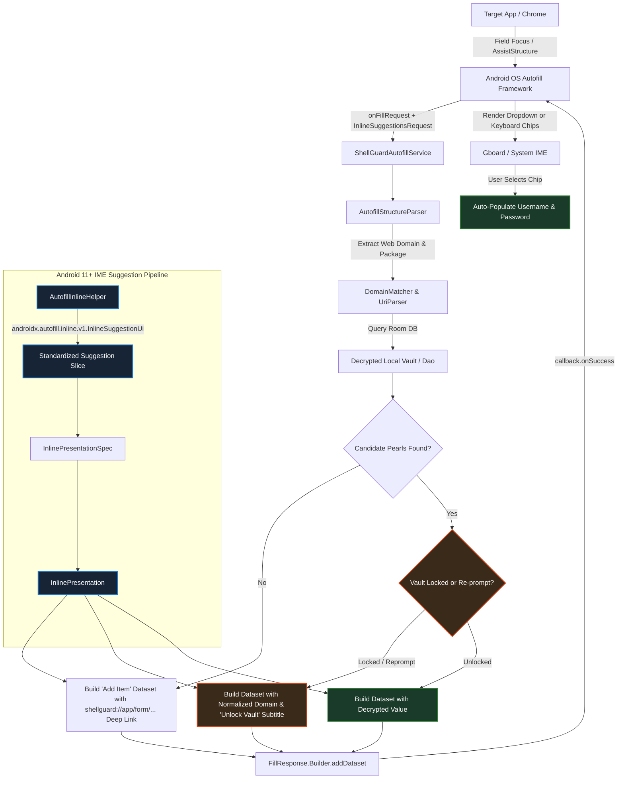

# 🔑 ShellGuard Mobile — Android Autofill & Credential Provider Specification

> **Android Autofill Framework (API 26+), Keyboard Inline Suggestions (Android 11+ / API 30+), Domain Matching & Biometric Gating**  
> *Targeted for Google AI Studio Android Application Generator & ShellGuard Mobile Architecture.*

---

## 1. Autofill Architecture Overview

ShellGuard Mobile operates as a system-level Android Autofill Service and Credential Provider. It allows users to automatically fill credentials (usernames, passwords, and TOTP verification codes) into native applications and browsers (Chrome, Firefox, Brave) without manual copy-pasting.

Beginning in Android 11 (API 30), Autofill suggestions can be rendered directly into the **keyboard suggestion strip** (Input Method Editor / IME, such as Gboard, SwiftKey, and Samsung Keyboard) via **Inline Presentations**.



---

## 2. Dependencies & Android Manifest Requirements

### 2.1. Gradle Dependencies (`app/build.gradle.kts` & `libs.versions.toml`)

Inline suggestions in modern Android IMEs (Gboard, SwiftKey) **strictly require** the Jetpack Autofill library to build compatible slices. Without this library, constructing empty or raw platform slices results in silent rejection by the keyboard:

```toml
# gradle/libs.versions.toml
[versions]
autofill = "1.3.0"
credentials = "1.5.0"

[libraries]
androidx-autofill = { group = "androidx.autofill", name = "autofill", version.ref = "autofill" }
```

```kotlin
// app/build.gradle.kts
dependencies {
    implementation(libs.androidx.autofill)
    implementation(libs.androidx.credentials)
    implementation(libs.androidx.credentials.play.services)
}
```

### 2.2. Service Declaration in `AndroidManifest.xml`
```xml
<!-- Android Autofill Framework Service (API 26+) -->
<service
    android:name=".services.autofill.ShellGuardAutofillService"
    android:label="@string/autofill_service_label"
    android:permission="android.permission.BIND_AUTOFILL_SERVICE"
    android:exported="true">
    <intent-filter>
        <action android:name="android.service.autofill.AutofillService" />
    </intent-filter>
    <meta-data
        android:name="android.service.autofill"
        android:resource="@xml/autofill_service_config" />
</service>

<!-- Transparent Biometric Gate for Locked Datasets & Claw Re-Prompt -->
<activity
    android:name=".services.autofill.AutofillAuthActivity"
    android:theme="@android:style/Theme.Translucent.NoTitleBar"
    android:excludeFromRecents="true"
    android:finishOnTaskLaunch="true"
    android:noHistory="true"
    android:exported="false" />
```

### 2.3. Service Configuration (`res/xml/autofill_service_config.xml`)
```xml
<?xml version="1.0" encoding="utf-8"?>
<autofill-service xmlns:android="http://schemas.android.com/apk/res/android"
    android:settingsActivity="com.clawstack.shellguard.ui.MainActivity"
    android:compatibilityMode="true" />
```

---

## 3. Core Autofill Engine Implementation

### `ShellGuardAutofillService.kt`
```kotlin
package com.clawstack.shellguard.services.autofill

import android.app.PendingIntent
import android.content.ClipData
import android.content.ClipDescription
import android.content.ClipboardManager
import android.content.Context
import android.content.Intent
import android.graphics.drawable.Icon
import android.net.Uri
import android.os.Build
import android.os.CancellationSignal
import android.os.Handler
import android.os.Looper
import android.service.autofill.*
import android.util.Log
import android.view.autofill.AutofillId
import android.view.autofill.AutofillValue
import android.widget.RemoteViews
import android.widget.Toast
import androidx.annotation.RequiresApi
import com.clawstack.shellguard.R
import com.clawstack.shellguard.ShellGuardApp
import com.clawstack.shellguard.crypto.ShellCryptionEngine
import com.clawstack.shellguard.domain.matcher.DomainMatcher
import com.clawstack.shellguard.domain.matcher.UriMatchMode
import com.clawstack.shellguard.engine.TotpEngine
import kotlinx.coroutines.*
import java.security.SecureRandom

@RequiresApi(Build.VERSION_CODES.O)
class ShellGuardAutofillService : AutofillService() {

    private val serviceScope = CoroutineScope(Dispatchers.IO + SupervisorJob())

    override fun onFillRequest(
        request: FillRequest,
        cancellationSignal: CancellationSignal,
        callback: FillCallback
    ) {
        val structure = request.fillContexts.lastOrNull()?.structure ?: run {
            callback.onSuccess(null)
            return
        }

        val parsedFields = AutofillStructureParser.parse(structure)
        if (parsedFields.usernameId == null && parsedFields.passwordId == null) {
            callback.onSuccess(null)
            return
        }

        val app = application as? ShellGuardApp ?: run {
            callback.onSuccess(null)
            return
        }

        val container = app.appContainer
        val deviceVault = container.deviceVault
        val database = container.database
        val cryptoEngine = container.cryptoEngine

        serviceScope.launch {
            val ownerUuid = deviceVault.getOwnerUuid()
            if (ownerUuid == null) {
                callback.onSuccess(null)
                return@launch
            }

            val webDomain = parsedFields.webDomain
            val packageName = parsedFields.packageName ?: ""
            val queryTarget = webDomain?.takeIf { it.isNotBlank() } ?: packageName

            // Query matching credentials from encrypted local Room database
            val candidatePearls = database.vaultPearlDao().search(ownerUuid, queryTarget)
                .ifEmpty {
                    // Match against all Pearls using DomainMatcher heuristic
                    val allPearls = database.vaultPearlDao().search(ownerUuid, "")
                    allPearls.filter { pearl ->
                        pearl.url.isNotBlank() && webDomain != null &&
                                DomainMatcher.isMatch(pearl.url, "https://$webDomain", UriMatchMode.BASE_DOMAIN)
                    }
                }

            val shellKey = deviceVault.getInMemoryShellKey()
            val isVaultLocked = (shellKey == null)

            val responseBuilder = FillResponse.Builder()
            val inlineRequest = if (Build.VERSION.SDK_INT >= Build.VERSION_CODES.R) {
                request.inlineSuggestionsRequest
            } else null

            val fillUrl = webDomain?.let { "https://$it" } ?: if (packageName.isNotBlank()) "androidapp://$packageName" else ""

            // Case A: No matched items -> ONLY show "Add Item" option chip with direct deep link
            if (candidatePearls.isEmpty()) {
                val primaryFieldId = parsedFields.passwordId ?: parsedFields.usernameId
                if (primaryFieldId != null) {
                    val fallbackDatasetBuilder = Dataset.Builder()
                    val displaySub = webDomain ?: packageName.ifBlank { "ShellGuard" }

                    val fallbackPresentation = RemoteViews(applicationContext.packageName, R.layout.autofill_suggestion_item).apply {
                        setTextViewText(R.id.autofill_title, "Add Item")
                        setTextViewText(R.id.autofill_subtitle, displaySub)
                    }

                    val fallbackInlinePresentation = if (Build.VERSION.SDK_INT >= Build.VERSION_CODES.R && inlineRequest != null) {
                        val spec = inlineRequest.inlinePresentationSpecs.firstOrNull()
                        if (spec != null) {
                            AutofillInlineHelper.createInlinePresentation(
                                context = applicationContext,
                                spec = spec,
                                title = "Add Item",
                                subtitle = displaySub,
                                icon = Icon.createWithResource(applicationContext, R.drawable.ic_locked_shell)
                            )
                        } else null
                    } else null

                    val addItemIntent = Intent(
                        Intent.ACTION_VIEW,
                        Uri.parse("shellguard://app/form/NEW/PASSWORD/new?url=${Uri.encode(fillUrl)}")
                    ).apply {
                        setPackage(applicationContext.packageName)
                        flags = Intent.FLAG_ACTIVITY_NEW_TASK or Intent.FLAG_ACTIVITY_SINGLE_TOP
                    }

                    val intentSender = PendingIntent.getActivity(
                        applicationContext,
                        8888,
                        addItemIntent,
                        PendingIntent.FLAG_UPDATE_CURRENT or PendingIntent.FLAG_IMMUTABLE
                    ).intentSender

                    fallbackDatasetBuilder.setAuthentication(intentSender)
                    if (fallbackInlinePresentation != null) {
                        fallbackDatasetBuilder.setValue(primaryFieldId, null, fallbackPresentation, fallbackInlinePresentation)
                    } else {
                        fallbackDatasetBuilder.setValue(primaryFieldId, null, fallbackPresentation)
                    }
                    responseBuilder.addDataset(fallbackDatasetBuilder.build())
                    callback.onSuccess(responseBuilder.build())
                } else {
                    callback.onSuccess(null)
                }
                return@launch
            }

            // Case B: Matches found -> Display matched URI / credentials inline
            for ((index, pearl) in candidatePearls.withIndex()) {
                val datasetBuilder = Dataset.Builder()

                // Standard Dropdown Presentation (RemoteViews)
                val dropdownPresentation = RemoteViews(applicationContext.packageName, R.layout.autofill_suggestion_item).apply {
                    setTextViewText(R.id.autofill_title, pearl.title)
                    setTextViewText(
                        R.id.autofill_subtitle,
                        pearl.username.ifBlank { "No Username" }
                    )
                }

                // If vault is locked, display the matched domain string inline so the user sees site recognition without leaking secret titles
                val chipTitle = if (isVaultLocked) {
                    pearl.url.removePrefix("https://").removePrefix("http://").removePrefix("androidapp://").substringBefore("/")
                } else {
                    pearl.title
                }
                val chipSubtitle = if (isVaultLocked || pearl.reprompt) "Unlock Vault" else pearl.username.ifBlank { "ShellGuard" }
                val chipIcon = if (isVaultLocked || pearl.reprompt) Icon.createWithResource(applicationContext, R.drawable.ic_locked_shell) else null

                // Android 11+ Keyboard Inline Suggestion Chip
                val inlinePresentation = if (Build.VERSION.SDK_INT >= Build.VERSION_CODES.R && inlineRequest != null) {
                    val specs = inlineRequest.inlinePresentationSpecs
                    val spec = specs.getOrNull(index) ?: specs.firstOrNull()
                    if (spec != null) {
                        AutofillInlineHelper.createInlinePresentation(
                            context = applicationContext,
                            spec = spec,
                            title = chipTitle,
                            subtitle = chipSubtitle,
                            icon = chipIcon,
                            pinned = (index == 0) // Pin highest-confidence match
                        )
                    } else null
                } else null

                // Claw Re-Prompt or Locked Vault: Wrap Dataset with Biometric Authorization Gate
                if (isVaultLocked || pearl.reprompt) {
                    val authIntent = Intent(applicationContext, AutofillAuthActivity::class.java).apply {
                        data = Uri.parse("shellguard://autofill/pearl/${pearl.id}")
                        putExtra(AutofillAuthActivity.EXTRA_PEARL_ID, pearl.id)
                        putExtra(AutofillAuthActivity.EXTRA_USERNAME_ID, parsedFields.usernameId)
                        putExtra(AutofillAuthActivity.EXTRA_PASSWORD_ID, parsedFields.passwordId)
                    }
                    val intentSender = PendingIntent.getActivity(
                        applicationContext,
                        pearl.id.hashCode() xor SecureRandom().nextInt(0xFFFF),
                        authIntent,
                        PendingIntent.FLAG_UPDATE_CURRENT or PendingIntent.FLAG_MUTABLE
                    ).intentSender

                    datasetBuilder.setAuthentication(intentSender)

                    // Attach BOTH dropdown and inline presentation to the unauthenticated placeholder values
                    parsedFields.usernameId?.let { userFieldId ->
                        if (inlinePresentation != null && Build.VERSION.SDK_INT >= Build.VERSION_CODES.R) {
                            datasetBuilder.setValue(userFieldId, null, dropdownPresentation, inlinePresentation)
                        } else {
                            datasetBuilder.setValue(userFieldId, null, dropdownPresentation)
                        }
                    } ?: parsedFields.passwordId?.let { passFieldId ->
                        if (inlinePresentation != null && Build.VERSION.SDK_INT >= Build.VERSION_CODES.R) {
                            datasetBuilder.setValue(passFieldId, null, dropdownPresentation, inlinePresentation)
                        } else {
                            datasetBuilder.setValue(passFieldId, null, dropdownPresentation)
                        }
                    }
                } else {
                    // Vault is unlocked and no re-prompt required: Decrypt in memory immediately
                    val decryptedPassword = try {
                        cryptoEngine.decryptField(
                            pearl.secret,
                            shellKey,
                            ShellCryptionEngine.AadNamespace.pearlSecret(pearl.id)
                        )
                    } catch (e: Exception) {
                        Log.e("AutofillService", "Decryption failed for pearl ${pearl.id}; failing closed", e)
                        null
                    }

                    if (decryptedPassword == null) {
                        // Fail CLOSED: Never emit raw ciphertext or corrupted bytes
                        continue
                    }

                    // Auto-copy TOTP to sensitive clipboard if present (Bitwarden Parity)
                    if (pearl.totpSecret.isNotBlank()) {
                        try {
                            val plainTotpSecret = cryptoEngine.decryptField(
                                pearl.totpSecret,
                                shellKey,
                                ShellCryptionEngine.AadNamespace.pearlTotp(pearl.id)
                            )
                            val totpCode = TotpEngine.generateTotp(plainTotpSecret)
                            copyTotpToClipboard(totpCode)
                        } catch (_: Exception) {}
                    }

                    parsedFields.usernameId?.let { userFieldId ->
                        if (inlinePresentation != null && Build.VERSION.SDK_INT >= Build.VERSION_CODES.R) {
                            datasetBuilder.setValue(
                                userFieldId,
                                AutofillValue.forText(pearl.username),
                                dropdownPresentation,
                                inlinePresentation
                            )
                        } else {
                            datasetBuilder.setValue(
                                userFieldId,
                                AutofillValue.forText(pearl.username),
                                dropdownPresentation
                            )
                        }
                    }

                    parsedFields.passwordId?.let { passFieldId ->
                        if (inlinePresentation != null && Build.VERSION.SDK_INT >= Build.VERSION_CODES.R) {
                            datasetBuilder.setValue(
                                passFieldId,
                                AutofillValue.forText(decryptedPassword),
                                dropdownPresentation,
                                inlinePresentation
                            )
                        } else {
                            datasetBuilder.setValue(
                                passFieldId,
                                AutofillValue.forText(decryptedPassword),
                                dropdownPresentation
                            )
                        }
                    }
                }

                responseBuilder.addDataset(datasetBuilder.build())
            }

            callback.onSuccess(responseBuilder.build())
        }
    }

    override fun onSaveRequest(request: SaveRequest, callback: SaveCallback) {
        // Prompts user to save newly entered credentials to ShellGuard
        callback.onSuccess()
    }

    private fun copyTotpToClipboard(code: String) {
        val clipboard = getSystemService(Context.CLIPBOARD_SERVICE) as? ClipboardManager ?: return
        val clip = ClipData.newPlainText("TOTP Code", code).apply {
            if (Build.VERSION.SDK_INT >= Build.VERSION_CODES.TIRAMISU) {
                description.extras = android.os.PersistableBundle().apply {
                    putBoolean(ClipDescription.EXTRA_IS_SENSITIVE, true)
                }
            }
        }
        clipboard.setPrimaryClip(clip)

        Handler(Looper.getMainLooper()).post {
            Toast.makeText(this, "Verification code copied to clipboard", Toast.LENGTH_SHORT).show()
        }

        // Schedule 30-second automated clipboard scrub
        Handler(Looper.getMainLooper()).postDelayed({
            try {
                if (clipboard.hasPrimaryClip()) {
                    val currentClip = clipboard.primaryClip
                    if (currentClip != null && currentClip.itemCount > 0) {
                        val text = currentClip.getItemAt(0).text?.toString()
                        if (text == code) {
                            if (Build.VERSION.SDK_INT >= Build.VERSION_CODES.P) {
                                clipboard.clearPrimaryClip()
                            } else {
                                clipboard.setPrimaryClip(ClipData.newPlainText("", ""))
                            }
                        }
                    }
                }
            } catch (_: Exception) {}
        }, 30_000L)
    }

    override fun onDestroy() {
        super.onDestroy()
        serviceScope.cancel()
    }
}
```

---

## 3.1. Keyboard Inline Suggestion Protocol (`AutofillInlineHelper.kt`)

### The Silent Drop Bug (Root Cause Analysis)
Android 11+ IMEs (Gboard, SwiftKey) do **not** render raw, unformatted `android.app.slice.Slice` objects. When an Autofill service returns a slice constructed via:
```kotlin
// ❌ WRONG: Creates an empty raw slice without protocol keys
val slice = Slice.Builder(uri, SliceSpec("inline_suggestion", 1)).build()
```
Gboard invokes `androidx.autofill.inline.v1.InlineSuggestionUi.fromSlice(slice)`. Because the raw slice lacks the mandatory action PendingIntent, title bundle, and RemoteViews content templates, the parser returns `null` or throws an exception. Gboard catches this and **silently drops the chip** from the keyboard strip with zero user feedback.

### Production Solution: Jetpack `InlineSuggestionUi`
To render correctly on Gboard, the slice must be built using `androidx.autofill.inline.v1.InlineSuggestionUi.newContentBuilder(attributionIntent)`:

```kotlin
package com.clawstack.shellguard.services.autofill

import android.app.PendingIntent
import android.content.Context
import android.graphics.drawable.Icon
import android.os.Build
import android.service.autofill.InlinePresentation
import android.widget.inline.InlinePresentationSpec
import androidx.annotation.RequiresApi
import androidx.autofill.inline.v1.InlineSuggestionUi

/**
 * Helper to construct Android 11+ (API 30+) Keyboard Inline Suggestion chips
 * for Gboard, SwiftKey, and modern IME keyboards.
 *
 * Utilizes the official AndroidX Autofill Inline Suggestion Slice Protocol
 * to guarantee that suggestion chips are parsed and rendered by IMEs.
 */
@RequiresApi(Build.VERSION_CODES.R)
object AutofillInlineHelper {

    fun createInlinePresentation(
        context: Context,
        spec: InlinePresentationSpec,
        title: String,
        subtitle: String = "",
        attributionIntent: PendingIntent,
        icon: Icon? = null,
        pinned: Boolean = false
    ): InlinePresentation {
        val builder = InlineSuggestionUi.newContentBuilder(attributionIntent)
            .setTitle(title)
            .setContentDescription(title)

        if (subtitle.isNotBlank()) {
            builder.setSubtitle(subtitle)
        }

        if (icon != null) {
            builder.setStartIcon(icon)
        }

        val slice = builder.build().slice

        return InlinePresentation(slice, spec, pinned)
    }
}
```

---

## 3.2. Biometric Authorization Gate (`AutofillAuthActivity.kt`)

When an item has Claw Re-Prompt enabled or the device vault is currently locked, the Android Autofill framework invokes `AutofillAuthActivity`.

```kotlin
package com.clawstack.shellguard.services.autofill

import android.app.Activity
import android.content.ClipData
import android.content.ClipDescription
import android.content.ClipboardManager
import android.content.Context
import android.content.Intent
import android.os.Build
import android.os.Bundle
import android.os.Handler
import android.os.Looper
import android.service.autofill.Dataset
import android.util.Log
import android.view.WindowManager
import android.view.autofill.AutofillId
import android.view.autofill.AutofillManager
import android.view.autofill.AutofillValue
import android.widget.Toast
import androidx.biometric.BiometricPrompt
import androidx.core.content.ContextCompat
import androidx.fragment.app.FragmentActivity
import com.clawstack.shellguard.BuildConfig
import com.clawstack.shellguard.ShellGuardApp
import com.clawstack.shellguard.crypto.AndroidKeyStoreHelper
import com.clawstack.shellguard.crypto.ShellCryptionEngine
import com.clawstack.shellguard.engine.TotpEngine
import kotlinx.coroutines.*

class AutofillAuthActivity : FragmentActivity() {

    private val activityScope = CoroutineScope(Dispatchers.Main)

    override fun onCreate(savedInstanceState: Bundle?) {
        super.onCreate(savedInstanceState)

        if (!BuildConfig.DEBUG) {
            window.setFlags(
                WindowManager.LayoutParams.FLAG_SECURE,
                WindowManager.LayoutParams.FLAG_SECURE
            )
        }

        val pearlId = intent.getStringExtra(EXTRA_PEARL_ID)
        val usernameId = if (Build.VERSION.SDK_INT >= Build.VERSION_CODES.TIRAMISU) {
            intent.getParcelableExtra(EXTRA_USERNAME_ID, AutofillId::class.java)
        } else {
            @Suppress("DEPRECATION")
            intent.getParcelableExtra(EXTRA_USERNAME_ID)
        }

        val passwordId = if (Build.VERSION.SDK_INT >= Build.VERSION_CODES.TIRAMISU) {
            intent.getParcelableExtra(EXTRA_PASSWORD_ID, AutofillId::class.java)
        } else {
            @Suppress("DEPRECATION")
            intent.getParcelableExtra(EXTRA_PASSWORD_ID)
        }

        if (pearlId.isNullOrBlank()) {
            setResult(Activity.RESULT_CANCELED)
            finish()
            return
        }

        promptBiometricAuthentication(pearlId, usernameId, passwordId)
    }

    private fun promptBiometricAuthentication(
        pearlId: String,
        usernameId: AutofillId?,
        passwordId: AutofillId?
    ) {
        val executor = ContextCompat.getMainExecutor(this)
        val prompt = BiometricPrompt(this, executor, object : BiometricPrompt.AuthenticationCallback() {
            override fun onAuthenticationSucceeded(result: BiometricPrompt.AuthenticationResult) {
                super.onAuthenticationSucceeded(result)
                fulfillAutofillDataset(pearlId, usernameId, passwordId)
            }

            override fun onAuthenticationError(errorCode: Int, errString: CharSequence) {
                super.onAuthenticationError(errorCode, errString)
                setResult(Activity.RESULT_CANCELED)
                finish()
            }
        })

        val promptInfo = BiometricPrompt.PromptInfo.Builder()
            .setTitle("Unlock ShellGuard")
            .setSubtitle("Confirm identity to autofill credentials")
            .setAllowedAuthenticators(
                androidx.biometric.BiometricManager.Authenticators.BIOMETRIC_STRONG or
                androidx.biometric.BiometricManager.Authenticators.DEVICE_CREDENTIAL
            )
            .build()

        prompt.authenticate(promptInfo)
    }

    private fun fulfillAutofillDataset(
        pearlId: String,
        usernameId: AutofillId?,
        passwordId: AutofillId?
    ) {
        val app = application as? ShellGuardApp ?: run {
            setResult(Activity.RESULT_CANCELED)
            finish()
            return
        }

        val container = app.appContainer
        val deviceVault = container.deviceVault
        val database = container.database
        val cryptoEngine = container.cryptoEngine

        activityScope.launch {
            val ownerUuid = deviceVault.getOwnerUuid()
            val shellKey = deviceVault.getInMemoryShellKey()

            if (ownerUuid == null || shellKey == null) {
                setResult(Activity.RESULT_CANCELED)
                finish()
                return@launch
            }

            val pearl = withContext(Dispatchers.IO) {
                database.vaultPearlDao().getById(ownerUuid, pearlId)
            }

            if (pearl == null) {
                setResult(Activity.RESULT_CANCELED)
                finish()
                return@launch
            }

            val decryptedPassword = withContext(Dispatchers.IO) {
                try {
                    cryptoEngine.decryptField(
                        pearl.secret,
                        shellKey,
                        ShellCryptionEngine.AadNamespace.pearlSecret(pearlId)
                    )
                } catch (e: Exception) {
                    Log.e("AutofillAuthActivity", "Decryption failed; failing closed", e)
                    null
                }
            }

            if (decryptedPassword == null) {
                setResult(Activity.RESULT_CANCELED)
                finish()
                return@launch
            }

            if (Build.VERSION.SDK_INT >= Build.VERSION_CODES.O) {
                val datasetBuilder = Dataset.Builder()

                if (usernameId != null && pearl.username.isNotBlank()) {
                    datasetBuilder.setValue(usernameId, AutofillValue.forText(pearl.username))
                }

                if (passwordId != null) {
                    datasetBuilder.setValue(passwordId, AutofillValue.forText(decryptedPassword))
                }

                val replyIntent = Intent().apply {
                    putExtra(AutofillManager.EXTRA_AUTHENTICATION_RESULT, datasetBuilder.build())
                }
                setResult(Activity.RESULT_OK, replyIntent)
            } else {
                setResult(Activity.RESULT_OK)
            }

            finish()
        }
    }

    companion object {
        const val EXTRA_PEARL_ID = "extra_pearl_id"
        const val EXTRA_USERNAME_ID = "extra_username_id"
        const val EXTRA_PASSWORD_ID = "extra_password_id"
    }
}
```

---

## 4. AssistStructure Parser & Anti-AutoSpill Protections

To protect against credential harvesting and malicious invisible iframes (AutoSpill attacks), the parser enforces strict visibility and structure checks:

1. **Node Visibility Filtering**: Inactive or invisible nodes (`node.visibility != View.VISIBLE`) are strictly ignored.
2. **Web Domain Extraction**: Web domains are extracted from `viewNode.webDomain` (supported in Chrome, Firefox, Custom Tabs).
3. **Autofill Hints Precedence**: Explicit platform hints (`View.AUTOFILL_HINT_USERNAME`, `View.AUTOFILL_HINT_PASSWORD`) always take precedence over view ID regex heuristics.

```kotlin
package com.clawstack.shellguard.services.autofill

import android.app.assist.AssistStructure
import android.os.Build
import android.view.View
import android.view.autofill.AutofillId
import androidx.annotation.RequiresApi

data class ParsedAutofillFields(
    var usernameId: AutofillId? = null,
    var passwordId: AutofillId? = null,
    var webDomain: String? = null,
    var packageName: String? = null
)

@RequiresApi(Build.VERSION_CODES.O)
object AutofillStructureParser {

    fun parse(structure: AssistStructure): ParsedAutofillFields {
        val result = ParsedAutofillFields()
        val nodeCount = structure.windowNodeCount

        for (i in 0 until nodeCount) {
            val windowNode = structure.getWindowNodeAt(i)
            traverseNode(windowNode.rootViewNode, result)
        }

        return result
    }

    private fun traverseNode(node: AssistStructure.ViewNode, result: ParsedAutofillFields) {
        // Anti-AutoSpill Defense: Disregard hidden, zero-sized, or non-visible view nodes
        if (node.visibility != View.VISIBLE || node.width <= 0 || node.height <= 0) return

        // Capture web domain if browser or custom tab
        node.webDomain?.let { if (result.webDomain == null) result.webDomain = it }
        node.idPackage?.let { if (result.packageName == null) result.packageName = it }

        val hints = node.autofillHints
        val idEntry = node.idEntry?.lowercase() ?: ""
        val hintText = node.hint?.toString()?.lowercase() ?: ""

        if (hints != null) {
            for (hint in hints) {
                when (hint.lowercase()) {
                    View.AUTOFILL_HINT_USERNAME, View.AUTOFILL_HINT_EMAIL_ADDRESS -> result.usernameId = node.autofillId
                    View.AUTOFILL_HINT_PASSWORD -> result.passwordId = node.autofillId
                }
            }
        }

        // Heuristic fallback if explicit hints are missing
        if (result.passwordId == null && (idEntry.contains("password") || idEntry.contains("pwd") || hintText.contains("password"))) {
            result.passwordId = node.autofillId
        } else if (result.usernameId == null && (idEntry.contains("username") || idEntry.contains("login") || idEntry.contains("email") || hintText.contains("email"))) {
            result.usernameId = node.autofillId
        }

        for (i in 0 until node.childCount) {
            traverseNode(node.getChildAt(i), result)
        }
    }
}
```

---

## 5. Domain & Package Matcher (`DomainMatcher.kt`)

```kotlin
package com.clawstack.shellguard.domain.matcher

import java.net.URI

enum class UriMatchMode {
    BASE_DOMAIN,
    HOST,
    EXACT,
    STARTS_WITH,
    NEVER
}

object DomainMatcher {

    fun getEffectiveDomain(url: String): String {
        return try {
            val cleanUrl = if (!url.startsWith("http://") && !url.startsWith("https://")) {
                "https://$url"
            } else url
            val uri = URI(cleanUrl)
            val host = uri.host?.lowercase() ?: return url

            val parts = host.split(".")
            if (parts.size >= 2) {
                "${parts[parts.size - 2]}.${parts[parts.size - 1]}"
            } else host
        } catch (_: Exception) {
            url
        }
    }

    fun isMatch(
        vaultUrl: String,
        requestedUrl: String,
        matchMode: UriMatchMode = UriMatchMode.BASE_DOMAIN
    ): Boolean {
        if (matchMode == UriMatchMode.NEVER) return false
        if (vaultUrl.isBlank() || requestedUrl.isBlank()) return false

        return when (matchMode) {
            UriMatchMode.BASE_DOMAIN -> {
                val vaultBase = getEffectiveDomain(vaultUrl)
                val requestedBase = getEffectiveDomain(requestedUrl)
                vaultBase.equals(requestedBase, ignoreCase = true)
            }
            UriMatchMode.HOST -> {
                val vaultHost = URI(vaultUrl).host ?: ""
                val requestedHost = URI(requestedUrl).host ?: ""
                vaultHost.equals(requestedHost, ignoreCase = true)
            }
            UriMatchMode.EXACT -> vaultUrl.trimEnd('/').equals(requestedUrl.trimEnd('/'), ignoreCase = true)
            UriMatchMode.STARTS_WITH -> requestedUrl.startsWith(vaultUrl, ignoreCase = true)
            UriMatchMode.NEVER -> false
        }
    }
}
```

---

## 6. Testing & Diagnostic Playbook

### 6.1. Verifying Autofill Registration via ADB
```bash
# Check current system autofill service
adb shell cmd autofill get default-service

# Set ShellGuard as the active autofill service
adb shell cmd autofill set default-service com.clawstack.shellguard/.services.autofill.ShellGuardAutofillService

# Force-enable inline suggestions in developer settings
adb shell settings put secure autofill_inline_suggestions_enabled 1

# Check Gboard inline suggestions availability
adb shell cmd autofill list requests
```

### 6.2. Common Pitfalls Checklist
1. **Empty Slice**: If Gboard does not show inline chips, ensure `AutofillInlineHelper` uses `InlineSuggestionUi.newContentBuilder(attributionIntent)` and never returns raw empty Slices.
2. **Missing Inline Presentation on Locked Vault**: Ensure `datasetBuilder.setValue(...)` passes `inlinePresentation` even when value is null for locked/reprompt datasets.
3. **IME Compatibility**: Ensure the active keyboard supports inline suggestions (Gboard, SwiftKey on Android 11+).
