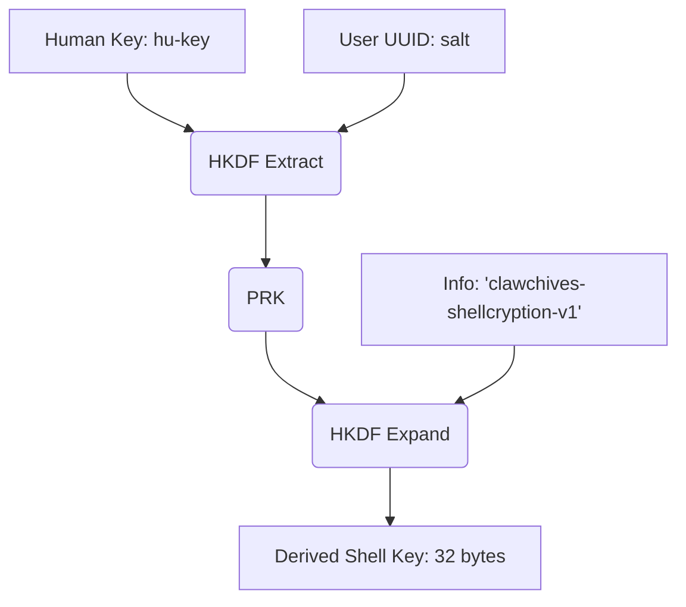
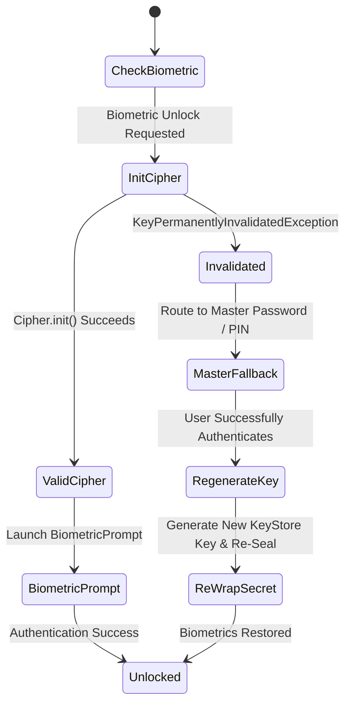

# ShellGuard Mobile: Cryptography & KeyStore Specification
Targeted for Google AI Studio Android Application Generator

## 1. Cryptographic Invariants & Parity
The Android client matches the web client with 100% cryptographic parity.



Key derivation: `HKDF-SHA-256(ikm=hu-key, salt=userUuid, info='clawchives-shellcryption-v1', L=32)`

The full mobile client must support ALL AAD namespaces:
- `vault_pearls:{id}` — Pearl secret (password)
- `vault_pearls_totp:{id}` — Pearl totp_secret
- `vault_pearls_custom:{id}` — Pearl custom_fields
- `vault_pearls_history:{id}` — Pearl password_history
- `vault_secure_notes:{id}` — Note content
- `vault_secure_notes_custom:{id}` — Note custom_fields
- `vault_ssh_keys:{id}` — SSH key key_value
- `vault_ssh_keys_custom:{id}` — SSH key custom_fields
- `vault_secure_attachments:{id}` — Attachment file_data
- `totp_backup:{ownerUuid}` — sgtotp.bak bridge

## 2. ShellCryption Envelope Schema
JSON envelope: `{v:1, alg:'AES-GCM-256', iv, ct, aad}`
AAD binding invariant: The AAD (Additional Authenticated Data) must exactly match the namespace and ID of the entity being encrypted or decrypted. If the AAD does not match, the decryption must fail.

## 3. ShellCryption Key Derivation & Decryption Engine (Kotlin)

```kotlin
package com.clawstack.shellguard.crypto

import android.util.Base64
import org.json.JSONObject
import javax.crypto.Cipher
import javax.crypto.Mac
import javax.crypto.spec.GCMParameterSpec
import javax.crypto.spec.SecretKeySpec
import java.security.SecureRandom

object ShellCryptionEngine {
    private const val ALGORITHM = "AES/GCM/NoPadding"
    private const val TAG_LENGTH_BIT = 128
    private const val HKDF_INFO = "clawchives-shellcryption-v1"

    fun deriveShellKey(huKey: String, userUuid: String): ByteArray {
        return hkdf(
            huKey.toByteArray(Charsets.UTF_8),
            userUuid.toByteArray(Charsets.UTF_8),
            HKDF_INFO.toByteArray(Charsets.UTF_8),
            32
        )
    }

    /**
     * Determines whether a raw string represents an encrypted ShellCryption envelope object.
     * Prevents deserialization crashes on plain JSON arrays (e.g. "[]") or empty strings.
     */
    fun isEncryptedEnvelope(value: String?): Boolean {
        if (value.isNullOrBlank()) return false
        val trimmed = value.trim()
        return trimmed.startsWith("{") && trimmed.endsWith("}") &&
               trimmed.contains("\"v\":") && trimmed.contains("\"ct\":")
    }

    fun decryptField(envelopeJson: String, shellKey: ByteArray, expectedAad: String): String {
        if (!isEncryptedEnvelope(envelopeJson)) {
            throw IllegalArgumentException("Invalid ShellCryption envelope: not a valid JSON envelope object")
        }
        val envelope = JSONObject(envelopeJson)
        val v = envelope.getInt("v")
        val alg = envelope.getString("alg")
        val iv = Base64.decode(envelope.getString("iv"), Base64.DEFAULT)
        val ct = Base64.decode(envelope.getString("ct"), Base64.DEFAULT)
        val aad = envelope.getString("aad")

        if (v != 1 || alg != "AES-GCM-256") {
            throw IllegalArgumentException("Unsupported envelope format")
        }

        if (aad != expectedAad) {
            throw SecurityException("AAD mismatch. Expected: $expectedAad, Actual: $aad")
        }

        val cipher = Cipher.getInstance(ALGORITHM)
        val secretKeySpec = SecretKeySpec(shellKey, "AES")
        val gcmParameterSpec = GCMParameterSpec(TAG_LENGTH_BIT, iv)

        cipher.init(Cipher.DECRYPT_MODE, secretKeySpec, gcmParameterSpec)
        cipher.updateAAD(aad.toByteArray(Charsets.UTF_8))

        val decrypted = cipher.doFinal(ct)
        return String(decrypted, Charsets.UTF_8)
    }

    fun encryptField(plainText: String, shellKey: ByteArray, aad: String): String {
        val cipher = Cipher.getInstance(ALGORITHM)
        val secretKeySpec = SecretKeySpec(shellKey, "AES")
        val iv = ByteArray(12)
        SecureRandom().nextBytes(iv)
        val gcmParameterSpec = GCMParameterSpec(TAG_LENGTH_BIT, iv)

        cipher.init(Cipher.ENCRYPT_MODE, secretKeySpec, gcmParameterSpec)
        cipher.updateAAD(aad.toByteArray(Charsets.UTF_8))

        val ct = cipher.doFinal(plainText.toByteArray(Charsets.UTF_8))

        val envelope = JSONObject().apply {
            put("v", 1)
            put("alg", "AES-GCM-256")
            put("iv", Base64.encodeToString(iv, Base64.NO_WRAP))
            put("ct", Base64.encodeToString(ct, Base64.NO_WRAP))
            put("aad", aad)
        }

        return envelope.toString()
    }

    private fun hkdfExtract(salt: ByteArray, ikm: ByteArray): ByteArray {
        val mac = Mac.getInstance("HmacSHA256")
        val saltKey = if (salt.isEmpty()) ByteArray(32) else salt
        mac.init(SecretKeySpec(saltKey, "HmacSHA256"))
        return mac.doFinal(ikm)
    }

    private fun hkdfExpand(prk: ByteArray, info: ByteArray, length: Int): ByteArray {
        val mac = Mac.getInstance("HmacSHA256")
        mac.init(SecretKeySpec(prk, "HmacSHA256"))
        
        var t = ByteArray(0)
        var okm = ByteArray(0)
        var i = 1
        
        while (okm.size < length) {
            mac.update(t)
            mac.update(info)
            mac.update(i.toByte())
            t = mac.doFinal()
            okm += t
            i++
        }
        
        return okm.copyOfRange(0, length)
    }

    private fun hkdf(ikm: ByteArray, salt: ByteArray, info: ByteArray, length: Int): ByteArray {
        val prk = hkdfExtract(salt, ikm)
        return hkdfExpand(prk, info, length)
    }
}
```

## 4. Hardware-Backed Android KeyStore & Biometric Sealing

```kotlin
package com.clawstack.shellguard.crypto

import android.security.keystore.KeyGenParameterSpec
import android.security.keystore.KeyProperties
import java.security.KeyStore
import javax.crypto.Cipher
import javax.crypto.KeyGenerator
import javax.crypto.SecretKey
import javax.crypto.spec.GCMParameterSpec

object AndroidKeyStoreHelper {
    private const val KEYSTORE_PROVIDER = "AndroidKeyStore"
    private const val BIOMETRIC_KEY_ALIAS = "ShellGuardBiometricKey"

    fun getOrCreateBiometricSecretKey(): SecretKey {
        val keyStore = KeyStore.getInstance(KEYSTORE_PROVIDER)
        keyStore.load(null)

        if (!keyStore.containsAlias(BIOMETRIC_KEY_ALIAS)) {
            val keyGenerator = KeyGenerator.getInstance(KeyProperties.KEY_ALGORITHM_AES, KEYSTORE_PROVIDER)
            val builder = KeyGenParameterSpec.Builder(
                BIOMETRIC_KEY_ALIAS,
                KeyProperties.PURPOSE_ENCRYPT or KeyProperties.PURPOSE_DECRYPT
            )
                .setBlockModes(KeyProperties.BLOCK_MODE_GCM)
                .setEncryptionPaddings(KeyProperties.ENCRYPTION_PADDING_NONE)
                .setUserAuthenticationRequired(true)
                .setInvalidatedByBiometricEnrollment(true)

            keyGenerator.init(builder.build())
            return keyGenerator.generateKey()
        }

        return keyStore.getKey(BIOMETRIC_KEY_ALIAS, null) as SecretKey
    }

    fun getBiometricCipher(mode: Int, iv: ByteArray? = null): Cipher {
        val cipher = Cipher.getInstance("${KeyProperties.KEY_ALGORITHM_AES}/${KeyProperties.BLOCK_MODE_GCM}/${KeyProperties.ENCRYPTION_PADDING_NONE}")
        val secretKey = getOrCreateBiometricSecretKey()

        if (mode == Cipher.ENCRYPT_MODE) {
            cipher.init(mode, secretKey)
        } else {
            cipher.init(mode, secretKey, GCMParameterSpec(128, iv))
        }

        return cipher
    }
}
```

## 5. Standard Key Hashing (ClawCrypto.kt)

```kotlin
package com.clawstack.shellguard.crypto

import java.security.MessageDigest

object ClawCrypto {
    fun hashKey(key: String): String {
        val bytes = key.toByteArray(Charsets.UTF_8)
        val md = MessageDigest.getInstance("SHA-256")
        val digest = md.digest(bytes)
        return digest.joinToString("") { "%02x".format(it) }
    }
}
```

## 6. Memory Hygiene & Secret Zeroing

```kotlin
package com.clawstack.shellguard.crypto

object MemoryHygiene {
    fun zeroArray(array: ByteArray?) {
        if (array == null) return
        for (i in array.indices) {
            array[i] = 0
        }
    }
    
    fun zeroArray(array: CharArray?) {
        if (array == null) return
        for (i in array.indices) {
            array[i] = '\u0000'
        }
    }
}
```
*Note: Ensure SQLCipher is configured for encrypted data at rest in the SQLite database.*

## 7. Emergency Panic Purge & Security Preference Architecture

```kotlin
package com.clawstack.shellguard.security

import android.content.BroadcastReceiver
import android.content.Context
import android.content.Intent
import android.util.Log

class PanicTriggerReceiver : BroadcastReceiver() {
    override fun onReceive(context: Context, intent: Intent) {
        if (intent.action == "com.clawstack.shellguard.PANIC_PURGE") {
            Log.w("PanicTriggerReceiver", "Emergency Panic Purge Triggered!")
            SecurityPreferenceController.purgeAll(context)
        }
    }
}

object SecurityPreferenceController {
    fun purgeAll(context: Context) {
        val prefs = context.getSharedPreferences("shellguard_secure_prefs", Context.MODE_PRIVATE)
        prefs.edit().clear().apply()
        
        context.deleteDatabase("shellguard.db")
        
        val keyStore = java.security.KeyStore.getInstance("AndroidKeyStore")
        keyStore.load(null)
        if (keyStore.containsAlias("ShellGuardBiometricKey")) {
            keyStore.deleteEntry("ShellGuardBiometricKey")
        }
    }
}
```

---

## 8. Biometric Invalidation Lifecycle & Recovery State Machine

When a user registers or updates biometrics (fingerprint/face) in Android system settings, `AndroidKeyStore` permanently destroys any hardware key configured with `.setInvalidatedByBiometricEnrollment(true)`. Attempting to initialize the biometric cipher will throw `KeyPermanentlyInvalidatedException`.



### Recovery Implementation (`BiometricRecoveryHandler.kt`)

```kotlin
package com.clawstack.shellguard.crypto

import android.security.keystore.KeyPermanentlyInvalidatedException
import javax.crypto.Cipher

sealed class BiometricCipherResult {
    data class Ready(val cipher: Cipher) : BiometricCipherResult()
    object KeyInvalidated : BiometricCipherResult()
    data class Failure(val error: Throwable) : BiometricCipherResult()
}

object BiometricRecoveryHandler {
    fun safeGetBiometricCipher(): BiometricCipherResult {
        return try {
            val cipher = AndroidKeyStoreHelper.getBiometricCipher()
            BiometricCipherResult.Ready(cipher)
        } catch (e: KeyPermanentlyInvalidatedException) {
            // Hardware key destroyed by OS due to biometric enrollment changes
            BiometricCipherResult.KeyInvalidated
        } catch (t: Throwable) {
            BiometricCipherResult.Failure(t)
        }
    }

    /**
     * Called after the user confirms their Master Password or PIN to recover from key invalidation.
     */
    fun reEnrollBiometrics(vaultSecretBytes: ByteArray): Boolean {
        return try {
            val keyStore = java.security.KeyStore.getInstance("AndroidKeyStore").apply { load(null) }
            if (keyStore.containsAlias("ShellGuardBiometricKey")) {
                keyStore.deleteEntry("ShellGuardBiometricKey")
            }
            // Generate fresh hardware key and re-seal the secret
            AndroidKeyStoreHelper.getOrCreateBiometricSecretKey()
            true
        } catch (e: Exception) {
            false
        }
    }
}
```

---

## 9. Sensitive Clipboard Hardening (Android 13+ CWE-359)

To prevent visual cleartext password leakage via Android 13+ system clipboard overlay previews, all clipboard copy operations must apply `EXTRA_IS_SENSITIVE`:

```kotlin
package com.clawstack.shellguard.utils

import android.content.ClipData
import android.content.ClipDescription
import android.content.ClipboardManager
import android.content.Context
import android.os.Build
import android.os.PersistableBundle
import kotlinx.coroutines.*

object SensitiveClipboardHelper {
    private var clearJob: Job? = null

    fun copySensitive(
        context: Context,
        label: String,
        plaintext: String,
        autoClearSeconds: Long = 30L,
        scope: CoroutineScope = CoroutineScope(Dispatchers.Main)
    ) {
        val clipboard = context.getSystemService(Context.CLIPBOARD_SERVICE) as ClipboardManager
        val clip = ClipData.newPlainText(label, plaintext).apply {
            if (Build.VERSION.SDK_INT >= Build.VERSION_CODES.TIRAMISU) {
                description.extras = PersistableBundle().apply {
                    putBoolean(ClipDescription.EXTRA_IS_SENSITIVE, true)
                }
            }
        }
        clipboard.setPrimaryClip(clip)

        // Schedule auto-purge
        clearJob?.cancel()
        clearJob = scope.launch {
            delay(autoClearSeconds * 1000L)
            if (clipboard.hasPrimaryClip() && clipboard.primaryClipDescription?.hasMimeType(ClipDescription.MIMETYPE_TEXT_PLAIN) == true) {
                if (Build.VERSION.SDK_INT >= Build.VERSION_CODES.P) {
                    clipboard.clearPrimaryClip()
                } else {
                    clipboard.setPrimaryClip(ClipData.newPlainText("", ""))
                }
            }
        }
    }
}
```

---

## 10. Password History Cryptographic Binding

Whenever an existing password pearl is updated, previous passwords must be preserved in `password_history`:
- **Serialized Form**: JSON array `[{"password":"...","changed_at":"2026-09-24T23:00:00Z"}]`
- **ShellCryption AAD Binding**: `vault_pearls_history:{id}`
- Decryption occurs only on-demand when the user views the History Sheet in `ItemDetailScreen`.

