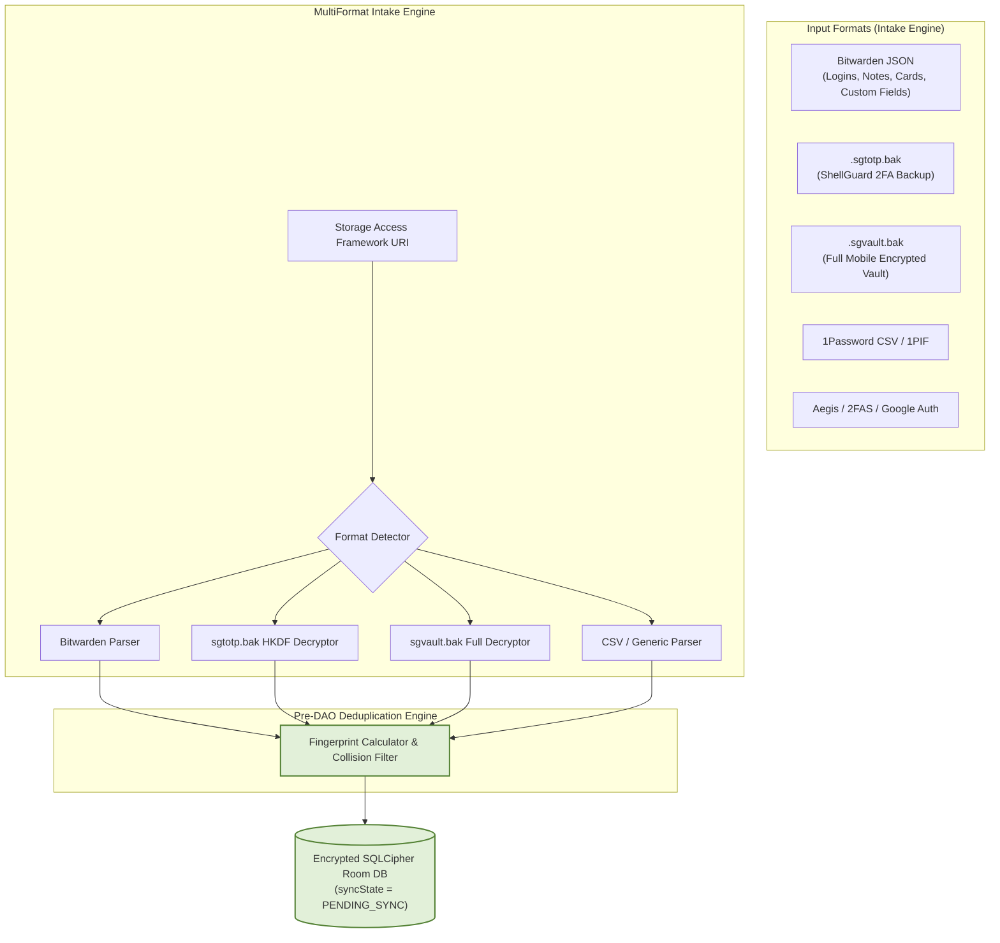

# 📦 ShellGuard Mobile — Import, Export & Migration Engine Specification

> **Bitwarden Intake, `.sgtotp.bak` Bridge, `.sgvault.bak` Full Backup & Deduplication Engine**  
> *Targeted for Google AI Studio Android Application Generator.*

---

## 1. Migration Architecture & Supported Formats

ShellGuard Mobile supports seamless data ingestion from major password managers and authenticator apps, plus full-vault bidirectional portability with the ShellGuard ecosystem.



---

## 2. Canonical Export Formats

### A. Full Encrypted Vault Backup (`.sgvault.bak`)
The primary backup format for ShellGuard Mobile. Encrypts all domains (Passwords, Notes, SSH Keys, Attachments metadata) into a single AES-GCM-256 envelope derived via HKDF from an export passphrase.

```json
{
  "version": "shellguard-vault-backup-v1",
  "created_at": "2026-09-24T23:00:00Z",
  "owner_uuid": "c983a542-...",
  "protection_mode": "PASSWORD",
  "checksum": "a1b2c3d4e5...",
  "cipher": {
    "v": 1,
    "alg": "AES-GCM-256",
    "iv": "3f9a...",
    "ct": "base64-payload...",
    "aad": "vault_backup:c983a542-..."
  }
}
```

### B. TOTP Companion Bridge (`.sgtotp.bak`)
100% compatible with the `ShellGuard-TOTP` Android app and the Web Server's `ImportExportView`:
- Envelope: `shellguard-totp-backup-v1`
- AAD: `totp_backup:{ownerUuid}`
- Exports login TOTP secrets + standalone verification codes.

---

## 3. Bitwarden JSON Ingestion Engine

Transforms standard Bitwarden vault exports (`items[]`) into ShellGuard domains:

| Bitwarden Field | ShellGuard Entity & Field | Transformation / Encryption |
|:---|:---|:---|
| `type == 1` (Login) | `VaultPearlEntity` | Maps `name` → `title`, `login.username` → `username`, `login.password` → ShellCrypted `secret`, `login.totp` → ShellCrypted `totpSecret`, `login.uris` → `uris`. |
| `type == 2` (Secure Note) | `SecureNoteEntity` | Maps `name` → `title`, `notes` → ShellCrypted `content`. |
| `fields[]` | `customFields` | JSON array of `{name, value, type}` serialized and encrypted into `customFields` blob. |
| `folderId` | `category` / Pod | Mapped from Bitwarden `folders[]` lookup table. |
| `favorite == true` | `tags` | Appends `"favorite"` tag to JSON array. |

---

## 4. Pre-DAO Fingerprint Deduplication

To prevent duplicate entries and UUID false-negatives when re-importing backups:

```kotlin
package com.clawstack.shellguard.data.backup

object DeduplicationEngine {

    /**
     * Computes a normalized invariant fingerprint for a vault pearl.
     */
    fun computePearlFingerprint(title: String, username: String, secret: String): String {
        val cleanTitle = title.trim().lowercase()
        val cleanUser = username.trim().lowercase()
        val cleanSecret = secret.trim().replace(" ", "").replace("-", "")
        return "$cleanTitle|$cleanUser|$cleanSecret"
    }

    /**
     * Filters incoming import items against existing fingerprints.
     */
    fun <T> filterDuplicates(
        incoming: List<T>,
        existingFingerprints: Set<String>,
        fingerprintSelector: (T) -> String
    ): List<T> {
        val seen = existingFingerprints.toMutableSet()
        val uniqueItems = ArrayList<T>()

        for (item in incoming) {
            val fp = fingerprintSelector(item)
            if (!seen.contains(fp)) {
                seen.add(fp)
                uniqueItems.add(item)
            }
        }
        return uniqueItems
    }
}
```

---

## 5. `VaultBackupEngine.kt` Implementation

```kotlin
package com.clawstack.shellguard.data.backup

import com.clawstack.shellguard.crypto.ClawCrypto
import com.clawstack.shellguard.crypto.EncryptedDeviceVault
import com.clawstack.shellguard.crypto.ShellCryptionEngine
import com.clawstack.shellguard.data.local.ShellGuardDatabase
import kotlinx.serialization.json.Json
import javax.inject.Inject
import javax.inject.Singleton

@Singleton
class VaultBackupEngine @Inject constructor(
    private val db: ShellGuardDatabase,
    private val deviceVault: EncryptedDeviceVault
) {
    private val json = Json { ignoreUnknownKeys = true; prettyPrint = true }

    /**
     * Exports full encrypted vault backup.
     * Uses HKDF-SHA256 for active hu- key or PBKDF2 for custom passphrase.
     */
    suspend fun exportVault(
        ownerUuid: String,
        protectionMode: BackupProtectionMode,
        customPassphrase: String? = null,
        activeClawKey: String? = null
    ): Result<ExportResult> {
        return try {
            val pearls = db.vaultPearlDao().getAllActivePearls(ownerUuid)
            val notes = db.secureNoteDao().getAllActiveNotes(ownerUuid)
            val keys = db.sshKeyDao().getAllActiveSshKeys(ownerUuid)

            val sessionShellKey = deviceVault.getShellKey()
            
            // Map into unified polymorphic items
            val allItems = mutableListOf<BackupVaultItem>()
            // ... (Mapping logic mapping entities into BackupVaultItem) ...

            val payload = VaultBackupPayload(
                ownerUuid = ownerUuid,
                itemCount = allItems.size,
                items = allItems
            )
            val serializedJson = json.encodeToString(VaultBackupPayload.serializer(), payload)

            val secretKey = when (protectionMode) {
                BackupProtectionMode.ACTIVE_KEY -> activeClawKey ?: throw IllegalArgumentException("activeClawKey required")
                BackupProtectionMode.CUSTOM_PASSPHRASE -> customPassphrase ?: throw IllegalArgumentException("customPassphrase required")
                BackupProtectionMode.PLAINTEXT -> ""
            }

            // Export container with cipher/kdf information
            
            // Return ExportResult
            Result.success(ExportResult(...))
        } catch (e: Exception) {
            Result.failure(e)
        }
    }

    /**
     * Imports and restores encrypted vault backup.
     */
    suspend fun importPayload(
        payload: VaultBackupPayload,
        ownerUuid: String
    ): Result<ImportResult> {
        return try {
            // Re-encrypt with device session key and insert into DAO with PENDING_SYNC state
            // Deduplication via Fingerprint calculation
            Result.success(ImportResult(...))
        } catch (e: Exception) {
            Result.failure(e)
        }
    }
}
```
