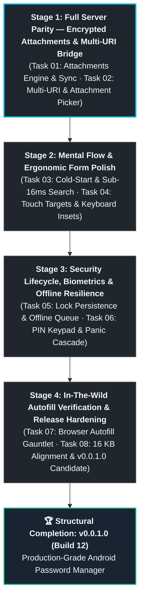

# 🤖 Master Meta-Prompt: ShellGuard Mobile — Feature Verification & Polish

> **INSTRUCTIONS & MULTI-STAGE PROMPTS FOR GOOGLE AI STUDIO (ANDROID BUILD MODE)**  
> *Aligned with ClawStack Mobile Standards and Google AI Studio Feature Architecture.*
>
> **Milestone Context**: The Genesis MVP (Stages 0–8 / Phases 1–7) is 100% complete and published up to `v0.0.0.11 (Build 11)`. The historical Genesis AI Studio meta-prompt is preserved at `.agents/internal/meta-prompt-ai-studio_MVP_GENESIS.md`.
>
> This active meta-prompt defines the **Feature Verification and Polish** meta-phase. It bridges remaining data gaps against the ShellGuard Web Server (Encrypted Attachments, Multi-URI), audits and polishes the full mental flow of the mobile client, and drives towards `structural_completion` at `v0.0.1.0`.

---

## 📋 Multi-Stage Execution Strategy

To ensure optimal token economy and avoid context degradation in **Google AI Studio**, development proceeds in deterministic 2-task stages mapped 1:1 to the **[`ROADMAP.md`](../ROADMAP.md)**:



---

## 📎 Stage 1 Prompt: Full Server Parity — Encrypted Attachments & Multi-URI Bridge

> 🗺️ **Master Roadmap Reference**: See [`ROADMAP.md`](../ROADMAP.md#stage-1-full-server-parity--encrypted-attachments--multi-uri-bridge) for complete specifications on **Task 01** and **Task 02**.  
> **📖 Required Context Files for Stage 1**:  
> 1. [`architecture.md`](./architecture.md) — Section 3 (Hybrid File-System Vault, CWE-400 defense).  
> 2. [`room-storage-schema.md`](./room-storage-schema.md) — Section 2.D (`SecureAttachmentEntity`), Section 3 (`SecureAttachmentDao`).  
> 3. [`crypto-and-keystore.md`](./crypto-and-keystore.md) — Section 1 (`vault_secure_attachments:{id}` AAD namespace).  
> 4. [`routes-and-contracts.md`](./routes-and-contracts.md) — Section 2.F (`/api/attachments` endpoints and DTOs).  

Copy and paste this prompt to execute **Stage 1 (Tasks 01 & 02)**:

```markdown
# STAGE 1 EXECUTION: Encrypted Attachments & Multi-URI Bridge

## 🎯 Objective
Achieve 100% data layer and synchronization parity with the ShellGuard server database across all 4 core tables (`vault_pearls`, `vault_secure_notes`, `vault_ssh_keys`, and `vault_secure_attachments`). Uphold the CWE-400 2MB CursorWindow defense by streaming ciphertext files directly to internal storage while maintaining reactive Room metadata.

## 📖 Reference Documentation
Before writing code, inspect:
- `architecture.md`: Hybrid File-System Vault architecture.
- `room-storage-schema.md`: `SecureAttachmentEntity` and `SecureAttachmentDao`.
- `crypto-and-keystore.md`: `vault_secure_attachments:{id}` AAD namespace.
- `routes-and-contracts.md`: Attachment routes and multipart wire contracts.

Execute Stage 1 adhering to the Functionality + UI Component pairing:

### Task 01: [Functionality] Attachments Network Engine, Hybrid Storage & Sync Repository Bridge
- Implement attachment endpoints in `ShellGuardClient.kt`:
  - `POST /api/attachments`: Multipart/form-data upload streaming pre-encrypted ShellCryption envelope bytes with progress tracking (`limits.fileSize = 500MB`).
  - `GET /api/attachments`: Fetch metadata list (`id`, `title`, `size_bytes`, `file_name`, `mime_type`, `category`, `created_at`).
  - `GET /api/attachments/:id/file`: Streamed chunked (1MB) ciphertext BLOB download.
  - `DELETE /api/attachments/:id`: Delete attachment record.
- Implement hybrid file-system vault in `data/local/`:
  - Ciphertext payloads stream to `context.filesDir/vault_attachments/{id}.enc` (never inline SQLite BLOBs).
  - Room `SecureAttachmentDao` stores lightweight metadata (`size_bytes`, `file_name`, `mime_type`, `local_file_path`).
- Wire attachments into `SyncRepository.kt`:
  - `syncAll()` pulls remote attachment metadata and prunes deleted records.
  - `pushPendingChanges()` uploads staged local attachments.
- Plumb `attachments` JSON string into `CreateNoteRequest` and `CreateVaultItemRequest` to achieve bidirectional attachment linking without schema loss.
- Verify with unit tests in `SyncRepositoryTest.kt` asserting against attachment delta sync and hybrid file streaming.

### Task 02: [UI/UX] Multi-URI Dynamic Form Editor, Attachment Picker & Detail Actions
- In `ItemFormScreen.kt`:
  - Dynamic Multi-URI list builder: add, edit, and remove multiple login URLs for a single password entry (`vault_pearls.uris`), matching Bitwarden and ShellGuard Web.
  - System file picker integration (`ActivityResultContracts.GetContent`) to stage, encrypt (AAD `vault_secure_attachments:{id}`), and link attachments to Pearls and Notes.
- In `ItemDetailScreen.kt`:
  - Multi-URI list display with launch-in-browser and copy actions.
  - Linked attachment section: file name, extension icon badge, humanized byte size, and tap-to-decrypt/share/view intent.
- In `VaultDashboardScreen.kt`:
  - Add `[Attachments]` Pod category filter chip and standalone attachment cards.
- Update `DomainMatcher` to evaluate all configured `uris` for domain matching during autofill.

Verify compilation, run test suite, and verify attachment upload and multi-URI display on physical Google Pixel.
```

---

## 🎨 Stage 2 Prompt: Mental Flow & Ergonomic Form Polish

> 🗺️ **Master Roadmap Reference**: See [`ROADMAP.md`](../ROADMAP.md#stage-2-mental-flow--ergonomic-form-polish) for complete specifications on **Task 03** and **Task 04**.  
> **📖 Required Context Files for Stage 2**:  
> 1. [`ui-ux-design-system.md`](./ui-ux-design-system.md) — Section 5 (Dashboard), Section 6 (Detail Views), Section 7 (Item Form).  
> 2. `mobile-android-design` skill / guidelines — Touch target sizes (≥48dp), haptics, keyboard insets.  

```markdown
# STAGE 2 EXECUTION: Mental Flow & Ergonomic Form Polish

## 🎯 Objective
Eliminate cognitive friction, latency, and layout quirks across the app's three primary views (Gateway, Dashboard, Universal Form). Ensure seamless transitions, instant search, and ergonomic keyboard and touch interactions.

### Task 03: [Functionality] Cold-Start Routing, Reconnect Recovery & Sub-16ms Search Performance
- Benchmark and optimize `observeUnifiedItems` search filtering across 100+ items to guarantee sub-16ms frame times.
- Harden Gateway cold-start routing: validate saved Base62 `hu-` sovereign key format, auto-fill server host/port, and transition immediately to local offline cache with an amber status banner if the server is unreachable.
- Implement automated network reconnect recovery: seamlessly transition from `OFFLINE_READ_ONLY` to `SYNCING` ➔ `ONLINE_SYNCED` without UI stutter.

### Task 04: [UI/UX] Touch Targets (≥48dp), Haptic Feedback & Keyboard Insets
- Audit all interactive surfaces against `mobile-android-design`: ensure all buttons, toggles, icon buttons, and list items have touch targets ≥ 48dp.
- Implement subtle, tactile haptic feedback on secret reveal, copy actions, and password generation.
- Polish soft keyboard auto-scroll behavior (`.imePadding()` + `LaunchedEffect` scroll-to-focused): ensure active text fields remain comfortably visible above Gboard on all screen sizes.
- Refine Secure Notes markdown rendering with clean monospace code blocks and formatted headers.
```

---

## 🛡️ Stage 3 Prompt: Security Lifecycle, Biometrics & Offline Resilience

> 🗺️ **Master Roadmap Reference**: See [`ROADMAP.md`](../ROADMAP.md#stage-3-security-lifecycle-biometrics--offline-resilience) for complete specifications on **Task 05** and **Task 06**.  
> **📖 Required Context Files for Stage 3**:  
> 1. [`crypto-and-keystore.md`](./crypto-and-keystore.md) — Section 4 (KeyStore Biometric Sealing), Section 7 (Panic Purge).  
> 2. [`sync-and-offline-engine-spec.md`](./sync-and-offline-engine-spec.md) — Section 6 (Offline Mutation Guarantees).  

```markdown
# STAGE 3 EXECUTION: Security Lifecycle, Biometrics & Offline Resilience

## 🎯 Objective
Harden background lifecycle, KeyStore biometric unsealing, timeout enforcement, and emergency wipe cascades. Guarantee zero data loss when modifying items offline.

### Task 05: [Functionality] Lock Persistence Across Process Death & Offline Mutation Queue
- Verify and harden `VaultLockManager` background timestamp tracking: ensure killing the app from recents or OS low-memory termination enforces the configured timeout upon relaunch.
- Test and verify offline mutation queueing in `SyncRepository`: items created, edited, or deleted in Airplane Mode must persist locally through app restarts and flush cleanly to the server on reconnect without resurrecting deleted items.
- Verify fail-closed decryption across all domains: corrupt or untrusted payloads must never leak ciphertext strings into editable form fields.

### Task 06: [UI/UX] PIN Keypad Polish, Circular Dial Feel & Panic Destruction
- Polish `LockScreen.kt` numerical PIN keypad: responsive press states, masked PIN dots, and instantaneous fallback to Master ClawKey.
- Polish `CircularDialPicker` gesture physics: smooth continuous arc dragging with clear duration snap points (5s–60s).
- Verify `PanicPurgeCountdownScreen`: 3 pulsing concentric Canvas rings, 68sp monospace timer, hardware back button cancellation, and full 4-step fail-closed destruction cascade.
```

---

## 🌐 Stage 4 Prompt: In-The-Wild Autofill Verification & Release Hardening

> 🗺️ **Master Roadmap Reference**: See [`ROADMAP.md`](../ROADMAP.md#stage-4-in-the-wild-autofill-verification--release-hardening) for complete specifications on **Task 07** and **Task 08**.  
> **📖 Required Context Files for Stage 4**:  
> 1. [`autofill-service-spec.md`](./autofill-service-spec.md) — Section 3 (AutofillService), Section 4 (Parser & Anti-AutoSpill).  
> 2. [`16kb-page-size-alignment-guide.md`](./16kb-page-size-alignment-guide.md) — Native packaging.  
> 3. [`verification-gates.md`](./verification-gates.md) — Verification gates & release protocol.  

```markdown
# STAGE 4 EXECUTION: In-The-Wild Autofill Verification & Release Hardening

## 🎯 Objective
Rigorously verify system autofill in real third-party applications and browsers, audit Android 15+ 16 KB page-size compliance and ProGuard R8 rules, and package the `v0.0.1.0` production candidate.

### Task 07: [Functionality] Real-World Browser & Native App Autofill Gauntlet
- Exercise system autofill across physical browsers (Google Chrome, Brave, Firefox) and native Android apps:
  - 2-step split login flows (`accounts.google.com`, Microsoft): verify Step 1 displays `"Add Item"` and Step 2 fills password.
  - Option B subtitle masking (`Work · lu***@company.com`): verify zero raw username leakage above keyboard.
  - Multi-field dataset injection: verify single tap fills both username and password simultaneously.
  - Anti-AutoSpill WebView isolation: verify WebView forms cannot inherit credentials from outer native views.
- Verify direct Settings deep-link from `SettingsAutofillScreen` opens system autofill picker cleanly.

### Task 08: [Configuration & Release] 16 KB Page Alignment, ProGuard Audit & v0.0.1.0 Candidate
- Audit uncompressed native packaging: verify SQLCipher `.so` native libraries pass 16 KB ELF alignment verification.
- Audit R8 ProGuard preservation rules: verify release builds preserve Room DAOs, SQLCipher JNI bindings, and Kotlinx Serialization models.
- Execute full regression test gauntlet (`./gradlew testDebugUnitTest assembleDebug`) verifying 100% green status.
- Author `RELEASE-v0.0.1.0.md` and format `<en-US>` release notes in `RELEASE-PLAY.md`.
- Bump monotonic `versionCode` and update `versionName` to `v0.0.1.0 (Build 12)`.
```
