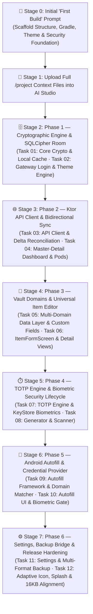

# 🤖 Master Meta-Prompt: ShellGuard Mobile Android Application

> **INSTRUCTIONS & MULTI-STAGE PROMPTS FOR GOOGLE AI STUDIO (ANDROID BUILD MODE)**  
> *Aligned with ClawStack Mobile Standards and Google AI Studio Feature Architecture.*

---

## 📋 Multi-Stage Execution Strategy

To ensure optimal token economy and avoid context degradation in **Google AI Studio**, development proceeds in deterministic 2-task stages mapped 1:1 to the **[`ROADMAP.md`](../ROADMAP.md)**. 

ShellGuard Mobile is the **full vault client**, providing bidirectional CRUD access to all domains (Passwords, Secure Notes, SSH Keys, Attachments), integrated TOTP generation, and system-wide Android Autofill with 100% cryptographic parity to the web server.



---

## 🚀 Stage 0: The "First Build" Initial Scaffold Prompt

> **📖 Required Reference Files Attached in AI Studio**:  
> 1. [`architecture.md`](./architecture.md) — System boundaries, security invariants, `FLAG_SECURE`, and build topology.  
> 2. [`ui-ux-design-system.md`](./ui-ux-design-system.md) — Section 1 & 2 (Reef Modernist Theme Tokens).

Copy and paste this exact prompt into Google AI Studio as the **First Build Message**:

```markdown
# FIRST BUILD PROMPT: ShellGuard Mobile Android Foundation

## 🎯 Objective
Initialize and scaffold the complete internal architecture and security foundation for **ShellGuard Mobile**, a privacy-first, zero-knowledge secrets vault native Android application. This is the **full vault client** (not just the TOTP companion).

**Tagline**: *"Your reef. Your keys. Your vault. In your pocket."*

## 📖 Reference Architecture Files
Before writing code, inspect and adhere to:
- `architecture.md`: Section 1 (System Role), Section 2 (Boundaries), and Section 4 (Threat Model).
- `ui-ux-design-system.md`: Section 2 (Reef Modernist Theme Tokens).

## 🛡️ Core Operating Invariant
"Build features around security, not security around features."
Do NOT build complex user interface components in this initial build. Focus 100% on scaffolding the project structure, Gradle build files, dependencies, SQLCipher initialization, Android KeyStore hardware wrappers, network security configuration, and application security boundaries.

## 🛠️ Technical Specifications & Dependencies
- **Target SDK**: 36 (Min SDK: 24), Java 17, Kotlin 2.2+
- **Package Name**: `com.clawstack.shellguard`
- **Gradle Plugins (`app/build.gradle.kts` & `libs.versions.toml`)**:
  - `alias(libs.plugins.android.application)`
  - `alias(libs.plugins.kotlin.compose)`
  - `alias(libs.plugins.kotlin.serialization)`
  - `alias(libs.plugins.google.devtools.ksp)`
  - `alias(libs.plugins.hilt.android)`
- **Key Dependencies**:
  - Jetpack Compose + Material 3 + Navigation Compose
  - AndroidX Coroutines + Kotlinx Serialization JSON
  - Ktor HTTP Client (OkHttp engine, content-negotiation, kotlinx-json)
  - SQLCipher for Android (`net.zetetic:sqlcipher-android:4.6.1`)
  - AndroidX Room (`2.7.0`) with KSP
  - Dagger Hilt for Dependency Injection
  - AndroidX Biometric / Security Crypto
  - CameraX + Google ML Kit Barcode Scanning

## 📐 Required Deliverables for this First Build:
1. `gradle/libs.versions.toml` & `app/build.gradle.kts`: Clean, conflict-free dependency resolution.
2. `AndroidManifest.xml` & `res/xml/network_security_config.xml`:
   - Permissions: `CAMERA`, `USE_BIOMETRIC`, `INTERNET`, `ACCESS_NETWORK_STATE`.
   - `network_security_config.xml`: Declares `<base-config cleartextTrafficPermitted="true" />` to permit plaintext HTTP and self-signed TLS across local LAN private IPs (`192.168.x.x`, `10.x.x.x`) and Tailscale CGNAT addresses (`100.64.0.0/10`). (Android's `<domain>` tag does not support IP CIDR subnets, making `<base-config>` mandatory for local server access).
   - `AndroidManifest.xml`: Sets `android:networkSecurityConfig="@xml/network_security_config"` and `android:usesCleartextTraffic="true"`.
3. `ShellGuardApp.kt` (Application Class):
   - Initializes SQLCipher library.
   - Annotated with `@HiltAndroidApp`.
4. `MainActivity.kt`:
   - Enforces `window.setFlags(WindowManager.LayoutParams.FLAG_SECURE, WindowManager.LayoutParams.FLAG_SECURE)` on `onCreate` to block screen capture and recents snooping.
   - Minimal Compose container applying the Reef Modernist Theme (`ShellGuardTheme`).
5. `crypto/ClawCrypto.kt` & `crypto/AndroidKeyStoreHelper.kt`:
   - `ClawCrypto.hashHumanKey(rawKey)`: SHA-256 lowercase 64-char hex string generator.
   - `AndroidKeyStoreHelper`: Generates hardware-backed AES-256-GCM key with `setUserAuthenticationRequired(true)`.
6. Clean package hierarchy under `com.clawstack.shellguard` (`crypto`, `data`, `di`, `engine`, `ui`).

Scaffold this foundational structure now. Verify compilation and ensure zero dependency conflicts.
```

---

## 📂 Stage 1: Uploading Context Files

Once the AI Studio agent finishes the First Build scaffold:
1. Upload the core root files:
   - [`DESIGN.md`](../DESIGN.md) (Reef Modernist Mobile Design System & side-by-side visual invariants)
   - [`ROADMAP.md`](../ROADMAP.md) (6 phases, 12 paired tasks)
2. Upload the documentation files from `/project/` into the AI Studio project directory (or attach them to the chat):
   - [`architecture.md`](./architecture.md)
   - [`crypto-and-keystore.md`](./crypto-and-keystore.md)
   - [`room-storage-schema.md`](./room-storage-schema.md)
   - [`routes-and-contracts.md`](./routes-and-contracts.md)
   - [`ui-ux-design-system.md`](./ui-ux-design-system.md)
   - [`sync-and-offline-engine-spec.md`](./sync-and-offline-engine-spec.md)
   - [`totp-engine-spec.md`](./totp-engine-spec.md)
   - [`autofill-service-spec.md`](./autofill-service-spec.md)
   - [`import-export-and-migration-spec.md`](./import-export-and-migration-spec.md)
   - [`verification-gates.md`](./verification-gates.md)
   - [`16kb-page-size-alignment-guide.md`](./16kb-page-size-alignment-guide.md)
   - [`app-icon-and-splash.md`](./app-icon-and-splash.md)
   - [`widgets-and-quick-tiles-spec.md`](./widgets-and-quick-tiles-spec.md)

---

## 🗄️ Stage 2: Phase 1 Prompt — Cryptographic Engine & SQLCipher Room

> 🗺️ **Master Roadmap Reference**: See [`ROADMAP.md`](../ROADMAP.md#phase-1-cryptographic-engine--local-cache-baseline-v0001-build-1) for complete specifications on **Task 01** and **Task 02**.  
> **📖 Required Context Files for Phase 1**:  
> 1. [`crypto-and-keystore.md`](./crypto-and-keystore.md) — Section 1 (HKDF Parity), Section 2 (Envelope Schema), Section 3 (ShellCryptionEngine).  
> 2. [`room-storage-schema.md`](./room-storage-schema.md) — Section 2 (Entities), Section 3 (DAOs), Section 4 (SQLCipher Builder).  
> 3. [`ui-ux-design-system.md`](./ui-ux-design-system.md) — Section 3 (GatewayScreen).  

Copy and paste this prompt to execute **Phase 1 (Tasks 01 & 02)**:

```markdown
# PHASE 1 EXECUTION: Cryptographic Engine & SQLCipher Room

## 📖 Reference Documentation
Before writing code, inspect:
- `crypto-and-keystore.md`: Section 1, 2, and 3 (ShellCryptionEngine.kt HKDF + AES-GCM AAD namespaces).
- `room-storage-schema.md`: Section 2 (VaultPearlEntity, etc.), Section 3 (DAOs), Section 4 (ShellGuardDatabase).
- `ui-ux-design-system.md`: Section 3 (GatewayScreen.kt).

Execute Phase 1 adhering to the Functionality + UI Component pairing:

### Task 01: [Functionality] ShellCryption HKDF Engine & SQLCipher Room Architecture
- Implement `crypto/ShellCryptionEngine.kt`:
  - HKDF-SHA256 key derivation (`info = "clawchives-shellcryption-v1"`).
  - AES-GCM-256 `decryptField` and `encryptField` supporting ALL AAD namespaces (e.g. `vault_pearls:{id}`, `vault_secure_notes:{id}`).
- Set up AndroidX Room with SQLCipher (`net.zetetic:sqlcipher-android`) via `SupportFactory`.
- Define all local entities in `data/local/entities/` (`VaultPearlEntity`, `SecureNoteEntity`, `SshKeyEntity`, `SecureAttachmentEntity`, `SyncMetadataEntity`, `AuditLogEntity`, `AgentKeyEntity`). Payloads must be opaque Strings.
- Implement DAOs in `data/local/dao/` providing reactive `Flow` observation.
- Add `ShellCryptionEngineTest.kt` verifying deterministic derivation and AAD tamper detection.

### Task 02: [UI Component] Standardized Gateway Login & Dynamic Theme Engine
- Implement `ui/theme/Color.kt`, `Theme.kt`, and `Type.kt` matching the **Reef Modernist** design system.
  - Implement `ThemeAccent` enum with 6 curated palettes and `LocalShellGuardColors`.
- Implement `ui/screens/GatewayScreen.kt` & `GatewayViewModel.kt`:
  - Faithful 1:1 port of the ClawStack Gateway: protocol/host/port segment bar, key paste/upload file dual mode.
  - Integrates with `AndroidKeyStoreHelper` for unlocking and hashing the `hu-` key.

Verify unit tests pass for ShellCryption across multiple AAD namespaces, Room compiles with KSP, and the Gateway screen renders on unified tokens.
```

---

## 🌐 Stage 3: Phase 2 Prompt — Ktor API Client & Bidirectional Sync

> 🗺️ **Master Roadmap Reference**: See [`ROADMAP.md`](../ROADMAP.md#phase-2-ktor-api-client--bidirectional-sync-baseline-v0002-build-2) for complete specifications on **Task 03** and **Task 04**.  
> **📖 Required Context Files for Phase 2**:  
> 1. [`routes-and-contracts.md`](./routes-and-contracts.md) — Section 1 (Uniform Envelope), Section 2 (DTOs), Section 3 (Ktor Client).  
> 2. [`sync-and-offline-engine-spec.md`](./sync-and-offline-engine-spec.md) — Section 3 (Push/Pull Logic), Section 4 (SyncRepository), Section 5 (WorkManager).  
> 3. [`ui-ux-design-system.md`](./ui-ux-design-system.md) — Section 5 (Vault Dashboard).  

Copy and paste this prompt to execute **Phase 2 (Tasks 03 & 04)**:

```markdown
# PHASE 2 EXECUTION: Ktor API Client & Bidirectional Sync

## 📖 Reference Documentation
Before writing code, inspect:
- `routes-and-contracts.md`: Section 1 (Envelope), Section 2 (DTOs), Section 3 (Ktor).
- `sync-and-offline-engine-spec.md`: Section 3 (Push/Pull Logic), Section 4 (SyncRepository), Section 5 (WorkManager).
- `ui-ux-design-system.md`: Section 5 (Vault Dashboard).

Execute Phase 2 adhering to the Functionality + UI Component pairing:

### Task 03: [Functionality] Ktor API Client & Bidirectional Delta Sync Engine
- Implement `data/remote/ShellGuardClient.kt`:
  - Ktor OkHttp engine with `ConnectionSpec.CLEARTEXT` and VPN tunnel routing.
  - Endpoints: `/api/auth/token`, `/api/vault`, `/api/notes`, `/api/keys`.
  - Handle uniform `ShellResponse<T>` envelopes.
- Implement `data/repository/SyncRepository.kt` (Bidirectional Sync):
  - **Upstream Push**: Find items with `syncState == PENDING_SYNC`. Derive `shellKey`, encrypt plaintext into envelopes (binding correct AAD), and push (POST/PUT/DELETE).
  - **Downstream Pull**: Fetch domains, filter, decrypt envelopes into memory, and upsert to Room DB.
  - Handle conflict resolution (server-wins fallback using `remoteUpdatedAt`).
- Schedule background delta sync via `VaultSyncWorker` using AndroidX WorkManager.

### Task 04: [UI Component] Master-Detail Vault Dashboard & Pod Filters
- Implement `ui/screens/VaultDashboardScreen.kt`:
  - Master-detail layout (collapsible sheet on phones, dual-pane on tablets).
  - Search bar with instant unified search across Pearls, Notes, and SSH Keys.
  - Horizontal Pod category filter chips (`[All]`, `[Passwords]`, `[Notes]`, `[SSH Keys]`, dynamic pods).
  - Expandable FAB speed dial (Add Password, Add Note, Add SSH Key).
- Implement `VaultDashboardViewModel.kt` combining Room `Flow` streams.

Verify the Ktor client successfully pulls and decrypts an existing vault from the Express server, and the Master-Detail dashboard populates with decrypted items.
```

---

## 🧩 Stage 4: Phase 3 Prompt — Vault Domains & Universal Item Editor

> 🗺️ **Master Roadmap Reference**: See [`ROADMAP.md`](../ROADMAP.md#phase-3-vault-domains--universal-item-editor-baseline-v0003-build-3) for complete specifications on **Task 05** and **Task 06**.  
> **📖 Required Context Files for Phase 3**:  
> 1. [`routes-and-contracts.md`](./routes-and-contracts.md) — Section 2 (Custom Fields & Tags).  
> 2. [`ui-ux-design-system.md`](./ui-ux-design-system.md) — Section 6 (Item Detail Views), Section 7 (Item Form/Editor).  

Copy and paste this prompt to execute **Phase 3 (Tasks 05 & 06)**:

```markdown
# PHASE 3 EXECUTION: Vault Domains & Universal Item Editor

## 📖 Reference Documentation
Before writing code, inspect:
- `routes-and-contracts.md`: Section 2 (Custom Fields JSON modeling).
- `ui-ux-design-system.md`: Section 6 (Detail Views), Section 7 (Form Editor).

Execute Phase 3 adhering to the Functionality + UI Component pairing:

### Task 05: [Functionality] Multi-Domain Data Layer & Bitwarden-Style Custom Fields
- Ensure all 3 primary domain repositories (`PearlRepository`, `SecureNoteRepository`, `SshKeyRepository`) properly handle CRUD operations and queue them for `SyncRepository`.
- Implement `domain/models/CustomField.kt` with types: `Text`, `Hidden`, `Checkbox`, `Linked`.
- Ensure custom fields and tags are properly serialized to JSON strings before ShellCryption encryption.

### Task 06: [UI Component] Universal ItemFormScreen & Polymorphic Detail Views
- Implement `ui/screens/ItemDetailScreen.kt`:
  - Polymorphic rendering based on item type (Password, Note, SSH Key).
  - Masked passwords with tap-to-copy, haptic feedback, and eye toggle.
  - Render custom fields according to their type (e.g. Hidden fields get a visibility toggle).
- Implement `ui/screens/ItemFormScreen.kt` (Create & Edit):
  - Unified form handling all domains.
  - Dynamic Custom Fields editor allowing users to add, remove, and reorder fields.
  - Tag input with autocomplete chips.

Verify that creating a complex Password item with 2 custom fields and 3 tags saves locally, syncs to the server, and renders correctly in the Detail view.
```

---

## ⏱️ Stage 5: Phase 4 Prompt — TOTP Engine & Biometric Security Lifecycle

> 🗺️ **Master Roadmap Reference**: See [`ROADMAP.md`](../ROADMAP.md#phase-4-totp-engine--biometric-security-lifecycle-baseline-v0004-build-4) for complete specifications on **Task 07** and **Task 08**.  
> **📖 Required Context Files for Phase 4**:  
> 1. [`totp-engine-spec.md`](./totp-engine-spec.md) — Section 1 (RFC 6238 TotpEngine), Section 2 (Base32Decoder), Section 4 (UriParser).  
> 2. [`crypto-and-keystore.md`](./crypto-and-keystore.md) — Section 4 (KeyStore Biometric Sealing).  
> 3. [`ui-ux-design-system.md`](./ui-ux-design-system.md) — Section 8 (TOTP Integration), Section 9 (Password Generator).  

Copy and paste this prompt to execute **Phase 4 (Tasks 07 & 08)**:

```markdown
# PHASE 4 EXECUTION: TOTP Engine & Biometric Security Lifecycle

## 📖 Reference Documentation
Before writing code, inspect:
- `totp-engine-spec.md`: Section 1 (TotpEngine), Section 2 (Base32Decoder), Section 4 (UriParser).
- `crypto-and-keystore.md`: Section 4 (KeyStore Biometrics).
- `ui-ux-design-system.md`: Section 8 (TOTP Integration), Section 9 (Password Generator).

Execute Phase 4 adhering to the Functionality + UI Component pairing:

### Task 07: [Functionality] Algorithmic TOTP Engine & Hardware KeyStore Biometrics
- Implement `engine/TotpEngine.kt` (RFC 6238 time-based codes, thread-safe, Kotlin Time synchronization, Steam Guard).
- Integrate `AndroidKeyStoreHelper` with `androidx.biometric.BiometricPrompt` on `ui/screens/LockScreen.kt`.
- Implement `AppLifecycleObserver.kt` enforcing auto-lock timeouts when the app is backgrounded.
- Apply `FLAG_SECURE` to prevent screen captures and recents thumbnails.

### Task 08: [UI Component] Password Generator, Countdown Display & CameraX Scanner
- Implement `PasswordGeneratorSheet.kt` with length slider, character set toggles, and passphrase mode.
- Implement `TotpCard.kt` & `TotpCountdownRing.kt`:
  - Large monospace split digits, Canvas arc depleting counter-clockwise, spring touch bounce.
- Integrate CameraX and ML Kit for `ui/screens/QrScannerScreen.kt` to parse `otpauth://` URIs and bind them to Pearls.

Verify TOTP codes generate accurately matching Google Authenticator, the password generator adheres to character constraints, and biometrics securely gate the app.
```

---

## 🔑 Stage 6: Phase 5 Prompt — Android Autofill & Credential Provider

> 🗺️ **Master Roadmap Reference**: See [`ROADMAP.md`](../ROADMAP.md#phase-5-android-autofill--credential-provider-baseline-v0005-build-5) for complete specifications on **Task 09** and **Task 10**.  
> **📖 Required Context Files for Phase 5**:  
> 1. [`autofill-service-spec.md`](./autofill-service-spec.md) — Section 1 (Architecture), Section 3 (AutofillService), Section 4 (Parser), Section 5 (DomainMatcher), Section 6 (Biometric Gating).  

Copy and paste this prompt to execute **Phase 5 (Tasks 09 & 10)**:

```markdown
# PHASE 5 EXECUTION: Android Autofill & Credential Provider

## 📖 Reference Documentation
Before writing code, inspect:
- `autofill-service-spec.md`: Section 1 (Architecture), Section 3 (AutofillService), Section 4 (Parser), Section 5 (DomainMatcher), Section 6 (Biometric Gating).

Execute Phase 5 adhering to the Functionality + UI Component pairing:

### Task 09: [Functionality] Autofill Service Architecture & Domain Matcher
- Implement `ShellGuardAutofillService` extending `android.service.autofill.AutofillService`.
- Implement `AutofillStructureParser` traversing `AssistStructure.ViewNode` hierarchies to extract usernames, passwords, web domains, and package names.
- Implement `DomainMatcher` with eTLD+1 normalization to match URLs against vault entries.
- Declare `android.permission.BIND_AUTOFILL_SERVICE` and `autofill_service_config.xml`.

### Task 10: [UI Component] Autofill Presentation Views & Biometric Authorization Gate
- Create `autofill_suggestion_item.xml` layout for RemoteViews presentation in autofill dropdowns.
- Implement `AutofillAuthActivity`: prompts biometric/PIN unlock before dispatching credentials to the calling app when the vault is locked.
- Support inline suggestions for Gboard and modern keyboards via `InlinePresentationSpec`.

Verify that visiting a login page in Chrome prompts ShellGuard autofill suggestions, and selecting an item unlocks biometrically and fills credentials accurately.
```

---

## ⚙️ Stage 7: Phase 6 Prompt — Settings, Backup Bridge & Release Hardening

> 🗺️ **Master Roadmap Reference**: See [`ROADMAP.md`](../ROADMAP.md#phase-6-settings-backup-bridge--release-hardening-baseline-v0009-build-9--milestone-1) for complete specifications on **Task 11** and **Task 12**.  
> **📖 Required Context Files for Phase 6**:  
> 1. [`ui-ux-design-system.md`](./ui-ux-design-system.md) — Section 10 (Settings Hub, SettingsSecurityScreen, Biometric & PIN Unlock).  
> 2. [`import-export-and-migration-spec.md`](./import-export-and-migration-spec.md) — Section 2 (Canonical Exports), Section 4 (Deduplication), Section 5 (BackupManager).  
> 3. [`crypto-and-keystore.md`](./crypto-and-keystore.md) — Section 4 (KeyStore Biometric Sealing), Section 7 (Panic Purge & Security Preferences).  
> 4. [`app-icon-and-splash.md`](./app-icon-and-splash.md) — Section 2 (Adaptive Icon), Section 3 (SplashScreen API).  
> 5. [`16kb-page-size-alignment-guide.md`](./16kb-page-size-alignment-guide.md) — Section 2 (Dependencies & Packaging).  
> 6. [`verification-gates.md`](./verification-gates.md) — Section 4 (Build Verification Gates).  

Copy and paste this prompt to execute **Phase 6 (Tasks 11 & 12)**:

```markdown
# PHASE 6 EXECUTION: Settings, Backup Bridge & Release Hardening

## 📖 Reference Documentation
Before writing code, inspect:
- `ui-ux-design-system.md`: Section 10 (Settings Hub, Security Sub-screens, PIN & Biometric Unlock).
- `import-export-and-migration-spec.md`: Section 2 (Exports), Section 4 (Deduplication), Section 5 (BackupManager).
- `crypto-and-keystore.md`: Section 4 (KeyStore Biometrics), Section 7 (Panic Purge).
- `app-icon-and-splash.md`: Section 2 (Adaptive Icon), Section 3 (SplashScreen API).
- `16kb-page-size-alignment-guide.md`: Section 2 (Packaging & SQLCipher).
- `verification-gates.md`: Section 4 (Verification Gates).

Execute Phase 6 adhering to the Functionality + Polish pairing:

### Task 11: [Functionality] Settings Hub, Vault Unlock Methods (Biometrics & PIN), Cold-Start Lock & Backup Engine
- Implement `ui/screens/settings/SettingsScreen.kt` categorized hub:
  - Security & Vault Timeout, Autofill & System Integration, Appearance & Theming, Server & Sync, Import/Export/Backups, About.
- Implement `ui/screens/settings/SettingsSecurityScreen.kt`:
  - **Vault Unlock Methods** (alternatives to logging in with the full 67-character `hu-` ClawKey):
    - `Unlock with Biometrics` toggle (Fingerprint / Face Unlock via `BiometricPrompt`).
    - `Unlock with PIN` toggle (4–8 digit numeric PIN enrollment, SHA-256 hashed and stored in `EncryptedDeviceVault`, with change PIN challenge).
  - **Vault Timeout Duration & Action**:
    - Duration selector: `Immediately`, `On App Restart` (locks upon process termination / swiping away), `1 Minute`, `5 Minutes` (default), `15 Minutes`, `30 Minutes`, `Never`.
    - Timeout Action selector: `Lock` (seals vault in KeyStore, prompts Biometric/PIN) vs `Log Out` (purges session, requires ClawKey).
- Implement **Cold-Start / Process Kill Lock Persistence** in `VaultLockManager`:
  - Persist background timestamp and timeout settings across process death in SharedPreferences.
  - On app launch (`MainActivity.onCreate`), if a session exists and `timeout == On App Restart` or background elapsed time >= timeout duration, initialize `_isVaultLocked = true` and navigate immediately to `LockScreen` instead of bypassing to dashboard.
- Upgrade `ui/screens/lock/LockScreen.kt`:
  - Interactive PIN entry keypad / input field enabling offline unlocking via enrolled PIN.
  - One-tap `Unlock with Biometrics` action with auto-prompt on display.
  - Fallback option to enter Master ClawKey for emergency recovery.
- Implement `data/backup/BackupManager.kt`:
  - Full vault encrypted export/import (`.sgvault.bak`) with SHA-256 integrity checksums.
  - TOTP companion bridge export (`.sgtotp.bak`).
  - Bitwarden JSON intake with pre-DAO deduplication.
- Implement `PanicTriggerReceiver` for emergency instant KeyStore + DB wipe.

### Task 12: [Configuration] Adaptive App Icon, Splash Screen, 16 KB Alignment & Release Gates
- Create adaptive launcher icon (`ic_launcher_foreground.xml` with Reef Shield + Pearl Keyhole).
- Add Android 12+ Core Splash Screen API (`installSplashScreen()`).
- Configure `app/proguard-rules.pro` with R8 preservation rules for SQLCipher JNI, Kotlinx Serialization, Room DAOs, and Ktor (`verification-gates.md` §7).
- Configure `jniLibs.useLegacyPackaging = false` in `app/build.gradle.kts` for Android 15 16 KB memory page-size alignment.
- Run full verification trilogy (`./gradlew testDebugUnitTest assembleDebug`) verifying 100% test pass rate.

Verify that swiping away the app and relaunching prompts for Biometrics or PIN according to settings, PIN can be enrolled and used to unlock without entering the ClawKey, backups export and import valid encrypted archives, and release binaries pass 16 KB page-alignment.
```
