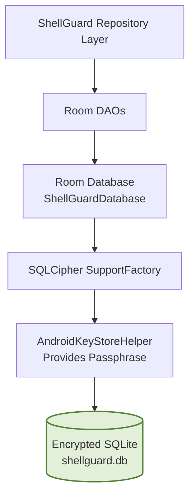

# 🗄️ ShellGuard Mobile — Room Storage & SQLCipher Schema

> **Offline-first encrypted local cache and entity architecture.**  
> *Targeted for Google AI Studio Android Application Generator.*

---

## 1. Room Storage Architecture

ShellGuard Mobile employs a robust, offline-first local cache using AndroidX Room. Data is encrypted at rest using SQLCipher, ensuring that all cached secrets remain secure even if the device filesystem is compromised.



## 2. Room Database Entities

All entities are strictly designed to hold ShellCryption opaque blobs for sensitive fields. The database never sees plaintext secrets.

### A. `VaultPearlEntity` (Passwords / Logins)

```kotlin
package com.clawstack.shellguard.data.local.entities

import androidx.room.ColumnInfo
import androidx.room.Entity
import androidx.room.PrimaryKey

@Entity(tableName = "vault_pearls")
data class VaultPearlEntity(
    @PrimaryKey
    @ColumnInfo(name = "id") val id: String,
    
    @ColumnInfo(name = "owner_uuid") val ownerUuid: String,
    @ColumnInfo(name = "title") val title: String,
    
    // Opaque ShellCryption Envelope String
    @ColumnInfo(name = "secret") val secret: String,
    
    @ColumnInfo(name = "username") val username: String = "",
    @ColumnInfo(name = "url") val url: String = "",
    @ColumnInfo(name = "type") val type: String = "password",
    @ColumnInfo(name = "category") val category: String = "",
    @ColumnInfo(name = "notes") val notes: String = "",
    
    // Opaque ShellCryption Envelope String
    @ColumnInfo(name = "totp_secret") val totpSecret: String = "",
    
    @ColumnInfo(name = "attachments") val attachments: String = "[]",
    
    // Opaque ShellCryption Envelope String
    @ColumnInfo(name = "custom_fields") val customFields: String = "",
    
    @ColumnInfo(name = "tags") val tags: String = "[]",
    
    // JSON array of URI objects: [{"uri": "https://...", "match": "HOST"}]
    @ColumnInfo(name = "uris") val uris: String = "[]",
    
    // Opaque ShellCryption Envelope String
    @ColumnInfo(name = "password_history") val passwordHistory: String = "[]",
    
    // Master Key Re-Prompt (Claw Re-Prompt): Requires biometric/PIN confirmation before reveal/copy
    @ColumnInfo(name = "reprompt") val reprompt: Boolean = false,
    
    @ColumnInfo(name = "sync_state") val syncState: String = "SYNCED", // PENDING_SYNC, SYNCED, PENDING_DELETE
    @ColumnInfo(name = "created_at") val createdAt: String,
    @ColumnInfo(name = "local_updated_at") val localUpdatedAt: Long = System.currentTimeMillis(),
    @ColumnInfo(name = "remote_updated_at") val remoteUpdatedAt: Long = 0L
)
```

### B. `SecureNoteEntity`

```kotlin
package com.clawstack.shellguard.data.local.entities

import androidx.room.ColumnInfo
import androidx.room.Entity
import androidx.room.PrimaryKey

@Entity(tableName = "vault_secure_notes")
data class SecureNoteEntity(
    @PrimaryKey
    @ColumnInfo(name = "id") val id: String,
    
    @ColumnInfo(name = "owner_uuid") val ownerUuid: String,
    @ColumnInfo(name = "title") val title: String,
    
    // Opaque ShellCryption Envelope String
    @ColumnInfo(name = "content") val content: String,
    
    @ColumnInfo(name = "category") val category: String = "",
    @ColumnInfo(name = "attachments") val attachments: String = "[]",
    
    // Opaque ShellCryption Envelope String
    @ColumnInfo(name = "custom_fields") val customFields: String = "",
    
    @ColumnInfo(name = "tags") val tags: String = "[]",
    
    // Master Key Re-Prompt (Claw Re-Prompt)
    @ColumnInfo(name = "reprompt") val reprompt: Boolean = false,
    
    @ColumnInfo(name = "sync_state") val syncState: String = "SYNCED",
    @ColumnInfo(name = "created_at") val createdAt: String,
    @ColumnInfo(name = "local_updated_at") val localUpdatedAt: Long = System.currentTimeMillis(),
    @ColumnInfo(name = "remote_updated_at") val remoteUpdatedAt: Long = 0L
)
```

### C. `SshKeyEntity`

```kotlin
package com.clawstack.shellguard.data.local.entities

import androidx.room.ColumnInfo
import androidx.room.Entity
import androidx.room.PrimaryKey

@Entity(tableName = "vault_ssh_keys")
data class SshKeyEntity(
    @PrimaryKey
    @ColumnInfo(name = "id") val id: String,
    
    @ColumnInfo(name = "owner_uuid") val ownerUuid: String,
    @ColumnInfo(name = "title") val title: String,
    
    // Opaque ShellCryption Envelope String
    @ColumnInfo(name = "key_value") val keyValue: String,
    
    @ColumnInfo(name = "username") val username: String = "",
    @ColumnInfo(name = "category") val category: String = "",
    
    // Opaque ShellCryption Envelope String
    @ColumnInfo(name = "custom_fields") val customFields: String = "",
    
    @ColumnInfo(name = "tags") val tags: String = "[]",
    
    // Master Key Re-Prompt (Claw Re-Prompt)
    @ColumnInfo(name = "reprompt") val reprompt: Boolean = false,
    
    @ColumnInfo(name = "sync_state") val syncState: String = "SYNCED",
    @ColumnInfo(name = "created_at") val createdAt: String,
    @ColumnInfo(name = "local_updated_at") val localUpdatedAt: Long = System.currentTimeMillis(),
    @ColumnInfo(name = "remote_updated_at") val remoteUpdatedAt: Long = 0L
)
```

### D. `SecureAttachmentEntity` (Hybrid File-System Vault)

> [!WARNING]
> **Android SQLite CursorWindow Invariant (CWE-400)**: Android enforces a hard 2MB `CursorWindow` limit for SQLite query rows. Storing multi-megabyte attachment BLOBs directly in Room entity rows causes unavoidable `SQLiteBlobTooBigException` or `RowTooBigException` runtime crashes. ShellGuard Mobile strictly decouples file metadata (stored in Room) from encrypted file payloads (streamed to `context.filesDir/vault_attachments/{id}.enc`).

```kotlin
package com.clawstack.shellguard.data.local.entities

import androidx.room.ColumnInfo
import androidx.room.Entity
import androidx.room.PrimaryKey

@Entity(tableName = "vault_secure_attachments")
data class SecureAttachmentEntity(
    @PrimaryKey
    @ColumnInfo(name = "id") val id: String,
    
    @ColumnInfo(name = "owner_uuid") val ownerUuid: String,
    @ColumnInfo(name = "title") val title: String,
    @ColumnInfo(name = "file_name") val fileName: String = "",
    @ColumnInfo(name = "mime_type") val mimeType: String = "application/octet-stream",
    
    // Relative path within app-private internal storage: "vault_attachments/{id}.enc"
    @ColumnInfo(name = "local_file_path") val localFilePath: String? = null,
    
    @ColumnInfo(name = "size_bytes") val sizeBytes: Long = 0,
    @ColumnInfo(name = "sha256_checksum") val sha256Checksum: String = "",
    @ColumnInfo(name = "category") val category: String = "",
    @ColumnInfo(name = "sync_state") val syncState: String = "SYNCED",
    @ColumnInfo(name = "created_at") val createdAt: String,
    @ColumnInfo(name = "local_updated_at") val localUpdatedAt: Long = System.currentTimeMillis()
)
```

### E. `SyncMetadataEntity`

```kotlin
package com.clawstack.shellguard.data.local.entities

import androidx.room.Entity
import androidx.room.PrimaryKey

@Entity(tableName = "sync_metadata")
data class SyncMetadataEntity(
    @PrimaryKey val id: Int = 1,
    val lastSyncTimestamp: Long,
    val serverUrl: String,
    val syncStatus: String
)
```

### F. `AuditLogEntity`

```kotlin
package com.clawstack.shellguard.data.local.entities

import androidx.room.Entity
import androidx.room.PrimaryKey

@Entity(tableName = "audit_log")
data class AuditLogEntity(
    @PrimaryKey(autoGenerate = true) val id: Long = 0,
    val timestamp: Long,
    val eventType: String,
    val details: String,
    val severity: String = "INFO"
)
```

### G. `AgentKeyEntity`

```kotlin
package com.clawstack.shellguard.data.local.entities

import androidx.room.ColumnInfo
import androidx.room.Entity
import androidx.room.PrimaryKey

@Entity(tableName = "agent_keys")
data class AgentKeyEntity(
    @PrimaryKey
    @ColumnInfo(name = "id") val id: String,
    @ColumnInfo(name = "owner_uuid") val ownerUuid: String,
    @ColumnInfo(name = "label") val label: String,
    @ColumnInfo(name = "can_read") val canRead: Boolean,
    @ColumnInfo(name = "can_write") val canWrite: Boolean,
    @ColumnInfo(name = "can_edit") val canEdit: Boolean,
    @ColumnInfo(name = "can_delete") val canDelete: Boolean,
    @ColumnInfo(name = "rate_limit") val rateLimit: Int,
    @ColumnInfo(name = "expires_at") val expiresAt: String?,
    @ColumnInfo(name = "is_revoked") val isRevoked: Boolean,
    @ColumnInfo(name = "created_at") val createdAt: String
)
```

## 3. Data Access Objects (DAOs)

Every entity has a corresponding DAO providing reactive `Flow` observation, direct CRUD, and synchronization pruning operations.

### Example: `VaultPearlDao`

```kotlin
package com.clawstack.shellguard.data.local.dao

import androidx.room.*
import com.clawstack.shellguard.data.local.entities.VaultPearlEntity
import kotlinx.coroutines.flow.Flow

@Dao
interface VaultPearlDao {
    @Query("SELECT * FROM vault_pearls WHERE owner_uuid = :ownerUuid ORDER BY title ASC")
    fun observeAll(ownerUuid: String): Flow<List<VaultPearlEntity>>

    @Query("SELECT * FROM vault_pearls WHERE owner_uuid = :ownerUuid AND (title LIKE '%' || :query || '%' OR username LIKE '%' || :query || '%') ORDER BY title ASC")
    fun search(ownerUuid: String, query: String): Flow<List<VaultPearlEntity>>

    @Query("SELECT * FROM vault_pearls WHERE id = :id")
    suspend fun getById(id: String): VaultPearlEntity?

    @Insert(onConflict = OnConflictStrategy.REPLACE)
    suspend fun upsert(item: VaultPearlEntity)

    @Insert(onConflict = OnConflictStrategy.REPLACE)
    suspend fun upsertItems(items: List<VaultPearlEntity>)

    @Query("DELETE FROM vault_pearls WHERE id = :id")
    suspend fun delete(id: String)

    @Query("DELETE FROM vault_pearls WHERE owner_uuid = :ownerUuid AND sync_state = 'SYNCED' AND id NOT IN (:activeRemoteIds)")
    suspend fun pruneDeletedRemoteItems(ownerUuid: String, activeRemoteIds: List<String>)

    @Query("DELETE FROM vault_pearls")
    suspend fun clearVault()

    @Query("SELECT COUNT(*) FROM vault_pearls WHERE owner_uuid = :ownerUuid")
    suspend fun getItemCount(ownerUuid: String): Int
}
```
*(Similar DAOs exist for `SecureNoteDao`, `SshKeyDao`, `SecureAttachmentDao`, `SyncMetadataDao`, `AuditLogDao`, and `AgentKeyDao` following the exact same pattern).*

## 4. Room Database Builder & SQLCipher Factory

```kotlin
package com.clawstack.shellguard.data.local

import android.content.Context
import androidx.room.Database
import androidx.room.Room
import androidx.room.RoomDatabase
import com.clawstack.shellguard.data.local.dao.*
import com.clawstack.shellguard.data.local.entities.*
import net.sqlcipher.database.SupportFactory

@Database(
    entities = [
        VaultPearlEntity::class,
        SecureNoteEntity::class,
        SshKeyEntity::class,
        SecureAttachmentEntity::class,
        SyncMetadataEntity::class,
        AuditLogEntity::class,
        AgentKeyEntity::class
    ],
    version = 1,
    exportSchema = false
)
abstract class ShellGuardDatabase : RoomDatabase() {
    abstract fun vaultPearlDao(): VaultPearlDao
    abstract fun secureNoteDao(): SecureNoteDao
    abstract fun sshKeyDao(): SshKeyDao
    abstract fun secureAttachmentDao(): SecureAttachmentDao
    abstract fun syncMetadataDao(): SyncMetadataDao
    abstract fun auditLogDao(): AuditLogDao
    abstract fun agentKeyDao(): AgentKeyDao

    companion object {
        @Volatile
        private var INSTANCE: ShellGuardDatabase? = null

        fun getDatabase(context: Context, passphrase: ByteArray): ShellGuardDatabase {
            return INSTANCE ?: synchronized(this) {
                val factory = SupportFactory(passphrase)
                val instance = Room.databaseBuilder(
                    context.applicationContext,
                    ShellGuardDatabase::class.java,
                    "shellguard_vault.db"
                )
                .openHelperFactory(factory)
                .fallbackToDestructiveMigration()
                .build()
                INSTANCE = instance
                instance
            }
        }
    }
}
```

## 5. Offline Cache Guarantees

1. **Zero Expiration**: Synced entities are never purged due to time. They remain accessible indefinitely while offline.
2. **Cold Start Fidelity**: UI binds directly to Room `Flow` streams, ensuring the vault renders instantly on launch with the last-known state without waiting for a network heartbeat.
3. **Optimistic Updates**: Local mutations (creates/edits) are saved instantly with `syncState = PENDING_SYNC` and synced in the background.

## 6. Backup & Restore Engine

The `BackupManager.kt` service exports the full vault across all domains (Pearls, Notes, SSH Keys) into the canonical `.sgtotp.bak` envelope format. Since the Full Client holds all data types, the export will encapsulate the entire offline state into a portable, encrypted JSON artifact using HKDF-SHA256 from an export password.

## 7. Audit Log Entity

An immutable ledger capturing high-privilege events (vault hatch, biometric toggle, sync failures, exports). Never synced to the server; stored locally to provide forensic visibility into the physical device's lifecycle.
