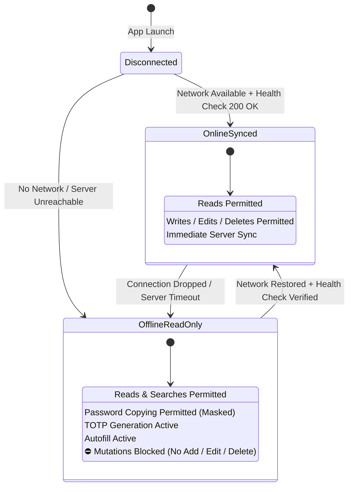

# 🔄 ShellGuard Mobile — Bitwarden-Model Offline Vault & Seamless Reconnection Specification

> **Encrypted Local Cache, Read-Only Offline Invariants, NetworkCallback & Seamless Re-Connection**  
> *Targeted for Google AI Studio Android Application Generator.*

---

## 1. Bitwarden-Model Offline Architecture Overview

ShellGuard Mobile adopts the proven **Bitwarden Client-Server Offline Pattern**:
1. **The Server is the Single Source of Truth**: The central Express 5 server maintains the authoritative state of the vault.
2. **Encrypted Local Bedrock**: When connected, the Android client mirrors the complete encrypted vault into local Room + SQLCipher storage.
3. **Read-Only Offline Access**: When network connectivity is absent or the server is unreachable, the vault remains **100% intact, readable, copyable, searchable, and usable by system Autofill and TOTP**. However, to guarantee data integrity and prevent split-brain merge conflicts, **no creations, edits, or deletions are permitted while offline**.
4. **Seamless Re-Connection**: The client actively monitors the network interface via Android's `ConnectivityManager`. As soon as the server is reachable, it automatically transitions from read-only to online, performs a background delta pull, and restores write capabilities without requiring user intervention.



---

## 2. Inviolable Invariant: Lock vs. Log Out

To preserve the offline vault cache reliably, ShellGuard Mobile strictly differentiates between **Locking** and **Logging Out**:

| Action | Memory (RAM) State | Disk (SQLCipher) State | Android KeyStore | Offline Usability |
|:---|:---|:---|:---|:---|
| **Lock Vault** | Plaintext `hu-` and `shellKey` **zeroed** immediately. | Encrypted database remains intact on disk. | Hardware biometric key remains enrolled. | **YES**: User can unlock offline using Biometrics, PIN, or Master Password. |
| **Log Out** | All session tokens and keys zeroed. | `context.deleteDatabase("shellguard.db")` wipes cached data. | KeyStore entries purged. | **NO**: Requires active internet connection to re-authenticate with the server. |

---

## 3. Connection State Machine (`VaultConnectionState`)

```kotlin
package com.clawstack.shellguard.domain.models

sealed class VaultConnectionState {
    /** Connected to ShellGuard server. All read and write operations permitted. */
    object OnlineSynced : VaultConnectionState()

    /** Actively attempting to establish a handshake or health probe with server. */
    object Connecting : VaultConnectionState()

    /**
     * Offline mode. Server unreachable. Vault is strictly READ-ONLY.
     * All existing credentials, notes, SSH keys, and TOTP codes are fully accessible.
     */
    data class OfflineReadOnly(val reason: String) : VaultConnectionState()
}
```

---

## 4. UI Hardening & Mutation Guards

When `connectionState` is `OfflineReadOnly`:

### A. Dashboard Status Banner
A persistent, subtle status banner is displayed at the top of `VaultDashboardScreen`:
```
+-------------------------------------------------------------+
| 🟡 Offline Mode — Vault is read-only. Connect to make edits |
+-------------------------------------------------------------+
```
When reconnected, the banner smoothly morphs to a transient green pill:
```
+-------------------------------------------------------------+
| 🟢 Connected — Vault in sync                                |
+-------------------------------------------------------------+
```
and automatically dismisses after 3 seconds.

### B. UI Mutation Protections
1. **FAB Speed Dial (`+`)**: Disabled or replaced with a tooltip: *"Connect to your ShellGuard server to add items."*
2. **Item Detail Screen Actions**:
   - `Copy Password`: **ENABLED** (with `ClipDescription.EXTRA_IS_SENSITIVE`).
   - `Copy Username`: **ENABLED**.
   - `Launch URL`: **ENABLED**.
   - `TOTP Verification Code`: **ENABLED** (generates continuously offline).
   - `Edit Item Button`: **DISABLED** (alpha 0.4f, shows snackbar on tap).
   - `Delete Item Button`: **DISABLED** (alpha 0.4f).
3. **Autofill & Credential Provider**: **100% FUNCTIONAL**. Autofill services read directly from the decrypted local cache and do not require server handshakes.

---

## 5. Seamless Reconnection Pipeline

### `ConnectivityMonitor.kt`

Uses Android's native `ConnectivityManager.NetworkCallback` to detect physical network changes (switching between Wi-Fi, Cellular, and VPN):

```kotlin
package com.clawstack.shellguard.services.network

import android.content.Context
import android.net.ConnectivityManager
import android.net.Network
import android.net.NetworkCapabilities
import android.net.NetworkRequest
import com.clawstack.shellguard.data.remote.ShellGuardClient
import com.clawstack.shellguard.domain.models.VaultConnectionState
import kotlinx.coroutines.*
import kotlinx.coroutines.flow.MutableStateFlow
import kotlinx.coroutines.flow.StateFlow
import javax.inject.Inject
import javax.inject.Singleton

@Singleton
class ConnectivityMonitor @Inject constructor(
    private val context: Context,
    private val client: ShellGuardClient
) {
    private val connectivityManager = context.getSystemService(Context.CONNECTIVITY_SERVICE) as ConnectivityManager
    private val _connectionState = MutableStateFlow<VaultConnectionState>(VaultConnectionState.Connecting)
    val connectionState: StateFlow<VaultConnectionState> = _connectionState

    private val monitorScope = CoroutineScope(Dispatchers.IO + SupervisorJob())
    private var healthCheckJob: Job? = null

    fun startMonitoring() {
        val request = NetworkRequest.Builder()
            .addCapability(NetworkCapabilities.NET_CAPABILITY_INTERNET)
            .build()

        connectivityManager.registerNetworkCallback(request, object : ConnectivityManager.NetworkCallback() {
            override fun onAvailable(network: Network) {
                // Physical connection detected -> probe ShellGuard server health
                triggerHealthProbe()
            }

            override fun onLost(network: Network) {
                _connectionState.value = VaultConnectionState.OfflineReadOnly("Network disconnected")
            }
        })

        // Initial probe on startup
        triggerHealthProbe()
    }

    fun triggerHealthProbe() {
        healthCheckJob?.cancel()
        healthCheckJob = monitorScope.launch {
            _connectionState.value = VaultConnectionState.Connecting
            val isHealthy = client.checkServerHealth()
            if (isHealthy) {
                _connectionState.value = VaultConnectionState.OnlineSynced
            } else {
                _connectionState.value = VaultConnectionState.OfflineReadOnly("Server unreachable")
            }
        }
    }
}
```

---

## 6. Downstream Synchronization on Reconnection

When `ConnectivityMonitor` transitions to `OnlineSynced`, the app automatically triggers a non-blocking downstream delta pull:

```kotlin
package com.clawstack.shellguard.data.repository

import com.clawstack.shellguard.services.network.ConnectivityMonitor
import com.clawstack.shellguard.domain.models.VaultConnectionState
import kotlinx.coroutines.CoroutineScope
import kotlinx.coroutines.Dispatchers
import kotlinx.coroutines.flow.collectLatest
import kotlinx.coroutines.launch
import javax.inject.Inject
import javax.inject.Singleton

@Singleton
class AutoSyncCoordinator @Inject constructor(
    private val connectivityMonitor: ConnectivityMonitor,
    private val syncRepository: SyncRepository
) {
    private val scope = CoroutineScope(Dispatchers.IO)

    fun initialize() {
        scope.launch {
            connectivityMonitor.connectionState.collectLatest { state ->
                if (state is VaultConnectionState.OnlineSynced) {
                    // Seamless background reconciliation
                    syncRepository.performDownstreamPullOnly()
                }
            }
        }
    }
}
```

### Why This Bitwarden Pattern Prevents Bugs:
1. **Zero Conflict Resolution Hell**: No need for complicated two-way merge resolution, Git-like branch trees, or duplicate conflict records.
2. **Instant Performance**: Offline users experience zero network lag; every search and code generation is served locally at 60fps.
3. **Bulletproof Data Safety**: Users can never accidentally overwrite a newer password changed on the Web UI while their phone was offline.
