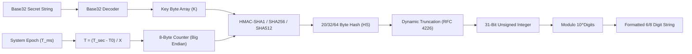

# ⏱️ ShellGuard Mobile — TOTP Engine & QR Code Specification

> **Algorithmic TOTP Generator (RFC 6238), Steam Guard Support, CameraX Scanner & Countdown Arc**  
> *Targeted for Google AI Studio Android Application Generator.*

---

## 1. RFC 6238 Algorithmic TOTP Engine

The TOTP engine deterministically computes time-based one-time passwords from Base32 shared secrets without network access, using Kotlin Time counter synchronization.



### Kotlin Engine (`TotpEngine.kt`)

```kotlin
package com.clawstack.shellguard.engine

import java.nio.ByteBuffer
import javax.crypto.Mac
import javax.crypto.spec.SecretKeySpec
import kotlin.math.pow
import kotlin.time.Duration.Companion.seconds

object TotpEngine {
    const val DEFAULT_TIME_STEP_SECONDS = 30L
    const val DEFAULT_DIGITS = 6

    enum class HashAlgorithm(val hmacName: String) {
        SHA1("HmacSHA1"),
        SHA256("HmacSHA256"),
        SHA512("HmacSHA512");

        companion object {
            fun fromString(value: String?): HashAlgorithm {
                return when (value?.uppercase()?.trim()) {
                    "SHA256", "HMACSHA256" -> SHA256
                    "SHA512", "HMACSHA512" -> SHA512
                    else -> SHA1
                }
            }
        }
    }

    /**
     * Computes the current TOTP numeric code for a given secret.
     */
    fun generateTotp(
        secretBase32: String,
        timestampMillis: Long = System.currentTimeMillis(),
        timeStepSeconds: Long = DEFAULT_TIME_STEP_SECONDS,
        digits: Int = DEFAULT_DIGITS,
        algorithm: HashAlgorithm = HashAlgorithm.SHA1
    ): String {
        val cleanSecret = secretBase32.replace(" ", "").replace("-", "").uppercase()
        if (cleanSecret.isBlank()) return "------"

        return try {
            val keyBytes = Base32Decoder.decode(cleanSecret)
            val timeWindow = (timestampMillis / 1000L) / timeStepSeconds
            val counterBytes = ByteBuffer.allocate(8).putLong(timeWindow).array()

            val mac = Mac.getInstance(algorithm.hmacName)
            mac.init(SecretKeySpec(keyBytes, algorithm.hmacName))
            val hash = mac.doFinal(counterBytes)

            // Dynamic Truncation (RFC 4226 §5.4)
            val offset = hash[hash.size - 1].toInt() and 0x0F
            val binary = ((hash[offset].toInt() and 0x7F) shl 24) or
                    ((hash[offset + 1].toInt() and 0xFF) shl 16) or
                    ((hash[offset + 2].toInt() and 0xFF) shl 8) or
                    (hash[offset + 3].toInt() and 0xFF)

            val otp = binary % (10.0.pow(digits.toDouble())).toInt()
            otp.toString().padStart(digits, '0')
        } catch (e: Exception) {
            "------"
        }
    }

    /**
     * Steam Guard 5-character alphanumeric token computation.
     */
    fun generateSteamGuard(
        secretBase32: String,
        timestampMillis: Long = System.currentTimeMillis()
    ): String {
        val STEAM_CHARS = "23456789BCDFGHJKMNPQRTVWXY"
        val cleanSecret = secretBase32.replace(" ", "").replace("-", "").uppercase()
        if (cleanSecret.isBlank()) return "-----"

        return try {
            val keyBytes = Base32Decoder.decode(cleanSecret)
            val timeWindow = (timestampMillis / 1000L) / 30L
            val counterBytes = ByteBuffer.allocate(8).putLong(timeWindow).array()

            val mac = Mac.getInstance("HmacSHA1")
            mac.init(SecretKeySpec(keyBytes, "HmacSHA1"))
            val hash = mac.doFinal(counterBytes)

            val offset = hash[hash.size - 1].toInt() and 0x0F
            var fullcode = ((hash[offset].toInt() and 0x7F) shl 24) or
                    ((hash[offset + 1].toInt() and 0xFF) shl 16) or
                    ((hash[offset + 2].toInt() and 0xFF) shl 8) or
                    (hash[offset + 3].toInt() and 0xFF)

            val code = StringBuilder()
            for (i in 0 until 5) {
                code.append(STEAM_CHARS[fullcode % STEAM_CHARS.length])
                fullcode /= STEAM_CHARS.length
            }
            code.toString()
        } catch (e: Exception) {
            "-----"
        }
    }
}
```

---

## 2. Base32 Decoder (RFC 4648 Compliant)

```kotlin
package com.clawstack.shellguard.engine

object Base32Decoder {
    private const val ALPHABET = "ABCDEFGHIJKLMNOPQRSTUVWXYZ234567"
    private val DECODE_TABLE = IntArray(128) { -1 }.apply {
        for (i in ALPHABET.indices) {
            this[ALPHABET[i].code] = i
        }
    }

    fun decode(encoded: String): ByteArray {
        val cleanInput = encoded.trim().replace("=", "").uppercase()
        if (cleanInput.isEmpty()) return ByteArray(0)

        val output = ArrayList<Byte>()
        var buffer = 0
        var bitsLeft = 0

        for (ch in cleanInput) {
            val charCode = ch.code
            if (charCode >= DECODE_TABLE.size || DECODE_TABLE[charCode] < 0) {
                continue
            }
            val value = DECODE_TABLE[charCode]
            buffer = (buffer shl 5) or value
            bitsLeft += 5

            if (bitsLeft >= 8) {
                bitsLeft -= 8
                output.add(((buffer shr bitsLeft) and 0xFF).toByte())
            }
        }
        return output.toByteArray()
    }
}
```

---

## 3. Reactive Countdown Ticker & Animation

```kotlin
package com.clawstack.shellguard.engine

import kotlinx.coroutines.delay
import kotlinx.coroutines.flow.Flow
import kotlinx.coroutines.flow.flow

data class TotpTick(
    val remainingSeconds: Int,
    val progress: Float // 1.0f -> 0.0f
)

object TotpTicker {
    fun createTicker(periodSeconds: Long = 30L): Flow<TotpTick> = flow {
        while (true) {
            val epochSeconds = System.currentTimeMillis() / 1000L
            val elapsed = epochSeconds % periodSeconds
            val remaining = (periodSeconds - elapsed).toInt()
            val progress = remaining.toFloat() / periodSeconds.toFloat()

            emit(TotpTick(remaining, progress))
            delay(500L) // Poll at sub-second precision for smooth Canvas animation
        }
    }
}
```

---

## 4. `TotpUriParser` Specification

Parses standard `otpauth://totp/...` and `otpauth://hotp/...` URLs:

```kotlin
package com.clawstack.shellguard.engine

import android.net.Uri

data class ParsedTotpData(
    val title: String,
    val secret: String,
    val issuer: String,
    val algorithm: String = "SHA1",
    val digits: Int = 6,
    val period: Long = 30L
)

object TotpUriParser {
    fun parse(uriString: String): ParsedTotpData? {
        val trimmed = uriString.trim()
        if (!trimmed.startsWith("otpauth://", ignoreCase = true)) {
            // Assume raw Base32 secret string
            return if (trimmed.length >= 8) {
                ParsedTotpData(title = "New Verification Code", secret = trimmed, issuer = "")
            } else null
        }

        return try {
            val uri = Uri.parse(trimmed)
            val secret = uri.getQueryParameter("secret") ?: return null
            val issuerParam = uri.getQueryParameter("issuer") ?: ""
            val algorithm = uri.getQueryParameter("algorithm") ?: "SHA1"
            val digits = uri.getQueryParameter("digits")?.toIntOrNull() ?: 6
            val period = uri.getQueryParameter("period")?.toLongOrNull() ?: 30L

            var label = uri.path?.removePrefix("/") ?: "Authenticator Code"
            var issuer = issuerParam

            if (label.contains(":")) {
                val parts = label.split(":", limit = 2)
                if (issuer.isBlank()) issuer = parts[0].trim()
                label = parts[1].trim()
            }

            ParsedTotpData(
                title = label,
                secret = secret,
                issuer = issuer,
                algorithm = algorithm,
                digits = digits,
                period = period
            )
        } catch (e: Exception) {
            null
        }
    }
}
```

---

## 5. CameraX & ML Kit QR Analyzer Pipeline

```kotlin
package com.clawstack.shellguard.ui.scanner

import androidx.camera.core.ImageAnalysis
import androidx.camera.core.ImageProxy
import com.google.mlkit.vision.barcode.BarcodeScanning
import com.google.mlkit.vision.barcode.common.Barcode
import com.google.mlkit.vision.common.InputImage

class QrCodeAnalyzer(
    private val onQrCodeDetected: (String) -> Unit
) : ImageAnalysis.Analyzer {

    private val scanner = BarcodeScanning.getClient()

    @androidx.camera.core.ExperimentalGetImage
    override fun analyze(imageProxy: ImageProxy) {
        val mediaImage = imageProxy.image
        if (mediaImage != null) {
            val image = InputImage.fromMediaImage(mediaImage, imageProxy.imageInfo.rotationDegrees)
            scanner.process(image)
                .addOnSuccessListener { barcodes ->
                    for (barcode in barcodes) {
                        if (barcode.valueType == Barcode.TYPE_TEXT || barcode.valueType == Barcode.TYPE_URL) {
                            barcode.rawValue?.let { code ->
                                onQrCodeDetected(code)
                            }
                        }
                    }
                }
                .addOnCompleteListener {
                    imageProxy.close()
                }
        } else {
            imageProxy.close()
        }
    }
}
```
