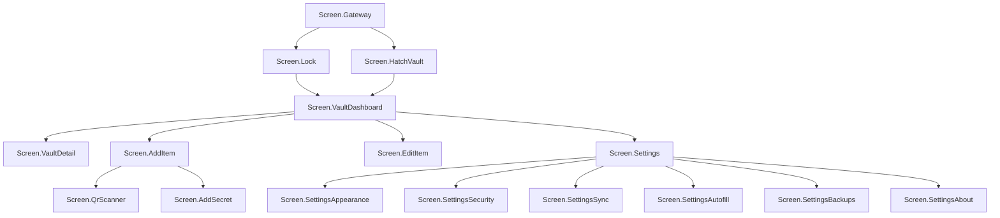

# ShellGuard Mobile - UI/UX Design System Specification

*Targeted for Google AI Studio Android Application Generator*

**Package:** `com.clawstack.shellguard`

This document defines the comprehensive UI/UX design system and architecture for the complete ShellGuard Mobile vault application.

## 1. Design Strategy

The ShellGuard Mobile application employs a dual-strategy design:
1. **Standardized ClawStack Gateway Login:** A faithful 1:1 port of the standard ClawStack ecosystem gateway to provide a unified authentication experience across the entire suite of apps.
2. **Full Vault Management Screens:** A comprehensive, feature-rich set of screens for managing an entire cryptographic vault, integrating the TOTP companion's capabilities seamlessly into a broader data management architecture.

## 2. Reef Modernist Theme Tokens & Dynamic Theme Engine

The application uses the "Reef Modernist" design language, bringing a highly polished, colorful, and deep-sea-inspired aesthetic to secure data management.

### Color.kt
```kotlin
package com.clawstack.shellguard.ui.theme

import androidx.compose.ui.graphics.Color

// Brand Colors
val LobsterRed = Color(0xFFE4048A)
val ClawCyan = Color(0xFF06B6D4)
val BrandPurple = Color(0xFF3B0764)
val CoralOrange = Color(0xFFF97316)
val Emerald = Color(0xFF10B981)

// Abyssal Dark Mode Tokens
val DarkBgBase = Color(0xFF0F1419)
val DarkBgSurface = Color(0xFF171C21)
val DarkBgElevated = Color(0xFF1E252C)
val DarkTextMain = Color(0xFFDEE3EA)
val DarkTextMuted = Color(0xFF879298)
val DarkBorderSubtle = Color(0xFF3D484E)

// Ocean Mist Light Mode Tokens
val LightBgBase = Color(0xFFF1F5F9)
val LightBgSurface = Color(0xFFFFFFFF)
val LightBgElevated = Color(0xFFF8FAFC)
val LightTextMain = Color(0xFF0F172A)
val LightTextMuted = Color(0xFF64748B)
val LightBorderSubtle = Color(0xFFCBD5E1)
```

### Theme.kt
```kotlin
package com.clawstack.shellguard.ui.theme

import androidx.compose.foundation.isSystemInDarkTheme
import androidx.compose.material3.MaterialTheme
import androidx.compose.runtime.Composable
import androidx.compose.runtime.CompositionLocalProvider
import androidx.compose.runtime.Immutable
import androidx.compose.runtime.staticCompositionLocalOf
import androidx.compose.ui.graphics.Color

enum class ThemeAccent(
    val displayName: String,
    val primaryColor: Color,
    val secondaryColor: Color
) {
    REEF_DEFAULT("Reef Bioluminescent", BrandLobsterRed, BrandClawCyan),
    CYAN_VENT("Electric Cyan", BrandClawCyan, BrandLobsterRed),
    PURPLE_SHELL("Imperial Shell", Color(0xFFA855F7), BrandClawCyan),
    EMERALD_TRENCH("Emerald Bio-Flora", BrandEmerald, BrandClawCyan),
    AMBER_FLARE("Solar Vent", Color(0xFFF59E0B), BrandLobsterRed),
    MONOCHROME("Minimalist Pearl", Color(0xFFF8FAFC), Color(0xFF879298))
}

enum class ThemeMode {
    SYSTEM, DARK, LIGHT
}

@Immutable
data class ShellGuardCustomColors(
    val bgBase: Color,
    val bgSurface: Color,
    val bgElevated: Color,
    val bgFloating: Color,
    val textMain: Color,
    val textMuted: Color,
    val borderSubtle: Color,
    val primaryAccent: Color,
    val secondaryAccent: Color,
    val warning: Color = BrandCoralOrange,
    val danger: Color = BrandLobsterRed,
    val success: Color = BrandEmerald
)

val LocalShellGuardColors = staticCompositionLocalOf<ShellGuardCustomColors> {
    error("No ShellGuardColors provided")
}

@Composable
fun ShellGuardTheme(
    themeMode: ThemeMode = ThemeMode.DARK,
    accent: ThemeAccent = ThemeAccent.REEF_DEFAULT,
    content: @Composable () -> Unit
) {
    val isDark = when (themeMode) {
        ThemeMode.SYSTEM -> isSystemInDarkTheme()
        ThemeMode.DARK -> true
        ThemeMode.LIGHT -> false
    }

    val customColors = if (isDark) {
        ShellGuardCustomColors(
            bgBase = DarkBgBase,
            bgSurface = DarkBgSurface,
            bgElevated = DarkBgElevated,
            bgFloating = DarkBgFloating,
            textMain = DarkTextMain,
            textMuted = DarkTextMuted,
            borderSubtle = DarkBorderSubtle,
            primaryAccent = accent.primaryColor,
            secondaryAccent = accent.secondaryColor
        )
    } else {
        ShellGuardCustomColors(
            bgBase = LightBgBase,
            bgSurface = LightBgSurface,
            bgElevated = LightBgElevated,
            bgFloating = LightBgFloating,
            textMain = LightTextMain,
            textMuted = LightTextMuted,
            borderSubtle = LightBorderSubtle,
            primaryAccent = accent.primaryColor,
            secondaryAccent = accent.secondaryColor
        )
    }

    CompositionLocalProvider(LocalShellGuardColors provides customColors) {
        MaterialTheme(
            content = content
        )
    }
}
```

## 3. Standardized ClawStack Gateway Login (GatewayScreen.kt)

Faithfully ported from ClawChives-Mobile to provide a unified entry point into the ClawStack ecosystem.

**Features:**
- Protocol (HTTP/HTTPS), Host, and Port segment bar.
- Dual-mode server key input: Paste from clipboard or Upload file.
- Warning card detailing connection safety and biometric prerequisites.
- "Connect to ShellGuard Server" primary action button.

## 4. Navigation Architecture

Single-Activity Compose Navigation with NavHost is used to route between all primary app functions.



## 5. Vault Dashboard (Master-Detail Pattern)

The core navigation hub for managing vault items.

- **Layout:** Three-segment layout (Sidebar for Pods/Categories → Item List → Detail Pane for tablets/Detail Screen for phones).
- **Bitwarden-Style Offline Banner:** When disconnected (`VaultConnectionState.OfflineReadOnly`), an amber status banner anchors to the top:
  `🟡 Offline Mode — Vault is read-only. Reconnect to make changes.`
  When connection is restored, it transitions to a transient green indicator:
  `🟢 Connected — Vault in sync` and auto-dismisses.
- **Grouped Sections:** Passwords, TOTP Codes, Secure Notes, SSH Keys.
- **Search & Filtering:**
  - Unified search bar across all item types.
  - Pod/Category filter chips.
  - Tag filter bar with AND/OR logical operators.
- **Action Dial & Mutation Guard:** FAB speed dial for quick access to (Add Password, Add Note, Add SSH Key, Scan QR, Enter TOTP Manually).
  - *Offline Guard*: When offline, the FAB is disabled (`alpha = 0.38f`) with a tap tooltip: *"Connect to server to add items."*

## 6. Item Detail Views

Read-only detailed views tailored to the data type.

- **VaultPearlDetailView:** Features masked password with quick-copy (applying `EXTRA_IS_SENSITIVE`), username, URL with launch intent button, integrated TOTP countdown ring (if applicable), custom fields, tags, attachments, notes, and password history log.
- **Claw Re-Prompt Gate:** If `reprompt == true` on an item:
  - Tapping the visibility eye icon to reveal the password or tapping the copy action intercepts the flow and triggers `BiometricPrompt` (or PIN).
  - Only after successful authentication is the secret revealed or placed in the clipboard.
- **SecureNoteDetailView:** Full content display tailored for rich text or markdown, attachments, custom fields, and tags. Gated by Claw Re-Prompt if enabled.
- **SshKeyDetailView:** Masked key value (private key), public key, username, custom fields, and tags. Gated by Claw Re-Prompt if enabled.
- **Offline Mutation Guards**: In `OfflineReadOnly` mode, the `Edit` and `Delete` header actions are rendered in a disabled state (alpha 0.4f), preventing local state forks while keeping copy, TOTP, and autofill 100% active.

## 7. Item Form/Editor

Unified `ItemFormScreen` handles the creation and editing of all item types.

- **Type Selector:** Segmented control for Password | Note | SSH Key.
- **URI & Match Mode Configuration:**
  - Dynamic URI entry list allowing multiple URLs per item.
  - Per-URI Match Detection dropdown: `[ Base Domain (Default) | Host | Exact | Starts With | Never ]` enabling precise home lab port matching (`http://192.168.1.50:8080` vs `http://192.168.1.50:9000`).
- **Security Guardrail Toggle:**
  - `Require Master Password / Biometric Re-prompt`: Toggle switch to mark high-security items for re-authentication.
- **Dynamic Custom Fields Editor:** Support for Text, Hidden, Checkbox, and Linked fields.
- **Metadata:** Tag input with autocomplete and pod selection.
- **Attachments:** File upload capability with integrated encrypted streaming to `filesDir/vault_attachments/{id}.enc`.

## 8. TOTP Integration (Inherited from TOTP companion)

Fully inherits the visual and functional fidelity of the standalone TOTP client.

- **TotpCard:** Large monospace split codes with a countdown ring and a satisfying spring bounce animation upon interaction.
- **TotpCountdownRing:** Custom Canvas-based arc depicting code lifecycle.
- **TotpEngine:** Full support for RFC 6238 and Steam Guard variations.
- **QR Scanner:** Integrated CameraX + ML Kit scanning functionality for rapid onboarding of new TOTP secrets.

## 9. Password Generator

A robust built-in tool for creating secure credentials.

- **Configurable Mode:** Length sliders, toggles for uppercase, lowercase, numbers, and symbols.
- **Passphrase Mode:** Configurable word count and custom separator injection.
- **Integration:** Copy directly to the clipboard or inject directly into the `ItemFormScreen`.

## 10. Settings Hub

A central configuration matrix split into categorized sub-screens providing full feature parity with Bitwarden while maintaining ShellGuard's zero-knowledge security guarantees.

### A. SettingsHomeScreen (`Screen.Settings`)
The main settings menu displaying category navigation tiles with icons, subtitles, and current configuration badges:
- **Security & Vault Timeout** (Current timeout, biometric status)
- **Autofill & System Integration** (Autofill service status, match algorithm)
- **Appearance & Theming** (Active theme, selected accent)
- **Server & Synchronization** (Server URL, connection state, last synced time)
- **Import, Export & Backups** (Vault backups, format bridges)
- **About & Security Model** (Version, zero-knowledge invariants, open-source licenses)

### B. SettingsSecurityScreen (`Screen.SettingsSecurity`)
Configures vault access restrictions, session lifecycles, and device memory hardening:
- **Vault Timeout Duration:** Time elapsed before the vault automatically locks:
  - Options: `Immediately`, `1 Minute`, `5 Minutes` (default), `15 Minutes`, `30 Minutes`, `1 Hour`, `On App Restart`, `Never`.
  - When `Never` is selected, display an explicit caution dialog warning about physical device compromise.
- **Vault Timeout Action:**
  - `Lock` (default): Encrypted keys remain sealed in KeyStore hardware; unlocking requires Biometric or PIN.
  - `Log Out`: Purges session tokens and master identity from memory; unlocking requires the full ClawKey (`hu-`).
- **Biometric Unlock:**
  - Toggle `Unlock with Biometrics` (Fingerprint / Face Unlock via `BiometricPrompt`).
  - Automated recovery state machine: if hardware biometrics change (`KeyPermanentlyInvalidatedException`), prompts for Master Password/PIN fallback to re-seal.
- **PIN Unlock:**
  - Toggle `Unlock with PIN` (4 to 8 digit numerical PIN).
  - Change PIN workflow with current PIN challenge.
- **Sensitive Clipboard Timeout (CWE-359):**
  - Options: `10 Seconds`, `20 Seconds`, `30 Seconds` (default), `1 Minute`, `2 Minutes`, `Never`.
  - Background coroutine timer actively scrubs clipboard and posts an Android notification: *"ShellGuard: Clipboard cleared."*
  - Applies `ClipDescription.EXTRA_IS_SENSITIVE = true` on Android 13+ to suppress cleartext in clipboard preview overlays.
- **Allow Screen Capture (`FLAG_SECURE`):**
  - Default: **Disabled** (`FLAG_SECURE` strictly enforced; prevents screenshots, screen recording, and task switcher previews).
  - Toggle: Displays a modal dialog explaining the security risk before allowing screen capture.
- **Claw Re-Prompt Gate:**
  - Global toggle enforcing biometric/PIN re-authentication when revealing or copying items flagged with `reprompt == true`.
- **Panic PIN & Destructive Wipe:**
  - Configurable Panic PIN. Entering this PIN on the lock screen immediately wipes local Room database, clears EncryptedSharedPreferences, and zeroizes memory before navigating to the Gateway setup screen.

### C. SettingsAutofillScreen (`Screen.SettingsAutofill`)
Configures Android system integration and credential injection:
- **Autofill Service Status:**
  - Status indicator (Active / Inactive) with a direct one-tap deeplink to Android's `Settings.ACTION_REQUEST_SET_AUTOFILL_SERVICE`.
- **Inline Presentation (Keyboard Suggestions):**
  - Toggle to enable Android 11+ inline suggestion chips above Gboard/SwiftKey keyboards alongside dropdown menus.
- **Default URI Match Algorithm:**
  - Selector for default match rule when evaluating target app/website domains:
    - `Base Domain` (default, matches `google.com` to `accounts.google.com`)
    - `Host` (exact subdomain matching: `mail.google.com` only)
    - `Exact` (strict scheme, host, and port matching: `http://192.168.1.50:8080`)
    - `Starts With` (prefix match)
    - `Never` (disables autofill for this item)
- **Auto-Copy TOTP on Autofill Selection:**
  - Toggle (default: **Enabled**). When an item with a TOTP secret is autofilled into a login form, ShellGuard automatically generates the current 6-digit TOTP code and copies it to the clipboard with sensitive masking and a 30s scrub timer, allowing instant pasting into subsequent 2FA challenge screens.

### D. SettingsAppearanceScreen (`Screen.SettingsAppearance`)
Configures visual styling and theming:
- **Theme Selection:**
  - `System Default`, `Dark Mode`, `Light Mode`, `OLED Midnight` (pure `#000000` background for battery efficiency on AMOLED screens).
- **Curated Theme Accent (6 Accents):**
  - `Reef Pink` (`#E4048A`, canonical ShellGuard brand default)
  - `Ocean Cyan` (`#00B4D8`)
  - `Emerald` (`#10B981`)
  - `Amber Gold` (`#F59E0B`)
  - `Deep Violet` (`#8B5CF6`)
  - `Coral` (`#F43F5E`)
- **Dynamic Color (Material You):**
  - Toggle for Android 12+ wallpaper-derived palette extraction (coexists with accent fallbacks).

### E. SettingsSyncScreen (`Screen.SettingsSync`)
Controls server synchronization and offline connectivity:
- **Connection Status Banner:**
  - Displays live server endpoint, connection state (`OnlineSynced`, `Connecting`, `OfflineReadOnly`), and timestamp of last successful sync.
- **Sync Now:**
  - Primary button to trigger an immediate bidirectional reconciliation (push pending, pull server changes).
- **Auto-Sync on App Open:**
  - Toggle (default: **Enabled**) to automatically perform a delta sync upon app launch.
- **Server URL & Gateway Configuration:**
  - Edit server endpoint (`http://` or `https://` with custom port) with connection test probe (`GET /api/health`).

### F. SettingsBackupsScreen (`Screen.SettingsBackups`)
Handles encrypted backup generation, file-system exports, and data imports:
- **Export Encrypted Backup:**
  - Exports full vault to `.sgvault.bak` encrypted via AES-GCM-256 using the master ClawKey or a custom export password.
  - Native Android `ActivityResultContracts.CreateDocument` file picker.
- **Import Backup / Migration:**
  - Supports `.sgvault.bak`, Bitwarden JSON export, and `.sgtotp.bak` companion backups.
  - Interactive import review dialog with pre-DAO deduplication summary (new items added vs. existing identical items skipped).

### G. SettingsAboutScreen (`Screen.SettingsAbout`)
Transparency and system information:
- **App Version & Build:**
  - Dynamic binding: `BuildConfig.VERSION_NAME` (`v0.0.0.1`) + `BuildConfig.VERSION_CODE` (`1`).
- **Cryptographic Specifications:**
  - Summary of client-side algorithms (HKDF-SHA-256, AES-GCM-256, SQLCipher 4.6.1+, PBKDF2-HMAC-SHA-256).
- **Open Source Licenses & Attribution:**
  - View third-party open source licenses (Jetpack, SQLCipher, Ktor, OkHttp).

## 11. Security Screens

Critical gateways that protect the vault access layer.

- **LockScreen:** Integrated biometric prompt, PIN fallback, and ClawKey hardware token support.
- **HatchVaultScreen:** An onboarding wizard guiding the user through master password configuration and recovery key generation.
- **PanicTriggerReceiver:** Background broadcast receiver hooked into device intents to initiate an emergency lockdown and memory wipe.
