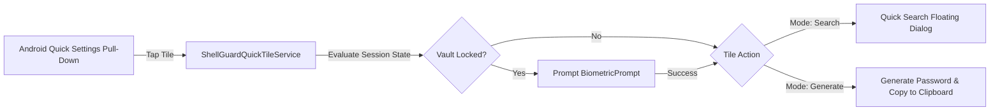

# 📲 ShellGuard Mobile — Widgets & Quick Settings Tile Specification

> **Android Quick Settings TileService, AndroidX Glance AppWidgets (2x2 & 4x2) & Lockscreen Shortcuts**  
> *Targeted for Google AI Studio Android Application Generator.*

---

## 1. Quick Settings Tile Architecture (`TileService`)

Android Quick Settings Tiles provide users with instant system-level access to ShellGuard from the notifications shade, even when another app is open or the phone is unlocked on the home screen.



### Manifest Declaration (`AndroidManifest.xml`)

```xml
<service
    android:name=".services.tiles.ShellGuardQuickTileService"
    android:label="@string/quick_tile_label"
    android:icon="@drawable/ic_launcher_monochrome"
    android:permission="android.permission.BIND_QUICK_SETTINGS_TILE"
    android:exported="true">
    <intent-filter>
        <action android:name="android.service.quicksettings.action.QS_TILE" />
    </intent-filter>
</service>
```

### TileService Implementation (`ShellGuardQuickTileService.kt`)

```kotlin
package com.clawstack.shellguard.services.tiles

import android.content.Intent
import android.os.Build
import android.service.quicksettings.Tile
import android.service.quicksettings.TileService
import androidx.annotation.RequiresApi
import com.clawstack.shellguard.ui.MainActivity
import com.clawstack.shellguard.utils.SensitiveClipboardHelper
import com.clawstack.shellguard.engine.PasswordGenerator

@RequiresApi(Build.VERSION_CODES.N)
class ShellGuardQuickTileService : TileService() {

    override fun onStartListening() {
        super.onStartListening()
        qsTile?.apply {
            state = Tile.STATE_ACTIVE
            label = "ShellGuard"
            updateTile()
        }
    }

    override fun onClick() {
        super.onClick()
        if (isLocked) {
            unlockAndRun { executeTileAction() }
        } else {
            executeTileAction()
        }
    }

    private fun executeTileAction() {
        // Quick Action: Launch Quick Search Dialog Overlay
        val intent = Intent(this, MainActivity::class.java).apply {
            flags = Intent.FLAG_ACTIVITY_NEW_TASK or Intent.FLAG_ACTIVITY_CLEAR_TOP
            putExtra("EXTRA_ACTION", "QUICK_SEARCH")
        }
        startActivityAndCollapse(intent)
    }
}
```

---

## 2. Interactive Home Screen Glance Widgets (`androidx.glance`)

Using modern Jetpack Compose Glance (`androidx.glance:glance-appwidget`), ShellGuard Mobile provides high-performance home screen widgets without legacy RemoteViews boilerplate.

```
+------------------------------------+
| 🐚 ShellGuard Vault          [ 🔍 ]|
|------------------------------------|
| 🌐 GitHub          [ 728 194 ] 22s |
| ☁️ AWS Console     [ 491 028 ] 14s |
| 💼 Work Google     [ 829 301 ] 03s |
+------------------------------------+
```

### A. Compact 2x2 Widget (`SingleTotpGlanceWidget.kt`)
- Displays the user's primary/pinned TOTP verification code.
- Live Canvas countdown progress arc.
- Tap-to-copy code directly from the home screen with sensitive clipboard masking.

### B. Expanded 4x2 Multi-Account Widget (`VaultListGlanceWidget.kt`)
- Vertical list of pinned logins and TOTP codes.
- Integrated quick search button in the widget header.
- Tap item: Copies password or TOTP depending on user configuration.
- Tap search: Launches ShellGuard directly into search mode.

### Implementation Dependencies (`libs.versions.toml`)

```toml
[versions]
glance = "1.1.0"

[libraries]
androidx-glance = { module = "androidx.glance:glance", version.ref = "glance" }
androidx-glance-appwidget = { module = "androidx.glance:glance-appwidget", version.ref = "glance" }
androidx-glance-material3 = { module = "androidx.glance:glance-material3", version.ref = "glance" }
```

### Glance Receiver & Periodic Refresh Invariants

Widget updates are synchronized to the 30-second TOTP epoch boundary using `GlanceAppWidgetManager`. To minimize battery drain, widgets only update when the device screen is active and pause when the device is locked or the screen is off.
